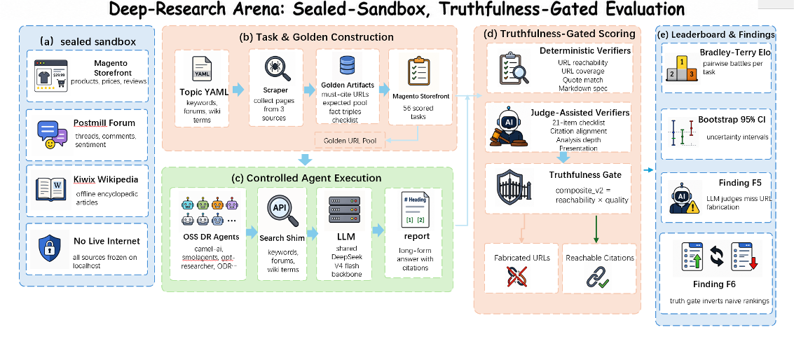

# Deep Research Arena

**A controlled-sandbox benchmark for Deep-Research agents, with judge-independent grounding scores and a separate usefulness jury.**

Live site: [www.deepresearcharena.com](https://www.deepresearcharena.com)

Agents perform cross-site research tasks inside a frozen, offline sandbox web (Magento shopping on `:7770`, Postmill forum on `:9999`, Kiwix Wikipedia on `:8090`). Grounding is scored without an LLM against that sandbox, so a fluent report that cites unreachable or fabricated sources cannot win on truth.



---

## Table of contents

1. [What this project is](#1-what-this-project-is)
2. [How it works (end-to-end)](#2-how-it-works-end-to-end)
3. [The sandbox and where the data comes from](#3-the-sandbox-and-where-the-data-comes-from)
4. [Tasks and goldens (how the QA is built)](#4-tasks-and-goldens-how-the-qa-is-built)
5. [Scoring](#5-scoring)
6. [Lanes and fairness](#6-lanes-and-fairness)
7. [Leaderboards (live)](#7-leaderboards-live)
8. [Quickstart: build the sandbox with Docker](#8-quickstart-build-the-sandbox-with-docker)
9. [Reproduce the boards](#9-reproduce-the-boards)
10. [Repository layout](#10-repository-layout)
11. [Deploy](#11-deploy)
12. [Status and limitations](#12-status-and-limitations)

---

## 1. What this project is

Deep Research Arena measures how good a "deep research" agent is at producing a long, well-cited market-intelligence report, and whether those citations stand up inside a closed world.

An LLM-as-judge will happily rank a fluent report highly even when most of its cited URLs do not exist. We therefore keep two families of scores separate:

- **Truth** (decidable, no LLM): closed-world reachability gated against evidence axes (fact support, proof-of-fetch, completeness). A pure fabricator scores 0.
- **Presentation / usefulness** (LLM jury): pairwise battles → Bradley-Terry ratings. This measures whether the report is useful to a reader. It is **not** multiplied into the production truth number today (see [§5](#5-scoring)).

Everything needed to rebuild tasks, goldens, decidable scores, and the site lives in this repo.

---

## 2. How it works (end-to-end)

```
                  data/tasks/...               data/golden/...
                  (task intent + spec)         (answer keys / must-cite / facts)
                          │                              │
   ┌──────────────────────┴──────────────┐               │
   │  Sandbox (frozen offline web)        │               │
   │   shopping :7770  reddit :9999       │               │
   │   wiki :8090   gateway :8081         │               │
   └──────────────────────┬──────────────┘               │
                          │ agent searches + browses      │
                          ▼                               │
            Agent report (Markdown, cited)                │
                          │                               │
                          ▼                               ▼
   src/eval/decidable_scorer.py                           │
     reach ^ γ × quality(fact, PoF, completeness)         │
     spec → compliance column (not in truth)              │
                          │                               │
                          ▼                               │
   scripts/build_truth_board.py  ←── optional jury panel  │
     rank by truth; presentation only breaks near-ties    │
                          │                               │
                          ▼                               │
   data/results/.../truth_board_*.json                    │
   (+ legacy Elo boards still power parts of the live site)
                          │
                          ▼
   frontend/ (Next.js) → web/dist/ → Cloudflare
```

Stages in words:

1. **Sandbox** brings up a frozen shopping site, forum, and Wikipedia, plus a search/LLM gateway. This is the only "web" agents may see in the closed-world setting.
2. **Tasks** tell the agent what report to write. **Goldens / answer keys** record must-cite sources and checkable facts.
3. **Agents** (17 lanes are declared in `config/lane_protocol.yaml`; **16 are runnable** in the closed-world sandbox — `codex` is declared but excluded at the isolation boundary; see [§6](#6-lanes-and-fairness)) run against the sandbox and emit a cited Markdown report.
4. **Decidable scoring** computes reach, PoF, fact support, completeness, and composes `truth` (K6). Spec is reported as compliance, not multiplied in.
5. **Jury** (optional panel) scores usefulness pairwise. On the truth board it is a separate column / tie-break only.
6. **Site** publishes committed boards from `frontend/` → `web/dist/`.

---

## 3. The sandbox and where the data comes from

All "web content" the agents see is a frozen, offline snapshot, served by containers on one Docker network. Nothing reaches the real internet in the intended closed-world setup, which is what makes citation grounding checkable and the benchmark reproducible.

| Service | Port | Corpus | Where the data comes from |
|---|---|---|---|
| `shopping` | 7770 | Magento product catalog (products, prices, ratings, reviews) | WebArena Magento snapshot, pre-populated DB baked into the image (`shopping_final_0712`, ~4.2 GB) |
| `reddit` | 9999 | Postmill forum (subforums, threads, comments, votes) | WebArena Postmill snapshot, pre-populated DB baked into the image (`postmill-populated-exposed-withimg`, ~1.8 GB) |
| `wiki` | 8090 | Wikipedia | Public Kiwix server image + a host-mounted `.zim` snapshot (English Wikipedia, ~28 GB) from [download.kiwix.org](https://download.kiwix.org/zim/wikipedia/) |
| `gateway` | 8081 | search + LLM shim | This repo (`infra/Dockerfile.gateway`); FastAPI search shim exposing Tavily / Serper / Brave / SearxNG / DDG / OpenAI-compatible endpoints, backed only by the three corpora above |
| `ds_proxy` | 8088 (internal) | LLM proxy | This repo (`infra/Dockerfile.ds_proxy`); OpenAI-compatible proxy to the backbone LLM |

Key design points:

- **The corpora are frozen.** Shopping and forum data were scraped once and baked into images. Re-scraping would change the benchmark. Wikipedia is a mounted `.zim` file.
- **The gateway is the intended door.** Agents are pointed at the shim/gateway. Search hits resolve to `localhost:7770/9999/8090` URLs that can later be checked for reachability.
- **Reset scripts** in `envs/{shopping,reddit}/reset.sh` restore a pristine container state between runs.
- Full image inventory and offline rebuild paths: [`infra/build-images.md`](infra/build-images.md).

---

## 4. Tasks and goldens (how the QA is built)

A "QA item" here is a **(task, golden / answer key)** pair. The task is the brief; the golden records which sandbox URLs and facts are ground truth.

### Task definition

Tasks live in `data/tasks/deep_research/cross_site_deep/*.json` (101 deep tasks) and `cross_site_deep_v2/*.json` (22 adversarial tasks). Each task JSON (schema `deep-1.0.0`) specifies:

- `intent` — the research brief
- `sites` — which corpora the task spans (shopping / reddit / wikipedia)
- `markdown_spec` — hard requirements (min words, citations, pages browsed)
- `citation_policy` — what must be cited, min distinct sources/domains, allowed domains
- `url_coverage` / `url_reachability` — must-cite recall and reachability thresholds
- `synthesis_requirements` — cross-site reasoning the report must perform
- `golden` — pointer to the golden / expected fact predicates

Topics are configured in `configs/deep_topics/*.yaml`.

### Golden generation

Goldens are built by **scraping the live sandbox**, not hand-written. `scripts/build_deep_golden.py` crawls the three corpora for a task's topic and emits files under `data/golden/deep_clean/` containing:

- `must_cite_urls` — ground-truth sources an honest report should cite
- `expected_pool_urls` — broader on-topic pool
- `triples` — `(subject, predicate, object, source_url)` facts used for fact support
- `metadata` — discovery stats (products, brands, thread counts)

### Cleaning and the manifest

Auto-built goldens are noisy. Cleaning:

- `src/verifiers/golden_curate.py` deduplicates and quality-checks sources
- `scripts/build_clean_benchmark_manifest.py` writes `data/golden/deep_clean/_manifest.json`

Current manifest (`canonical_scorable = 75`):

| verdict | count | meaning |
|---|---:|---|
| `valid` | 65 | full cross-site golden, fully scorable |
| `forum-invalid` | 10 | usable but with thin forum coverage |
| `quarantine` | 25 | too few on-topic cross-site cites after cleaning, held out |

Of 100 deep tasks, **75 are scorable**. The 22 adversarial tasks exist but their goldens are not built yet. See [`docs/EVAL_SET_REMEDIATION.md`](docs/EVAL_SET_REMEDIATION.md) and [`docs/CONTAMINATION_REPORT.md`](docs/CONTAMINATION_REPORT.md).

---

## 5. Scoring

Production decidable scoring lives in `src/eval/decidable_scorer.py` and is locked as **formula K6** (`FORMULA_LOCK`, version stamp `tv2.2-nofloor-D1` on truth boards).

### 5.1 Truth (decidable)

```
quality = 0.39·fact + 0.28·PoF + 0.33·completeness
truth   = reach^γ · quality          # γ = 1.5 by default
```

| Axis | What it measures | Notes |
|---|---|---|
| `reach` | Fraction of cited URLs that are in-corpus / reachable in the closed world | Anti-fabrication **gate**. Unfloored: `reach = 0` ⇒ `truth = 0`. |
| `fact` | Structured claims checked against DB / answer-key truth | "Wrong claim" failure mode |
| `PoF` | Proof-of-fetch / quote support against page text (default `text_v1`) | "Unread citation" failure mode; see caveats below |
| `completeness` | Vital-fact recall over the ranked vital pool from the answer key. Denominator is `min(K*, \|pool\|)`; because each task's vital pool holds ~14-17 nuggets (below `K*=20`), this is in practice a **census** — covering *every* vital fact the task offers scores 1.0. `K*` is retained only as an upper cap and does not bind at current pool sizes. | "Missing coverage" failure mode |
| `spec` | Output-shape / format checks | **Compliance column only.** Never multiplied into truth. |

Design constraints (enforced in code + tests):

- **C1**: a pure fabricator (`reach = 0`) cannot score positive truth.
- **C2**: a format-perfect empty shell (`reach = 1`, zero substance, high spec) scores `truth = 0`.
- **No quality floor** (`EPS_FLOOR = 0.0`): axes contribute raw values so mini-shells are not inflated.
- Weights `0.39 / 0.28 / 0.33` are a declared harm-ordering renormalization, **not** claimed optimal. Raw axis scores are published; weight sensitivity is disclosed in the formula lock docs.

Board builder: `scripts/build_truth_board.py` ranks by macro-mean truth. An optional `--panel` (jury winrates / scores) may break ties within `--tie-eps`; it does **not** enter the truth number (M-C1).

### 5.2 Presentation / usefulness (LLM jury)

Pairwise usefulness battles → Bradley-Terry fit (`src/scoring/bradley_terry.py`, `scripts/run_usefulness_jury.py`). Judges are instructed **not** to score citation truthfulness; that is the decidable stack's job.

Historical / live site boards still expose Elo-style composites from earlier pipelines (`scripts/build_real_leaderboard.py`). Those are **not** the same object as K6 truth.

A candidate **Arena** form `reach^γ × winrate` was evaluated and does **not** inherit the truth gate theorem; it is not the production headline until a safe gate is in place.

### 5.3 Intended vs current composition

| Layer | Status in this repo |
|---|---|
| `reach^γ × quality` | **Production** (K6) |
| `× judge Elo / winrate` | **Not multiplied into truth yet**; presentation is a separate column / tie-break |
| Old README formula `Elo × (reach% + quote%) / 200` | **Retired**; do not cite |

If you need a single scalar that folds usefulness in, say so explicitly and treat it as a separate product decision (prefer BT **winrate** over raw Elo if multiplying: Elo is an interval scale).

### 5.4 PoF semantics (important)

Default PoF is **`text_v1`**: verbatim / page-level match between report context and an evaluator-held page cache. That answers "does the prose look like this page?", not "did this agent fetch the page on this run?".

A transport-level alternative **`transport_v2`** (`|cited ∩ fetched| / |cited|` from shim evidence logs) exists in `src/eval/fetch_log.py` and can be required via `build_truth_board.py --require-transport-pof`, but only when runs have attributed evidence and the lane's page reads are observable (see [§6](#6-lanes-and-fairness) and [§12](#12-status-and-limitations)).

### 5.5 Which sandbox sources actually earn score

A task spans all three corpora, but the three grounding axes do **not** credit them symmetrically. Stated honestly (the board stamps this in `protocols.sources_scored`):

| Axis | Sources that can move it |
|---|---|
| `reach`, `PoF` | source-agnostic (any cited sandbox URL) |
| `fact` | **shopping only** — structured price / rating claims bound to a named product |
| `completeness` | **shopping + Wikipedia** ranked vital pool, plus **one virtual forum slot** per task that declares community sources |

So the truth number is earned on **shopping + Wikipedia**. The forum is a **provenance dimension**, not a vital-fact source: forum citations are classified (searched / linked / guessed) and a forum-declaring task gets a single virtual completeness slot covered by a quoted, task-relevant allowed-forum thread, but there are **no real forum vital nuggets** in the answer keys today. Building decidable forum vital nuggets (thread_score / comment_count predicates) is a **v2.1 dataset task** (see [`docs/DATASHEET.md`](docs/DATASHEET.md)). Do not read this benchmark as "three-source scoring".

---

## 6. Lanes and fairness

> Running your own experiment, or plugging in your own framework? Read
> **[docs/RUNNING_EXPERIMENTS.md](docs/RUNNING_EXPERIMENTS.md)** first. It states
> what each grounding axis actually measures, what the harness is forbidden to do
> for a lane, and which lanes currently have `proof_of_fetch` withheld because
> nothing observed whether they opened the pages they cite.

`config/lane_protocol.yaml` **declares 17 lanes**; **16 are runnable** in the closed-world sandbox and one (`codex`) is declared but excluded at the isolation boundary. Each runnable lane sits behind an adapter under `scripts/runners/` / `scripts/run_deep_task.py`:

| Lane | Typical delivery | Notes |
|---|---|---|
| deerflow, gpt-researcher, camel-ai, smolagents, langchain-odr, storm, co-storm, ii-researcher, flowsearcher-ds, ldr, qx-agents, deepagents, local-deep-researcher, tongyi-dr | Mostly open-source agent frameworks (in-process or subprocess) | Adapters must not inject citations or golden URLs |
| opencode, claude-code | CLI products | Not the same class as in-process open-source DR frameworks; capability delivery differs (curl recipes, write-to-file paths) |
| ~~codex~~ | CLI over SSH | **Excluded at the isolation boundary** (declared, structurally unrunnable: the remote-isolation-proof has no writer and netns blocks SSH egress). The board emits its machine-readable `excluded_reason` in `excluded_lanes` so "never ran" is never read as "ran and did poorly". |

Fairness contract: [`config/lane_protocol.yaml`](config/lane_protocol.yaml).

- Every lane gets the shared task intent plus a shared "return a markdown report" line. Prompt extras that teach citation counts, word counts, or example URLs are forbidden unless declared.
- The output budget unit is each backbone's **own tokenizer token** (not characters or words); the same 8192-token cap buys ~10-15% different English text across the three tokenizers, so a report's completeness ceiling shifts slightly by backbone. Cost is likewise reported in each backbone's own tokens.
- Harness must not graft URLs, rewrite model URLs into sandbox hits, or repair reports against scored axes.
- Preflight: `python3 scripts/check_parity.py` (adapter surface vs protocol).
- Historical fairness blockers (ii-researcher output URL graft; flowsearcher prior-run memory seed) are disabled by default; memory requires `FLOWSEARCHER_MEMORY=1`, evidence ghostwriting requires `EVIDENCE_FALLBACK_ENABLE=1`.

Capability delivery is still **not identical** across lanes (CLI vs tool-calling; some lanes search-only; many page-read paths still bypass the recording shim). That is disclosed per lane via `fetch_observable` / `fetch_mode` in the protocol file.

---

## 7. Leaderboards (live)

The public site still shows framework and backbone boards built from committed jury / grounding artifacts. Treat live numbers as **deployment snapshots**; regenerating under K6 truth can change ranks relative to older gated-Elo tables.

**Illustrative older framework snapshot** (gated Elo era; not K6 truth):

| Agent | judge Elo | reach% | gated |
|---|---:|---:|---:|
| claude-code | 1166 | 90 | 1032 |
| opencode | 1078 | 94 | 975 |
| camel-ai | 1040 | 60 | 572 |
| deerflow | 1005 | 60 | 545 |
| flowsearcher-ds | 943 | 46 | 416 |

`gpt-researcher` historically ranked high on raw judge Elo but near the bottom once grounding was applied. That inversion is the point of a grounding gate.

**Backbone-LLM board** (`/models`): vendor LLMs on a shared minimal scaffold (task count / battle count vary by release; see the site changelog).

> Honest caveat: the live 12-agent framework board is about **40.5% single-juror** (later claude-code / opencode battles ran when judge accounts were nearly out of funds). A clean 3-judge re-judge is pending. Tracked on [`/changelog`](https://www.deepresearcharena.com/changelog).

K6 truth boards (when built) stamp `protocols.formula_version` / extractor commits so boards from different formula versions are not compared silently.

---

## 8. Quickstart: build the sandbox with Docker

```bash
docker compose -f infra/sandbox.docker-compose.yml up -d

# Smoke-test all services
curl -fsS http://localhost:8081/healthz   # gateway (returns 200 within ~90s)
curl -fsS http://localhost:7770/          # Magento shopping
curl -fsS http://localhost:9999/          # Postmill forum
curl -fsS http://localhost:8090/          # Kiwix Wikipedia
```

Point an agent at the sandbox:

```bash
export TAVILY_API_URL=http://localhost:8081
export OPENAI_BASE_URL=http://localhost:8081/llm/v1   # any Bearer token works
export DEEPSEEK_API_KEY=sk-...                         # backbone LLM key (bring your own)
```

Image sourcing:

- **Gateway and ds_proxy** build from this repo:
  ```bash
  docker build -f infra/Dockerfile.gateway  -t dr-bench-gateway:latest  .
  docker build -f infra/Dockerfile.ds_proxy -t dr-bench-ds-proxy:latest .
  ```
- **Wiki**: public Kiwix image; set `WIKI_ZIM_DIR` to a folder with a `.zim` snapshot.
- **Shopping / reddit**: pre-populated corpus images, or offline rebuild via [`infra/build-images.md`](infra/build-images.md) (`Path C`).

`down -v` plus `envs/{shopping,reddit}/reset.sh` restores the frozen state.

---

## 9. Reproduce the boards

Legacy site boards (jury Elo era):

```bash
python3 scripts/build_site_board_from_judge_elo.py   # framework board -> data/results/deep_v3/leaderboard_deep_v3.json
python3 infra/box/build_model_board.py               # backbone-LLM board (uses /opt paths; sed the root to run elsewhere)
```

K6 truth board (decidable stack):

```bash
python3 scripts/build_truth_board.py \
  --run-dir data/results/runs/<run-set>/<backbone> \
  --replicates 3 \
  --keys-dir data/golden/answer_keys \
  --cache path/to/sandbox_cache.json \
  --out truth_board.json
# evidence/worker-N and evidence/egress-worker-N are discovered recursively.
# optional: --panel winrates.json
```

Formal boards require the immutable `<run-dir>/run_plan.json` and bound flat
`raw/*.meta.json` artifacts. Missing and non-pass task x replicate cells score
zero, while outcome rates and task-cluster bootstrap intervals remain visible.
For pre-run-set historical data only, opt out explicitly with
`--reports-dir path/to/reports --legacy-nested-layout --replicates 1`.

Parity preflight before a headline run:

```bash
python3 scripts/check_parity.py
```

Score a single report (needs sandbox / cache as configured by the script you use):

```bash
python3 scripts/score_deep_answer.py --task dr_cross_deep_0001 --answer path/to/report.md
```

---

## 10. Repository layout

```
src/eval/         decidable scorer (K6 truth), answer keys, fetch_log
src/scoring/      Bradley-Terry, composites, pairwise judge helpers
src/verifiers/    reachability, quote-match, checklist, KG, etc.
scripts/          runners, truth board, jury, parity check, analysis
config/           lane_protocol.yaml (fairness / fetch observability contract)
data/             tasks, goldens, committed boards + jury sources
configs/          deep_topics/*.yaml
frontend/         Next.js site (production source) -> web/dist
web/              committed deploy artifact + Cloudflare worker
infra/            sandbox compose, Dockerfiles, box ops
envs/             WebArena sandbox envs + reset scripts
integrations/     search_shim, ds_proxy, per-agent adapters
tests/            offline tests (incl. formula lock)
docs/             methodology, datasheet, fairness audits
```

---

## 11. Deploy

The public site is served by Cloudflare from committed `web/dist/`:

```bash
cd frontend && npm ci && npm run typecheck && npm run build
rsync -a --delete --exclude 'wrangler.jsonc' frontend/out/ web/dist/
# commit frontend/ + data/ + web/dist/, then push main; Cloudflare redeploys automatically
```

Hard rule: every meaningful change must be logged in `data/changelog.json` (rendered on `/changelog`) before deploy. Schema and steps: [`CLAUDE.md`](CLAUDE.md).

---

## 12. Status and limitations

Validated methodology notes: [`docs/EVAL_FACTSHEET.md`](docs/EVAL_FACTSHEET.md), [`docs/DATASHEET.md`](docs/DATASHEET.md), [`docs/EVAL_SET_REMEDIATION.md`](docs/EVAL_SET_REMEDIATION.md), [`docs/LANE_FAIRNESS_AUDIT_2026-07-06.md`](docs/LANE_FAIRNESS_AUDIT_2026-07-06.md). Maintainer formula lock / decision memos live under `internal/docs/` (local, not always in the public tree).

**Known limitations (current code):**

1. **Not every lane is an open-source in-process harness.** `claude-code` and `opencode` are CLI products; adapters differ by necessity.
2. **Fairness hard cheats are gated off, but capability parity is incomplete.** Many lanes still have `fetch_observable: false` (page reads bypass the recording shim). Transport PoF cannot be applied uniformly until those paths converge.
3. **Default PoF (`text_v1`) is text similarity to an evaluator cache**, not a proof the agent fetched the page on that run. Cache construction is still driven by URLs appearing in the report.
4. **Presentation is not inside production truth.** `truth = reach^γ · quality` only. Multiplying judge Elo into a headline score is a separate, unfinished product decision.
5. **Live framework jury is partly single-juror (~40.5%).** Do not treat it as a clean 3-judge board until re-judged.
6. **Cross-backbone thinking is not yet equalized.** Protocol requires uniform thinking; `ds_proxy` still forces thinking off for DeepSeek-style models while local Qwen may keep it on.
7. **Weight choice is declared, not fitted.** Especially on small deepseek panels, top-1 can be weight-sensitive; report tiers / CIs rather than over-claiming a unique champion.
8. **Adversarial task goldens** and fuller human-alignment labels remain open work.

Site progress: [`/changelog`](https://www.deepresearcharena.com/changelog).
