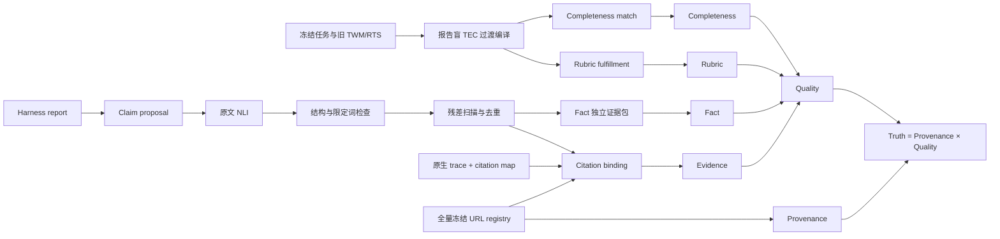

# DRA 四轴评分流水线实现与 DR Tulu 单题 Pilot

日期：2026-07-23
实现版本：`dra_four_axis_score_v1`
设计依据：`DRA_THREE_AXIS_SCORING_REDESIGN_2026-07-22.pdf`，PDF 内部已更新为四轴方案

## 1. 本次交付解决什么

本次实现把一份 harness 报告从原始文本一直处理到可复核数值，不再要求人手挑选 claim 或人工填写真假标签。



职责边界如下：

| 环节 | 由谁决定 | 程序只做什么 |
|---|---|---|
| claim 提出与原子化 | `deepseek-v4-flash` | 验证 exact substring、offset、ID 与 JSON 枚举 |
| 报告是否蕴含 claim | `deepseek-v4-flash` NLI | 过滤非 entailment |
| Fact 真假 | `deepseek-v4-flash`，只看独立检索 evidence packet | 检查模型引用的 span ID 确实属于 packet |
| citation 是否绑定并支持 | `deepseek-v4-flash`，只看本次实际观察文本 | 确定性计算 Valid、Observed 和五腿合取 |
| Completeness unit match | `deepseek-v4-flash` | 验证 claim ID 与 exact quote，执行证据门 |
| Rubric fulfillment | `deepseek-v4-flash` | 验证 exact quote 和有限 verdict |
| URL 真实性 | 冻结 registry | canonicalization、registry membership、snapshot availability |
| 最终公式 | 纯程序 | 固定分母、宏平均、等权 Quality、外层 Provenance |

流水线中人工 claim 决策数固定记录为 `0`。模型版本、temperature、system prompt、user payload、原始响应、解析响应和 SHA-256 全部保存。

## 2. 评分公式

### Fact

Fact 只使用可裁决为 `true` 或 `false` 的 material atomic claims：

```text
Fact = true_mass / (true_mass + false_mass)
```

`unresolved`、`out_of_world` 和 `instrument_ambiguous` 不进入分子或分母，但必须报告数量与 `resolution_rate`。因此高 Fact 不能脱离可裁决率单独解释。

### Evidence

每个 citation binding 必须同时满足：

```text
Pass = Valid ∧ Observed ∧ Bound ∧ Supports ∧ RoleOK
```

```text
EvidencePrecision = passing bindings / all material bindings
EvidenceRecall = grounded citation-required units / all citation-required units
Evidence = F1(EvidencePrecision, EvidenceRecall)
```

### Completeness

TEC 中 core atomic 与 higher-order research units 按 `(facet, unit_type)` 分组。先算组内覆盖率，再对非空组宏平均：

```text
Completeness = mean(group coverage)
```

### Rubric

```text
fulfilled = 1
partially_fulfilled = 0.5
not_fulfilled = 0

Rubric = weighted mean(item value)
```

### Provenance、Quality 与 Truth

```text
ValidURL = Canonicalized ∧ InRegistry ∧ SnapshotAvailable
Provenance = valid unique cited URLs / all unique cited URLs

Quality = (Fact + Evidence + Completeness + Rubric) / 4
Truth = Provenance × Quality
```

写作 Elo 不进入 Truth。

## 3. 自动 false 防误伤

Pilot 暴露出一个重要 evaluator 风险：模型会把“证据包没有目标型号”错误解释为“目标 claim 为假”。为此，最终 `false` 采用四重合取：

1. Fact verifier 给出 `false`；
2. false guard 确认同实体、同型号、同条件；
3. burden-of-proof appeal 再次确认直接矛盾；
4. 最终 same-scope NLI 必须输出 `contradiction`。

不同型号、页面未提及、兼容的四舍五入和来源归因不一致都不能直接计为 false。任一门不通过，结果降为 `unresolved`、`out_of_world` 或 `instrument_ambiguous`。

这个机制在本题中把以下误伤移出了 false：

- 没有 Trance Go 页面，不能用 Flare 2 页面反驳 Trance Go；
- `77%` 与四舍五入后的 `3.9/5` 兼容；
- 页面没有提到“40W 到 24W swap”不等于明确反驳；
- 标准定义不能反驳“某些用户曾这样表述”。

最终只保留一条直接 false：报告称 Ortizan 40W listing 没有 360° claim，而冻结页面明确提出该 claim。

## 4. DR Tulu 单题结果

任务：`dra_v3_dev_audio_0002`

| 指标 | 最终 v8 |
|---|---:|
| Truth | **0.8052** |
| Quality | 0.8052 |
| Provenance | 1.0000 |
| Fact | 0.9881 |
| Fact resolution rate | 0.4912 |
| Evidence | 0.6920 |
| Completeness | 0.6607 |
| Rubric | 0.8800 |
| Legacy weight ablation | 0.7971 |

诊断带为：

```text
high_aggregate_with_material_gaps
```

它不是 `strong_across_axes`，原因是 Evidence、Completeness 和 Fact resolution rate 均低于 0.8。

### 报告做得好的部分

- 8 个唯一引用 URL 全部位于冻结 registry，未发现 fabricated URL；
- 167 个 claim-citation bindings 中 117 个通过；
- 25 个冻结 rubric 中 22 个完成；
- 23 个 core completeness units 中 15 个通过；
- 84 个最终可裁决 Fact claims 中 83 个 true、1 个 false；
- 推荐、预算、价格、主要产品 listing 项和部分比较结构确实完成。

### 报告做得不好的部分

- 171 个 material claims 中仅 84 个进入 true/false 分母，Fact resolution rate 只有 49.1%；
- 47 个 unresolved、35 个 out-of-world、5 个 instrument ambiguous；
- 50 个 unsupported citations、9 个 wrong bindings、22 个 wrong-role bindings；
- 只执行 4 次搜索，没有抓取任何完整页面；
- 8 个引用 URL 全部只观察到 search snippet；
- community atomic evidence、community pattern、部分 design mechanism 和 use-case mechanism 没有通过；
- 报告对 Ortizan 360° claim 有一条可确认的直接错误；
- 报告大量扩展到相关型号、被动 crossover、用户经验和电池/热失真建议，但当前冻结 task corpus 无法独立裁决其中很大一部分。

因此，这份报告的正确描述是：

> 表面任务履约和 URL 真实性较强，能够用 snippet 支撑不少浅层商品事实；但证据支持精度、研究关系覆盖、完整页面研究和 claim 可裁决率存在明显缺口。

## 5. 为什么仍然不是正式榜单分

数值可以比较报告好坏，但 `formal_eligible=false`。原因与报告本身分开：

1. 当前使用过渡编译器把既有 TWM/RTS 转成 TEC，还不是 protocol-complete TEC；
2. latent rubrics 尚未完成 blinded double-human review；
3. alternative-route recall、tail audit 和 coverage certificate 尚未冻结；
4. 仍有 5 个 `instrument_ambiguous` Fact verdicts。

这些问题不会让分数消失，但正式论文榜单前必须完成校准。

## 6. 一键运行

先在 shell 中加载 evaluator 的私有 judge 配置。密钥不进入仓库，也不会写入审计产物。

```bash
set -a
. /root/.config/dra/judge.env
set +a

PYTHONPATH=. python3 scripts/run_four_axis_pipeline.py \
  --task /path/to/task.json \
  --report /path/to/report.md \
  --trace /path/to/trace.json \
  --citation-map /path/to/citation-map.json \
  --task-world-model /path/to/task-world-model.json \
  --research-test-suite /path/to/research-test-suite.json \
  --graph-dir /path/to/frozen-evidence-graph \
  --url-registry data/golden/url_registry.json \
  --output-dir /path/to/output \
  --model deepseek-v4-flash
```

可以重复传入 `--judge-cache-dir`。只有完整 request hash 相同的响应才会复用。

## 7. 每次运行的主要产物

```text
input-manifest.json
native-observation-ledger.json
execution-audit.json
tec/
  tec-manifest.json
  atomic_facts.jsonl
  research_units.jsonl
  rubric_items.jsonl
claims/
  report_segments.jsonl
  claim_proposals.jsonl
  claim_nli_judgments.jsonl
  claim_structural_judgments.jsonl
  report_claims.jsonl
fact_packets/
fact_verdicts.jsonl
fact_false_guard.jsonl
fact_false_appeal.jsonl
fact_final_false_nli.jsonl
citation_bindings.jsonl
citation_required_units.jsonl
completeness_units.jsonl
rubric_verdicts.jsonl
cited_urls.jsonl
score-packet.json
score.json
SUMMARY.md
judge_calls/
  <call-id>/
    request.json
    raw-response.txt
    parsed-response.json
    metadata.json
```

## 8. 下一步

代码流水线已经跑通。正式化应按以下顺序进行：

1. 在 Dev-14 上建立 protocol-complete TEC；
2. 对 rubric、atomic match、Fact、binding 和 unit match 分层抽样双人标注；
3. 报告每层 human-human 与 model-human agreement；
4. 专门建立 absence、wrong-model、rounding、attribution 和 snippet-overreach 对抗集；
5. 冻结 prompt、model snapshot、schema 与 scorer major version；
6. 再扩展到 56 题和 12 个 harness。

在完成这些步骤前，v8 是方法与工程闭环 pilot，不是最终榜单结论。
