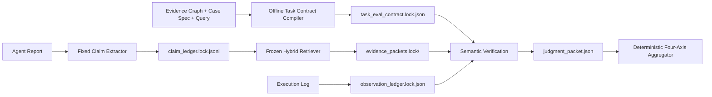

# DRA Judge and Evaluation-Instrument Stability Audit

Date: 2026-07-28

Status: implementation audit plus first corrective implementation; no formal
leaderboard claim

## 0. Protocol decision on 2026-07-29

The official semantic evaluator is one frozen local `Qwen3-8B` snapshot.
Qwen is used for Task Evaluation Contract compilation, report claim
extraction/NLI/structural filtering, Fact, Evidence, Completeness, and Rubric.
It is not used to generate or rewrite the evaluated harness report.

Scores from Qwen and v4lite are not averaged, voted, or mixed across axes.
v4lite may remain in a validation table, but it cannot contribute to the
official score. The official reproducibility unit is:

```text
fixed report + native trace
+ frozen task contract
+ frozen Claim Ledger
+ frozen Fact packets
+ Qwen model snapshot
+ prompt/scorer hashes
= replayable Qwen score
```

Judge validity is established by comparing this fixed Qwen ruler with
double-human labels on a stratified calibration set. The paper reports
per-axis sample size, class confusion, agreement, and confidence intervals.
Numerically similar totals from two LLM judges are not evidence that the
judges are equivalent.

## 1. Executive conclusion

The intended DRA architecture is coherent:

1. Evidence Graph and Case Spec construct answerable research tasks.
2. A report-side evaluator scores Fact, Evidence, Completeness, and Rubric.
3. Provenance remains a report-level multiplier.
4. Retrieval and vector similarity locate candidate evidence but never award
   score directly.

The current implementation does not yet instantiate that design as a formal,
reproducible benchmark. The main blocker is not the final aggregation formula.
It is evaluation-instrument drift.

At present, one model invocation is allowed to regenerate the task Rubric,
Completeness units, claim inventory, and semantic verdicts inside every report
scoring run. Changing the judge therefore changes both the test instrument and
the answers assigned by the instrument. Even without changing the model,
repeated calls can change the denominator.

The immediate correction is:

> Compile and freeze one task evaluation contract per task, freeze one claim
> ledger and one evidence packet set per report, and only then compare or
> replace semantic judges.

## 2. What currently exists

### 2.1 Construction-side assets

`data/results/truth56_full_20260727/assets` contains 56 task directories. Every
directory contains:

- `task-world-model.json`;
- `research-test-suite.json`;
- a frozen graph directory;
- `build-summary.json`.

All 56 build summaries identify the artifacts as `diagnostic_transition` and
set `formal_eligible` to false. These artifacts are useful construction-side
inputs, but they are not yet protocol-complete formal task evaluation
contracts.

### 2.2 Report-side four-axis scorer

The current report score is:

\[
Quality_t =
\frac{Fact_t + Evidence_t + Completeness_t + Rubric_t}{4}
\]

\[
Truth_t = Provenance_t \times Quality_t
\]

The pure aggregation implementation is deterministic. The focused scorer,
frozen-artifact and controlled-judge tests currently pass:

```text
37 passed
```

The implemented separation is generally sound:

- Provenance checks registered and snapshotted URLs.
- Fact checks material report claims against frozen-world evidence packets.
- Evidence checks observed, locally bound, supportive, scope-matched and
  role-appropriate claim-citation bindings.
- Completeness measures task-side semantic coverage.
- Rubric measures query compliance.
- Writing Elo remains separate.

The local results tree currently contains 19 complete
`dra_four_axis_score_v2` artifacts, covering primarily
`dra_v3_dev_audio_0002` plus one `dra_v3_dev_chair_0015` run. None is formally
eligible. The Qwen pilot retained its final score summary locally, but not the
complete intermediate claim ledgers, task contract, evidence packets and judge
transcripts needed for a paired audit.

## 3. Critical empirical finding: the test instrument changes per harness

The v4lite harness matrix provides a natural repeatability experiment. Ten
harness reports for the same task caused the task compiler to be invoked ten
times. The task, Task World Model and Research Test Suite hashes were identical
in every run. The model was `deepseek-v4-flash`, the recorded temperature was
0.0, and the compiler prompts were identical.

The audited transcripts show:

| Compiler stage | Calls | Unique request hashes | Unique response hashes |
|---|---:|---:|---:|
| Query-only Rubric compiler | 10 | 1 | 10 |
| Report-blind Completeness compiler | 10 | 1 | 10 |
| Atomic facet compiler | 10 | 1 | 2 |

After normalizing away audit metadata, the emitted scoring artifacts still
have:

| Artifact | Distinct semantic variants |
|---|---:|
| `rubric_items.jsonl` | 10 |
| `research_units.jsonl` | 4 |
| `atomic_facts.jsonl` | 2 |

This is not merely harmless wording variation.

For example, nine runs merged the user constraints “60-dollar budget” and
“balcony and poolside use” into one Rubric item, while one run split them into
two separately weighted items. The task consequently had nine Rubric items in
most runs and ten in another run.

Research-unit types also changed between `decision`, `synthesis`,
`cross_source_synthesis`, `conflict`, `community_pattern`, and `procedure`.
Completeness macro-averages by `(facet_id, unit_type)`, so these type changes
alter group weights and can alter the score even when the underlying semantic
requirements remain similar.

Temperature zero therefore did not make the task compiler deterministic. This
is consistent with recent reproducibility studies, but DRA already has direct
within-repository evidence and does not need to rely on that literature claim.

## 4. Why the Qwen–v4lite comparison is currently confounded

For the same STORM report:

| Judge | Fact | Evidence | Completeness | Rubric | Truth |
|---|---:|---:|---:|---:|---:|
| Qwen3-8B | 0.750 | 0.642 | 1.000 | 0.714 | 0.777 |
| v4lite | 1.000 | 0.395 | 0.647 | 0.900 | 0.735 |

The aggregate difference is only about 0.041, but the axis differences are
large and point in opposite directions.

More importantly:

- Qwen produced 53 report claims; v4lite produced 41.
- Qwen used 26 core Completeness units in 5 macro groups.
- v4lite used 28 core Completeness units in 7 macro groups.
- Qwen used 7 Rubric items; v4lite used 15.

Thus the observed difference is:

\[
\Delta_{\text{observed}}
=
\Delta_{\text{instrument}}
+
\Delta_{\text{claim extraction}}
+
\Delta_{\text{retrieval}}
+
\Delta_{\text{semantic judge}}
\]

It is not a controlled estimate of
\(\Delta_{\text{semantic judge}}\). Similar Truth values only show numerical
cancellation.

## 5. A second construction–evaluation mismatch

The transition compiler currently copies every Task World Model assertion into
the atomic Completeness candidate set. The atomic compiler:

- does not receive the public query;
- cannot drop an assertion;
- only assigns a facet, `core|supporting`, and `evidence_required`.

For `dra_v3_dev_keyboard_0004`, the Task World Model contains 30 assertions.
Qwen treated 26 as core; v4lite treated 28 as core. Several assertions describe
available world facts such as battery claims, weight, ratings or seller use
scope, rather than independently necessary research requirements in the
public query.

This conflates:

- facts that exist in the witness graph;
- facts that are necessary for task completeness.

The correct mapping is:

- Case Spec `required_subgoals` and public-query requirements define the
  Completeness denominator;
- Task World Model assertions and known evidence act as answerability
  witnesses and retrieval seeds;
- report-introduced claims are evaluated by Fact, whether or not they appeared
  in the construction graph.

World facts should not automatically become Completeness obligations.

## 6. Reproducibility gaps in the current artifacts

### 6.1 Generated task outputs are not sealed

`tec-manifest.json` records source hashes and counts, but it does not hash the
generated:

- Rubric items;
- atomic units;
- research units;
- facet assignments.

Nine task manifests in the matrix have the same manifest hash even though
their semantic Rubric and unit files differ.

### 6.2 Scorer identity is incomplete

The input manifest records data-file hashes and model names, but formal
reproduction also needs:

- scorer Git commit;
- dirty-worktree state or source bundle hash;
- prompt hashes;
- retriever configuration;
- endpoint identity and resolved model revision;
- container or environment digest;
- frozen task-contract hash;
- frozen claim-ledger hash;
- frozen evidence-packet-set hash.

The four-axis scoring implementation and related documents are currently
untracked in the working tree. Existing score files therefore cannot be tied
to a committed scorer revision.

### 6.3 Model separation is being used as a proxy for validation

The current formal-eligibility code rejects runs when claim proposal, NLI,
structural checking and Fact verification do not use distinct model names.
Model-name separation does not itself establish evaluator correctness, and
using one model does not automatically make a calibrated evaluator invalid.

A better formal requirement is measured component validity:

- fixed component versions;
- held-out human agreement;
- extractor precision/recall;
- verifier error rates;
- repeatability statistics.

Different model families can remain a robustness ablation rather than an
automatic formal-eligibility condition.

## 7. Retrieval status

The current Fact resolver is useful but transitional:

1. inspect every valid agent-cited page first;
2. query the frozen search API;
3. fetch a bounded number of result pages;
4. add graph seed chunks;
5. rank chunks with deterministic value-blind lexical scoring;
6. send Top-12 spans to the semantic verifier.

This design already allows non-preselected URLs and separates evaluator fetches
from agent observations. It also requires full-page scope for bounded negative
claims.

It is not yet the planned formal union of:

- exact and numeric lookup;
- full-world BM25;
- dense retrieval;
- structured product lookup;
- graph expansion.

Retrieval scores correctly do not enter Truth directly.

## 8. Required target architecture



### 8.1 Task contract

Compile once per task, before any evaluated report is visible:

- query-only Rubric items;
- task Completeness units;
- applicability conditions;
- partial-credit contracts;
- evidence-required flags;
- stable program-assigned IDs;
- hashes of every emitted file.

All harnesses must consume the same immutable contract.

### 8.2 Report claim ledger

Run one fixed claim-extraction pipeline per report and freeze:

- exact report spans;
- atomic normalized claims;
- materiality;
- citation-required status;
- local citation occurrences;
- deduplication relations.

Changing the Fact or Evidence verifier must not regenerate this ledger.

### 8.3 Evidence packets

Run candidate retrieval once for each frozen claim and seal the exact spans.
Qwen, v4lite and any future judge must receive byte-identical claim and
evidence packets.

### 8.4 Rejudge-only mode

The scorer must support:

```text
--task-contract-dir
--frozen-claims-dir
--frozen-fact-packets-dir
--model / --fact-model / --evidence-model
```

The report, trace, citation map and URL registry remain content-addressed
inputs. In a judge-comparison run, replacing the semantic model is the only
permitted experimental variable.

## 9. Judge validation protocol

### 9.1 Calibration items

Build a stratified, human-anchored calibration set over the actual atomic
decisions:

- Fact: true, false, conflicted, unresolved;
- Evidence: supported, unsupported, contradicted, wrong binding, wrong role,
  unobserved;
- Completeness: atomic, comparison, mechanism, conflict, synthesis and
  decision;
- Rubric: fulfilled, partial, not fulfilled and ambiguous;
- product, community and reference sources;
- exact numbers, scoped negative claims and higher-order conclusions.

Two blinded annotators label each item. Disagreements are adjudicated.

### 9.2 Metrics

Report, per axis:

- human–human Cohen's kappa or Krippendorff's alpha;
- judge–human kappa;
- macro-F1 and balanced accuracy;
- class-wise false-positive and false-negative rates;
- confusion matrix;
- repeated-run flip rate.

At report and leaderboard level, additionally report:

- Spearman and Kendall rank correlation;
- pairwise rank-flip rate;
- paired bootstrap confidence intervals.

Qwen–v4lite agreement is a reliability statistic, not an accuracy statistic.
Human-anchored alignment is required to select the official judge.

### 9.3 Recommended deployment

Use one frozen primary judge for all formal scores. A lower-cost model may be
used as a shadow judge or first-pass judge only under a predeclared escalation
policy. Escalate:

- ambiguous verdicts;
- critical false or contradicted-citation verdicts;
- disagreements between deterministic rules and the primary model;
- a fixed random audit sample.

Do not average Qwen and v4lite's raw axis scores. Opposite biases can cancel.

Prediction-powered inference may be used to correct aggregate benchmark means
and produce confidence intervals from a smaller human-labelled subset. It does
not repair individual unreviewed verdicts.

## 10. Minimal correction experiment

Do not rescore all 56 tasks yet.

### Experiment A: instrument repeatability

For two development tasks:

1. compile the task contract ten times;
2. measure exact and semantic hash agreement;
3. choose and freeze one audited contract;
4. require all subsequent harness runs to use it.

Success criterion: all harnesses reference one identical task-contract hash.

### Experiment B: true Qwen–v4lite comparison

For one report:

1. freeze one claim ledger;
2. freeze one evidence-packet set;
3. run Qwen and v4lite only as semantic verifiers;
4. repeat each verifier three to five times;
5. compare item-level verdicts and run-to-run flips;
6. human-label every disagreement plus a matched agreement sample.

This separates semantic-judge error from instrument and retrieval variance.

### Experiment C: denominator sensitivity

Score the same ten harness reports twice:

- current per-run compiled denominator;
- one frozen task denominator.

Measure:

- axis-score changes;
- ranking changes;
- Kendall tau;
- which Rubric or Completeness units caused each change.

### Experiment D: end-to-end calibration pilot

Create a small stratified gold set from Dev tasks. Select the official judge by
per-axis human alignment, not aggregate-score proximity. DeepResearch Bench II
uses the same basic principle: candidate evaluators are compared on the same
human-labelled report–rubric decisions before one evaluator is selected.

## 11. What can and cannot be claimed now

Safe claim:

> DRA has implemented a diagnostic four-axis, execution-aware scoring
> prototype and constructed transition World Model and Research Test Suite
> assets for 56 tasks. The prototype separates URL provenance, factual
> accuracy, claim-level evidence, task completeness and query compliance, and
> supports route-flexible, on-demand evidence verification.

Not yet safe:

> DRA currently provides a frozen, judge-invariant, formally publishable score
> for all 56 tasks.

The design does not need to be discarded. The aggregation formula is not the
first blocker. The next milestone is to make the evaluation instrument fixed,
replayable and human-calibrated.

## 12. Primary literature anchors

- DeepResearch Bench II, arXiv:2601.08536: freezes fine-grained task rubrics,
  labels report–rubric decisions with humans, and selects an evaluator by
  accuracy and F1 against the same human labels.
- ARES, arXiv:2311.09476: uses a small human validation set and
  prediction-powered inference to correct automated RAG-evaluation estimates
  and construct confidence intervals.
- RAGChecker, arXiv:2408.08067: validates fine-grained claim-level RAG
  diagnostics through meta-evaluation against human judgments.
- JudgeBench, arXiv:2410.12784: demonstrates that strong general-purpose
  models are not automatically reliable judges on objectively difficult
  factual and reasoning cases.
- Necessary but Not Sufficient: Temperature Control and Reproducibility in
  LLM-as-Judge Safety Evaluations, arXiv:2606.26185: reports that temperature
  zero reduces but does not eliminate repeated-run judge flips.

## 13. Corrective implementation completed on 2026-07-28

The first instrument-freezing layer is now implemented. It does not alter the
accepted four-axis aggregation formula.

### 13.1 Immutable Task Evaluation Contract

`src/scoring/task_evaluation_contract.py` implements:

- `dra_task_evaluation_contract_v1`;
- hashes for every emitted Rubric, Completeness, facet and answerability file;
- one contract identity hash;
- query, task, TWM and RTS binding;
- duplicate-ID and facet-reference validation;
- byte-level tamper rejection.

The schema makes two semantics explicit:

- `transition_legacy_exact` reproduces the current diagnostic denominator;
- `research_obligations_v1` moves TWM assertions out of Completeness and keeps
  them as answerability/retrieval witnesses, unless task construction
  explicitly marks an atomic assertion as scored.

This compatibility split is deliberate. Freezing the instrument must not
silently change historical scores. The target semantics can be validated as a
separate benchmark version.

### 13.2 Report-bound Claim Ledger

`src/scoring/frozen_claim_ledger.py` implements:

- a hash over every extraction-stage artifact;
- an exact report SHA-256 binding;
- verification of every claim and occurrence offset;
- verification that `raw_text` is the exact report substring;
- duplicate-ID and byte-tamper rejection.

Consequently, changing Fact or Evidence judges no longer requires regenerating
the claim denominator.

### 13.3 Frozen Fact candidate packets

`src/scoring/frozen_fact_packets.py` seals every per-claim candidate evidence
packet and binds the bundle to the Claim Ledger. It verifies:

- exact material-claim coverage;
- exact claim text and claim kind;
- unique span IDs;
- URL and original span text presence;
- every packet file hash;
- one bundle identity hash.

Retrieval similarity remains a candidate-selection mechanism and contributes
no numeric credit.

### 13.4 Runtime behavior

`run_four_axis_pipeline.py` now has two modes:

```text
legacy diagnostic:
  compile task contract + extract claims + retrieve candidates in the run

controlled rejudge:
  --task-contract-dir ...
  --frozen-claims-dir ...
  --frozen-fact-packets-dir ...
```

In controlled mode the pipeline does not instantiate or call the task
compiler and claim extractor. A regression test replaces both functions with
hard failures and confirms that the frozen run succeeds without invoking
either.

Every new input manifest also includes:

- scorer source-file hashes;
- all semantic prompt hashes;
- batching parameters;
- judge temperature and token contract;
- retrieval parameters;
- aggregation identity;
- one `protocol_sha256`.

Thus even a prompt-only evaluator change creates a new protocol identity.

### 13.5 Controlled judge comparison

`src/scoring/judge_comparison.py` and
`scripts/compare_controlled_judges.py` compare judges only after confirming
identical:

- scoring protocol;
- task contract;
- Claim Ledger;
- Fact packet bundle;
- report, trace, citation map, TWM, RTS, graph, registry and task hashes.

The output reports item-set equality, Jaccard overlap, raw agreement, Cohen's
kappa and concrete disagreement examples separately for Fact, Evidence,
Completeness and Rubric. If one frozen hash differs, the comparison fails
closed. Similar total Truth values are never treated as an equivalence test.

`src/scoring/calibration_queue.py` then exports every judge disagreement plus a
stratified sample of agreements into a blinded human-annotation queue. Judge
labels are written to a separate private file and remain hidden until both
human annotations have been frozen.

### 13.6 Retrospective STORM rehearsal

The existing STORM assets were sealed retrospectively without changing their
legacy semantics:

```text
task contract:
d71db7f99b6e4d3810fb18055f582f3c5092c09aadd5156a91a8882b49195a74

Claim Ledger:
a0536e448845668d2494c775517dcbc785bb8df0964e049a3ae52b6a04a957c6

Fact packet bundle:
e3a2e275bd5b04e958a47694468540287682d395419c05ead36af5a9f280f2d5
```

The controlled replay reused 17 old semantic calls by exact request hash. One
Rubric request correctly failed cache lookup because the Rubric prompt had
subsequently gained stricter identifier-return requirements. The runner then
stopped because no external judge backend was configured.

This is the desired fail-closed behavior. Treating the old response as if it
answered the new prompt would hide protocol drift. A fresh Qwen-v4lite
comparison must run both judges under the new common `protocol_sha256`.

## 14. Remaining work, in order

1. Build `research_obligations_v1` contracts for two Dev tasks before viewing
   new reports.
2. Run Qwen and v4lite on the same frozen contract, Claim Ledger and packet
   bundle.
3. Human-label all judge disagreements plus a matched agreement sample.
4. Report per-axis human-human and judge-human kappa, macro-F1, class recall
   and repeat-run flip rate.
5. Only after the judge and denominator pass calibration, expand the frozen
   workflow to Dev-14 and then 56 tasks.

The complete benchmark still needs a broader hybrid evidence retriever and a
human calibration set. Instrument drift, however, is now blocked in code
rather than merely described in a plan.
