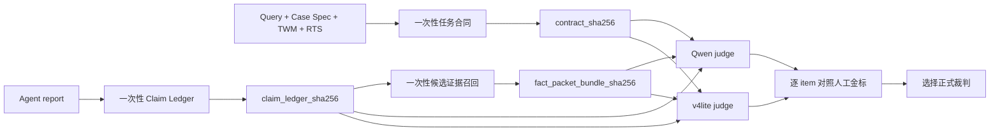

# DRA 裁判校准与受控 Rejudge 方案

日期：2026-07-28

状态：方法与第一版代码已经落地；尚未产生正式榜单结论

## 1. 一句话结论

Qwen 与 v4lite 的总分接近，不能证明两个裁判等价。此前两个裁判看到的
Rubric 数、Completeness 单元、Claim 数和候选证据都不相同，实际上不是
在批改同一张考卷。

正确做法不是把两个裁判的总分平均，而是：

1. 每题只生成并冻结一次 Task Evaluation Contract；
2. 每份报告只抽取并冻结一次 Claim Ledger；
3. 每个 claim 只召回并冻结一次 Fact 候选证据包；
4. Qwen、v4lite 和人工标注员判断完全相同的 item；
5. 分轴比较 judge-human agreement，再选正式裁判；
6. 最终仍按现有四轴公式评分，写作 Elo 单独汇报。

## 2. 不改变的评分主体

\[
Quality_t =
\frac{
Fact_t + Evidence_t + Completeness_t + Rubric_t
}{4}
\]

\[
Truth_t = Provenance_t \times Quality_t
\]

其中：

- `Provenance`：报告引用的 URL 是否属于冻结世界且快照有效；
- `Fact`：报告主动提出的外部可核验 claim 有多少被证据判真；
- `Evidence`：需要引用的 claim 中，引用是否观察过、就地绑定、语义支持且
  来源角色合适；
- `Completeness`：报告是否完成题目要求的研究内容；
- `Rubric`：报告是否遵守公开 query 的任务指令；
- `Writing Elo`：只比较表达、组织和可读性，独立汇报，不进入 Truth。

向量检索、BM25、结构化查询和图扩展都只负责找到候选证据，不直接产生
分数。

## 3. 旧 Qwen-v4lite 对照为什么无效

同一份 STORM 报告的旧结果是：

| 裁判 | Fact | Evidence | Completeness | Rubric | Truth |
|---|---:|---:|---:|---:|---:|
| Qwen3-8B | 0.750 | 0.642 | 1.000 | 0.714 | 0.777 |
| v4lite | 1.000 | 0.395 | 0.647 | 0.900 | 0.735 |

总分只差约 0.041，但：

- Qwen 抽取 53 个 claims，v4lite 抽取 41 个；
- Qwen 使用 26 个 core Completeness 单元、5 个宏分组；
- v4lite 使用 28 个 core Completeness 单元、7 个宏分组；
- Qwen 使用 7 个 Rubric items，v4lite 使用 15 个。

因此旧实验实际测到：

\[
\Delta_{\mathrm{observed}}
=
\Delta_{\mathrm{contract}}
+
\Delta_{\mathrm{claim\ ledger}}
+
\Delta_{\mathrm{retrieval}}
+
\Delta_{\mathrm{judge}}
\]

我们真正想测的只有最后一项。

## 4. 新的受控流水线



受控对照成立必须同时满足：

```text
scoring_protocol_sha256 相同
task_contract_sha256 相同
claim_ledger_sha256 相同
fact_packet_bundle_sha256 相同
report / trace / citation_map / registry 等输入哈希相同
```

任意一项不同，程序把该实验标记为 `controlled_comparison=false`。

## 5. 已实现的冻结资产

### 5.1 Task Evaluation Contract

文件：`src/scoring/task_evaluation_contract.py`

它检查：

- task、query、TWM、RTS 的哈希；
- Rubric、Completeness、facet、answerability 文件的哈希；
- ID 是否重复；
- 单元是否引用不存在的 facet；
- 合同身份哈希是否一致。

同时显式区分：

- `transition_legacy_exact`：完全复现旧诊断分母；
- `research_obligations_v1`：TWM 事实只作可回答性 witness，不自动进入
  Completeness。

### 5.2 Claim Ledger

文件：`src/scoring/frozen_claim_ledger.py`

它检查：

- Ledger 是否绑定当前报告的完整 SHA-256；
- 每个 claim 的 `start/end/raw_text` 是否与报告原文逐字一致；
- 每个重复 occurrence 是否也能回到原文；
- Claim ID 是否重复；
- 所有抽取阶段文件是否被篡改。

### 5.3 Fact Candidate Packets

文件：`src/scoring/frozen_fact_packets.py`

它检查：

- 每个 material claim 是否恰好有一个候选包；
- claim 文本与 claim 类型是否一致；
- evidence span ID 是否重复；
- URL 和原始 span text 是否存在；
- 每个候选包及整个 bundle 的哈希。

### 5.4 评分协议快照

每次新评分还会记录：

- scorer 源码哈希；
- 所有 judge prompt 哈希；
- batch size；
- temperature 和 max tokens；
- retrieval Top-K 与分块参数；
- 聚合公式身份；
- 总的 `protocol_sha256`。

仅修改一个 prompt，也会产生新的协议版本。

## 6. 给标注员看的四类具体例子

下面是校准 item 的形式示例，不是由当前作者手工替真实报告判分。正式
label 由两名盲标人员独立完成；合成腐蚀样本的 label 则由构造操作直接
确定。

### 6.1 Fact 示例：数值被定向替换

```text
原证据 span：
"Battery Capacity: 5200 mAh"

受测 claim：
"The product has a 6600 mAh battery."

构造方式：
只把原报告中的 5200 改成 6600，其他上下文和引用不变。

构造真值：
false
```

这个样本检测裁判能否识别“页面相关但具体数值相反”，而不是只做主题
相似度判断。

### 6.2 Evidence 示例：相关页面但型号错绑

```text
附近 claim：
"Soundcore Flare 2 is rated IPX7."

引用页面：
Soundcore Mini 3 商品页，页面确实写有 IPX7。

构造真值：
passed = false
failure_reason = wrong_binding / scope_mismatch
```

这个样本区分“页面谈到了 IPX7”和“页面支持当前型号的 IPX7 claim”。

### 6.3 Completeness 示例：只列事实，没有做比较

```text
冻结 requirement：
"Compare the two products' output and distortion wording, and explain
what can and cannot be inferred about distortion risk."

报告片段：
分别抄录两个商品页的 wattage，但没有比较 distortion wording，
也没有说明测量缺口。

人工待判：
content_covered = true / false
```

这里不能由相似度直接判分。两名标注员必须根据冻结 requirement 判断
是否真正完成研究动作，并保留 exact quote 和理由。

### 6.4 Rubric 示例：没有给出用户要求的最终路线

```text
公开 query：
"Recommend one route."

报告结尾：
"Both options have tradeoffs and the user should decide."

人工待判：
fulfilled / partially_fulfilled / not_fulfilled
```

Rubric 只检查是否遵守公开指令，不在这里判断推荐是否事实正确。

## 7. 校准集怎么建

### 7.1 第一阶段：Dev 小规模可运行校准

从两个 Dev 任务和多种 harness 报告中采样 320 个判断 item：

| 轴 | 自然 item | 合成负例 | 合计 |
|---|---:|---:|---:|
| Fact | 50 | 30 | 80 |
| Evidence | 40 | 40 | 80 |
| Completeness | 60 | 20 | 80 |
| Rubric | 60 | 20 | 80 |
| 总计 | 210 | 110 | 320 |

采样必须覆盖：

- 真、假、冲突、不可裁决；
- 支持、错绑、反驳、未观察、来源角色错误；
- atomic、comparison、mechanism、conflict、synthesis、decision；
- fulfilled、partial、not fulfilled；
- 商品、论坛、百科；
- 数字、负命题和高阶结论。

### 7.2 第二阶段：正式校准

ARES 使用约 150 个或更多的人类标注样本来校正每个 RAG 维度并构造
置信区间。DRA 有四个差异较大的轴，正式阶段建议至少做到每轴
150--300 个双人标注 item，即 600--1200 个；根据第一阶段的置信区间和
稀有错误类别再决定是否扩到更大规模。

不能把 600--1200 理解为 600--1200 篇报告。一个长报告会产生许多
claim、binding、coverage 和 rubric item。

## 8. 每个裁判怎么比较

每个轴单独报告：

- human-human Cohen's kappa 或 Krippendorff's alpha；
- judge-human Cohen's kappa；
- accuracy；
- macro-F1；
- balanced accuracy；
- 每类 precision、recall；
- critical false-accept rate；
- 同一输入重复运行的 flip rate；
- 不可裁决率。

同时报告：

- item set 是否完全一致；
- item-set Jaccard；
- Qwen-v4lite 的 raw agreement 和 kappa；
- 每类真实分歧例子。

其中：

> Qwen-v4lite agreement 是 reliability，不是 accuracy。

两个裁判可以非常一致地犯同一个错误。正式裁判必须依据 judge-human
结果选择。

## 9. 如何选正式裁判

不使用“哪个裁判的 Truth 更接近另一个裁判”作为选择条件。

推荐顺序：

1. 先检查两个裁判是否使用相同冻结输入；
2. 按轴比较 macro-F1、kappa 和关键错误召回；
3. 选择一个固定 primary judge；
4. 另一个作为 shadow judge；
5. 对以下 item 自动升级人工复核：
   - 两裁判分歧；
   - `ambiguous / unresolved / conflicted`；
   - Fact=false；
   - contradicted citation；
   - 固定比例随机样本。

如果 Qwen 在某一轴明显达不到 human-alignment 要求，可以继续作为低成本
初筛，但不能仅因总 Truth 接近 v4lite 就替代正式裁判。

也不建议直接平均 Qwen 与 v4lite 的轴分。旧实验已经证明，Fact 与
Evidence/Completeness 的相反偏差可以在总分中互相抵消。

## 10. 文献给我们的直接启示

### DeepResearch Bench II

该工作对 10 份多样报告的同一批 human-labeled report-rubric items 测试
不同 evaluator，按 ACC 和 F1 选裁判。Gemini-2.5-Pro 的
ACC/F1 为 91.75/89.57，GPT-5 为 88.36/78.28，Gemini-2.5-Flash 为
89.45/79.79。它证明“总榜分接近”不是裁判选择依据，必须对同一人工标签
做 item-level 对照。

### ARES

ARES 为不同评价维度训练独立 judge，并使用约 150 个或更多人类标注样本
加 prediction-powered inference，对系统级均值给出校正估计和置信区间。
DRA 后续可用相同思想校正四轴总体均值，但不能用它替代单条严重错误的
判定。

### RAGChecker

RAGChecker 使用 claim-level checking，并用 280 个 response-pair
meta-evaluation items、每个两名标注员，从 correctness、completeness 和
overall preference 检验指标与人的相关性。它支持我们保留细粒度诊断，
再做 meta-evaluation，而不是直接相信一个 LLM 总分。

### LLM-Rubric

LLM-Rubric 发现原始 LLM 多维判断不能天然复现人类标注；它用多维输出和
少量人类数据训练校准层，对用户满意度的预测误差相对未校准基线改善约
两倍。它支持“judge 输出是待校准测量值”，而不是天然的 ground truth。

### JudgeBench

JudgeBench 说明通用强模型在细微事实与推理错误上也可能接近随机水平。
因此模型规模、品牌或同族一致性都不能替代 DRA 自己的受控校准集。

## 11. 论文可直接使用的英文表述

> To isolate evaluator variance from instrument variance, DRA freezes three
> content-addressed artifacts before a cross-judge comparison: a task-level
> evaluation contract, a report-bound claim ledger, and a per-claim candidate
> evidence bundle. Candidate retrieval is used only to supply evidence and
> never contributes score directly. Two judge runs are considered comparable
> only if the scoring-protocol hash and all three artifact hashes, together
> with the report, execution trace, citation map, and frozen-world registry
> hashes, are identical.

> We do not infer judge equivalence from similar aggregate Truth scores.
> Candidate judges are evaluated on the same human-labelled item set
> separately for Fact, Evidence, Completeness, and query compliance. We report
> accuracy, macro-F1, Cohen's kappa, class-wise error rates, and repeated-run
> flip rates. Inter-judge agreement is treated as a reliability diagnostic,
> whereas judge selection is based on agreement with human adjudication.

> The official report score remains
> \(Truth=Provenance\times(Fact+Evidence+Completeness+Rubric)/4\).
> Writing quality is evaluated in a separate pairwise Elo track and is not
> allowed to compensate for factual, evidential, coverage, or provenance
> failures.

## 12. 论文与代码入口

- 完整稳定性审计：
  `docs/DRA_JUDGE_AND_INSTRUMENT_STABILITY_AUDIT_2026-07-28.md`
- Task Contract：
  `src/scoring/task_evaluation_contract.py`
- Claim Ledger：
  `src/scoring/frozen_claim_ledger.py`
- Fact packet bundle：
  `src/scoring/frozen_fact_packets.py`
- 受控 judge 对比：
  `src/scoring/judge_comparison.py`
- 盲标队列生成：
  `src/scoring/calibration_queue.py`
- 命令行：
  `scripts/run_four_axis_pipeline.py`
- 对比命令：
  `scripts/compare_controlled_judges.py`
- 盲标队列命令：
  `scripts/build_judge_calibration_queue.py`

## 13. 参考文献

- [DeepResearch Bench II](https://arxiv.org/abs/2601.08536)
- [ARES](https://aclanthology.org/2024.naacl-long.20/)
- [RAGChecker](https://arxiv.org/abs/2408.08067)
- [LLM-Rubric](https://aclanthology.org/2024.acl-long.745/)
- [JudgeBench](https://proceedings.iclr.cc/paper_files/paper/2025/file/9e720fce64f91114c49cfd640d821da3-Paper-Conference.pdf)
