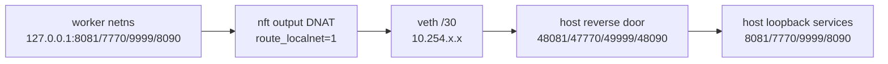
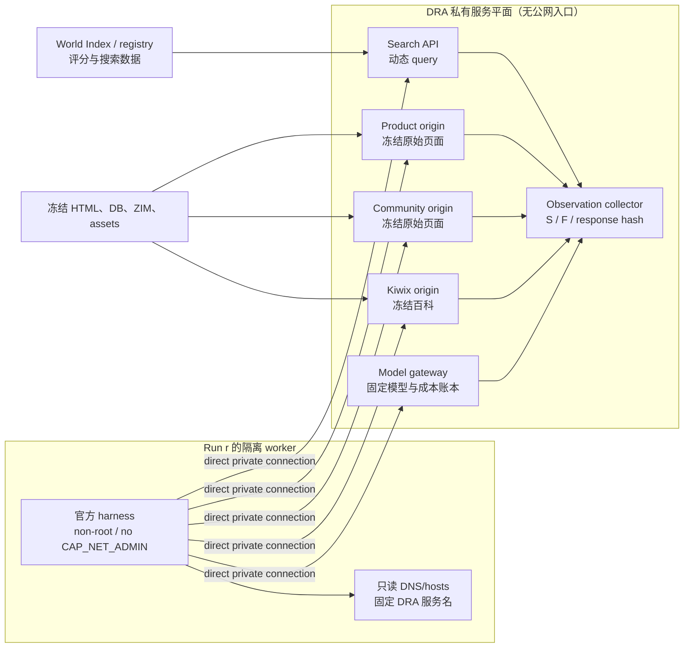
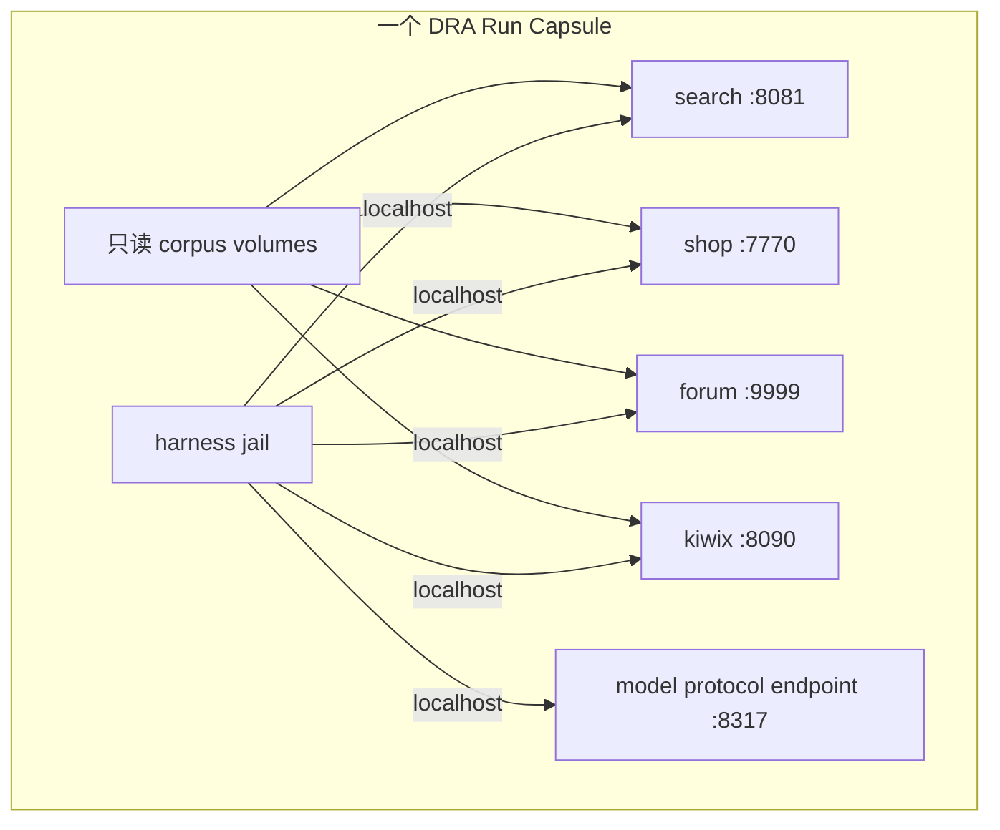

# DRA 无端口转发沙盒架构设计

> 日期：2026-07-21<br>
> 状态：设计草案，尚未修改运行环境<br>
> 适用范围：DRA 冻结网页环境、12 个正式 harness、搜索与页面访问、模型调用、观察账本<br>
> 不影响事项：my5090 上正在运行的 E2 Wfull 编译继续按现有方式执行

## 0. 结论先行

DRA 可以在不使用 SSH 隧道、Docker 宿主端口发布、DNAT、REDIRECT 或当前 reverse door 的情况下运行。

推荐主方案是：

> **把搜索、商城、论坛、百科和模型网关做成沙盒私有服务平面，worker 直接连接服务的真实私有地址；服务不发布宿主端口，worker 没有公网默认路由。**

这不是“把一个端口转发到另一个端口”，而是普通的服务到服务直连：

```text
worker HTTP client
    -> private service address
    -> actual DRA service process
```

推荐方案保留以下性质：

- harness 继续使用它原生的 HTTP、浏览器、MCP 或页面读取方式；
- 不修改 planner、agent loop、提示词、搜索策略或报告；
- 动态 query 仍然可用，不退化成预生成答案缓存；
- 所有搜索返回和 HTTP 200 页面读取仍可按 run 记录；
- 网页 URL、页面哈希、来源角色和冻结快照仍然可复现；
- 不把 E1/E2 的结构化调试页错误地暴露给 harness；
- 12 个 harness 使用同一服务平面和同一网络规则。

如果平台不允许访问任何跨沙盒私有 IP，但仍允许同一沙盒内的 loopback，则可以把全部服务共置在一个 run capsule 中。如果连 loopback TCP/HTTP socket 也禁止，则不存在一个对 12 个 harness 完全透明的通用方案。大多数 harness 的官方工作流原生依赖 HTTP 搜索 API、HTTP 页面读取和 HTTP 模型 API。此时只有两条路：

1. 平台重新允许同沙盒 loopback，并把所有网页服务和模型放进同一个沙盒；或
2. 修改上游 harness，把 HTTP 改成 stdio、Unix socket 或文件队列。

第二条会改变部分 harness 的原生能力边界，不应作为正式排行榜默认方案。

---

## 1. “不允许端口转发”必须先区分三个强度

“不能端口转发”常被用来描述不同限制。三种限制对应的工程方案不同。

| 级别 | 禁止内容 | 仍允许内容 | DRA 是否可统一支持 12 个 harness |
|---|---|---|---:|
| P1 | SSH `-L/-R`、公网暴露、Docker `-p` | 私有网络、内部服务地址 | 可以 |
| P2 | P1，加上 DNAT、REDIRECT、透明 TCP 转发、reverse door | worker 到服务真实私有 IP 的直接连接 | 可以，推荐本文主方案 |
| P3 | P2，加上跨沙盒/跨 namespace 私有 IP 网络 | 同一 sandbox network namespace 内的 loopback、stdio、Unix socket | 可以，但必须把全部服务共置成 run capsule |
| P4 | P3，加上 loopback TCP/HTTP socket | stdio、Unix socket、只读文件 | 不能透明统一；必须改变部分上游 transport |

本文以 **P2** 为正式设计目标，给出 P3 的降级方案，并明确 P4 的不可行边界。

### 1.1 端口与端口转发不是一回事

HTTP 服务监听端口不等于端口转发。

- `worker -> 10.253.0.10:8081`，该地址上就是搜索服务：**直接连接**；
- `worker localhost:8081 -> DNAT -> host:48081 -> proxy -> search:8081`：**端口转发/代理链**。

P2 禁止后者，不必禁止前者。如果基础设施只允许 443，也可以让多个 DRA 虚拟主机都直接监听私有 HTTPS 入口的 443。

---

## 2. 当前架构为什么依赖转发

当前 `dra-harness-adapters` 的隔离计划大致是：



现有实现的关键位置：

- `dra-harness-adapters/src/dra_harness_adapters/isolation.py`
  - 创建独立 netns 和 veth；
  - 打开 `route_localnet`；
  - 使用 nft `dnat`/`snat`；
  - 将 worker 的 `localhost` 端口映射到 host link 地址。
- `dra-harness-adapters/src/dra_harness_adapters/reverse_door.py`
  - 在 host link 地址监听另一组端口；
  - 再向宿主机 loopback 服务发送 HTTP；
  - 记录请求、响应与实体哈希。
- `dra-harness-adapters/src/dra_harness_adapters/protocol_sidecar.py`
  - 为部分官方客户端保留固定 HTTPS hostname/wire protocol；
  - 当前同样依赖 worker 到 host-side listener 的映射。

这套设计的优点是能让 worker 继续看到 `localhost`，且便于统一审计；缺点是它明确依赖 NAT 和反向门，因此无法满足 P2。

---

## 3. 不能为了“无转发”牺牲什么

新方案必须同时满足以下硬约束。

### 3.1 保留原生 harness 行为

- 不给 harness 新增研究计划；
- 不添加任务特定 MCP 工具；
- 不改 planner、graph、重试、并发和预算；
- 不把不具备 page-read 的 harness 人工升级为 page-read；
- 不删除官方工作流已有的 search、crawl、page-read 或 browser 能力；
- 只允许通过官方配置面、官方扩展面或外部网络边界映射 transport。

### 3.2 保留动态研究

agent 在运行中生成的 query 无法提前穷举。因此以下办法不能作为正式主方案：

- 只给每道题预生成固定搜索结果；
- 只把构题 witness URL 放进 worker；
- 用有限 query-response 文件假装搜索服务；
- 把 gold graph 或评分 rubric 暴露给 worker。

这些做法会把 Deep Research 变成答案回放，并产生路线绑定。

### 3.3 分离 agent 网页与评分网页

E1/E2 World Index 的结构化页面、block、span、hash 和 parent relation 用于：

- 构图；
- 查询编译；
- 评分；
- 回溯与人工审计。

它们不是 harness 的默认网页界面。harness 应访问冻结的原始网页视图：

- Magento 风格商品页及图片、规格、评论；
- Postmill 风格论坛页及回复树；
- Kiwix 的 Wikipedia HTML、表格、链接和资源。

无端口转发改造不得把结构化证据视图替换成 agent-facing 页面。

### 3.4 保留可观察性

正式分数要区分：

- `S`：本次搜索接口实际返回过的 URL；
- `F`：本次实际成功读取并返回 HTTP 200 正文的 URL；
- `L`：本次已读取正文内出现的链接。

移除 reverse door 后，不能因此失去 `F`。观察应下沉到真实服务端，而不是依赖 harness 自报。

---

## 4. 候选方案比较

| 方案 | 无端口转发 | 动态 query | 12 harness 透明性 | 观察性 | 规模化 | 结论 |
|---|---:|---:|---:|---:|---:|---|
| SSH tunnel / Docker `-p` | 否 | 是 | 高 | 中 | 中 | 直接排除 |
| 当前 DNAT + reverse door | 否（P2 下） | 是 | 高 | 高 | 高 | 保留为旧 transport profile |
| `HTTP_PROXY` 环境变量 | 表面上是 | 是 | 低 | 中 | 中 | 易绕过、浏览器和 shell 不统一，不采用 |
| 每题预生成搜索缓存 | 是 | 否 | 高 | 高 | 高 | 改变研究任务，不采用 |
| 全部改成 MCP stdio | 是 | 是 | 低 | 高 | 中 | 只有原生支持 MCP 的 harness 可用 |
| Unix socket / 文件队列 | 是 | 是 | 低 | 高 | 中 | 多数官方 HTTP SDK 不支持，不能统一 |
| microVM vsock broker | 是 | 是 | 中 | 高 | 中 | VM 平台可做，但 guest 内仍需本地协议适配器 |
| 同一沙盒内共置全部服务 | 是 | 是 | 高 | 高 | 低至中 | P3 降级方案 |
| 私有服务平面直接连接 | 是 | 是 | 高 | 高 | 高 | **推荐主方案** |
| 出站直连私有 HTTPS 服务 | 是 | 是 | 高 | 高 | 高 | 云沙盒推荐部署形态 |

---

## 5. 推荐架构：DRA Private Service Fabric

### 5.1 逻辑结构



### 5.2 网络性质

worker 与服务位于一个不可访问公网的私有 fabric 中：

- worker 没有公网默认路由；
- 不开启 host `ip_forward` 为 worker 转发公网流量；
- 不使用 DNAT、SNAT、REDIRECT 或 MASQUERADE；
- 不运行 `reverse_door`；
- 不发布任何 host port；
- worker 仅能连接五类显式服务地址；
- worker 不能连接其他 worker；
- 服务进程是目标地址本身，而不是到宿主 loopback 的透明转发器。

裸机上可采用 direct L2 bridge + 固定 service IP；严格 P2 下不要使用会隐式 DNAT 的虚拟 ClusterIP，优先 headless/direct endpoint 或等价的直接路由实现。

### 5.3 服务名称

不要把临时容器 IP 写进报告。建议冻结一组 benchmark origin，例如：

| 角色 | 示例逻辑 origin |
|---|---|
| 商品 | `http://shop.world.dra.test` |
| 论坛 | `http://forum.world.dra.test` |
| 百科 | `http://wiki.world.dra.test` |
| 搜索 | `http://search.world.dra.test` |
| 模型 | `https://model.api.dra.test` |

`.test` 名称只在 DRA 私有 DNS 或 root-owned `/etc/hosts` 中解析。正式名称需要在兼容性 smoke 后冻结；上表只是设计占位符。

如果短期必须保持已有 `localhost:7770/9999/8090/8081` URL，则采用第 6 节的“同 sandbox 共置”模式，而不是继续做 DNAT。

### 5.4 模型网关不是通用网络出口

模型网关是一个具备明确 OpenAI/Anthropic wire contract 的应用服务，不是 CONNECT/SOCKS/任意 URL proxy。

它必须：

- 只接受审核过的模型协议和路径；
- 在转发前验证请求模型 ID；
- 自己持有上游凭据，worker 不持有真实密钥；
- 拒绝任意 hostname、任意 URL 和 CONNECT；
- 独立记录模型 identity、tokens、成本与错误；
- 与 worker fabric 分离地拥有所需出站能力；
- 不允许 worker 借模型网关访问一般互联网。

### 5.5 Search 服务不是开放代理

Search 服务直接查询冻结 World Index 和来源索引。它可以兼容 Tavily、Serper、SearXNG、AskNews、Exa 等被审核的 wire shape，但不能接受任意代理目标。

协议适配的输出必须归一到同一批冻结页面，并记录：

- run identity；
- 请求序号；
- 原始 query 或其受控哈希；
- 协议类型；
- 返回 URL 的有序列表；
- 每个结果的分数和内容哈希；
- World snapshot 和 search build ID。

### 5.6 Page 服务就是原始页面 origin

商品、论坛和百科服务直接返回 agent-facing 冻结网页。它们不接受任意目标 URL，也不转发公网请求。

服务端记录：

- 请求方法与 canonical URL；
- 重定向链；
- 最终 HTTP 状态；
- 正文实体 SHA-256 和字节数；
- MIME type；
- snapshot ID；
- run identity；
- 单调递增 request sequence。

CSS、图片等资源请求可以作为诊断记录；`F` 的正式分子应只计入符合页面合同的正文读取，避免浏览器加载一个页面的几十个静态资源改变分数。

---

## 6. P3 降级：DRA Run Capsule

如果平台不允许 worker 连接任何私有服务 IP，但仍允许沙盒内部 loopback，则可以把服务与 harness 共置在同一 sandbox network namespace。



这个模式没有跨 namespace 转发，且可保留当前 localhost URL。需要注意：

- 服务应先于非 root worker 启动并占用固定端口；
- 服务进程与 worker 必须使用不同 PID、mount、user boundary；
- corpus 通过只读 mount 提供，不能复制 1955 万页到每个 run；
- 服务审计日志写到 worker 不可见的 host-owned 目录；
- worker network namespace 可以只包含 loopback；
- 外部模型调用需要本地模型，或通过非 TCP 边界（例如受审计 vsock/Unix RPC）交给外部 gateway；
- 如果给整个 capsule 增加公网接口，worker 也会得到该接口，不能只靠“模型 sidecar 会自觉”来保证隔离。

此模式适合单机、小并发或基础设施严格的 smoke，不是 12 harness 大规模并行的首选。

---

## 7. 出站直连私有 HTTPS：云沙盒部署形态

很多托管沙盒禁止入站连接和端口转发，但允许出站 HTTPS。此时可以把 DRA 服务部署为只有沙盒可访问的私有 HTTPS origins：

```text
worker -> https://search.world.dra.test
worker -> https://shop.world.dra.test
worker -> https://forum.world.dra.test
worker -> https://wiki.world.dra.test
worker -> https://model.api.dra.test
```

这仍然是 direct client-to-service，不要求连接进入 worker，也不需要 SSH tunnel。

必须额外满足：

- DNS 与证书固定并纳入 environment manifest；
- 服务只接受 benchmark workload identity；
- worker 的出站 allowlist 只有这些 origins；
- 不能把服务开放成匿名公网 benchmark；
- 不在 URL query 中放 run token，避免引用泄露凭据；
- run identity 优先来自不可伪造的网络身份、单独沙盒地址或受控 TLS 身份；
- 任何 CDN、WAF 或缓存层都必须冻结配置并记录响应哈希。

---

## 8. URL 身份与引用合同

移除 localhost 会影响当前 URL registry，因此不能静默替换字符串。

### 8.1 新 URL registry 最小字段

```json
{
  "snapshot_id": "dra-world-v1",
  "page_snapshot_id": "ps_...",
  "canonical_url": "http://wiki.world.dra.test/wiki/Active_noise_control",
  "source_family": "encyclopedia",
  "native_locator": "zim:...",
  "content_sha256": "...",
  "allowed_transport_profile": "direct-fabric-v1"
}
```

### 8.2 必须遵守的规则

1. Search 返回 canonical URL，而不是临时 service IP。
2. HTML 内链接也使用同一 canonical origin。
3. 报告中的 URL 不做事后改写或“修复”。
4. 评分器按冻结 registry 匹配 URL，并使用 `source_family` 判断来源角色。
5. transport origin、snapshot ID 和 registry hash 写入 run manifest。
6. `localhost-v1` 与 `direct-fabric-v1` 是两个 transport profile，未经等价性验证不得混榜。
7. 同一页面即使有多个可服务 locator，正式 profile 也只能选择一个 canonical report URL。

### 8.3 为什么不能只按域名判断来源多样性

未来可能使用统一 HTTPS front door 或多个虚拟 host。来源角色应来自 World Index/registry 的 `source_family`，而不是简单按 hostname 计数。这样商品、论坛、百科的语义身份不会被部署拓扑改变。

---

## 9. 无 reverse door 后如何构建观察账本

观察账本改由服务端直接产生，不由 worker 或 adapter 声明。

### 9.1 建议事件格式

```json
{
  "schema": "dra_service_observation_v1",
  "run_id": "run_...",
  "sequence": 42,
  "service": "wiki",
  "event": "page_response",
  "method": "GET",
  "canonical_url": "http://wiki.world.dra.test/wiki/ANC",
  "status": 200,
  "response_sha256": "...",
  "response_bytes": 123456,
  "snapshot_id": "dra-world-v1",
  "previous_record_sha256": "...",
  "record_sha256": "..."
}
```

### 9.2 S、F、L 的确定性生成

- `S`：所有 `search_response` 事件中返回的 canonical URL 并集；
- `F`：所有合格 `page_response` 事件中最终状态为 200、正文 hash 合法的 canonical URL 并集；
- `L`：对 `F` 中响应实体按冻结 parser 提取链接，再归一到 registry 后的并集。

`L` 可以在服务返回时生成，也可以在 run 后从 sealed response entity 确定性重建。后一种更容易复核。

### 9.3 run attribution

优先级如下：

1. 每个 run 独立服务实例或独立 service connection；
2. 每个 worker 唯一、不可在 worker 内修改的私有源地址；
3. 由平台提供的 workload identity；
4. 受控 TLS client identity。

不要依赖 agent 自己填写 `X-DRA-Run-ID`。模型或 harness 可以伪造普通请求头，不能把它当作唯一归因证据。

### 9.4 完整性

- 日志写到 worker 不可写目录；
- 每个 run 使用 hash chain；
- 响应正文按内容寻址密封；
- run 结束时写入首尾 sequence、账本 SHA-256、registry hash；
- 丢事件、sequence 跳号或实体缺失时，该 run 的 transport evidence 应 withheld，而不是默认为未抓取或零分。

---

## 10. 12 个 harness 的 transport 映射

下表只改变连接目的地，不改变 agent 工作流。

| Harness | 官方研究 transport | 无转发映射 | 备注 |
|---|---|---|---|
| `camel-ai` | AskNews/Reddit HTTP(S) | 私有 exact-host protocol service | 未冻结的数据面继续 fail closed |
| `claude-code` | 本地 stdio MCP search/fetch | MCP server 直接查询 service fabric；模型走 model service | 搜索/抓取本身可完全不使用 TCP door |
| `deerflow` | Serper + Browserless | 私有 Serper/Browserless endpoints | image search 仍按 capability profile 处理 |
| `gpt-researcher` | Tavily + native scraper | 私有 Tavily endpoint + 直接 page origins | 不注入 URL，不修改 report |
| `ii-researcher` | `web_search` + `page_visit` | 私有 search endpoint + 直接 page origins | 特殊 PDF/YouTube 等保持 out of scope |
| `langchain-odr` | Tavily raw content | 私有 Tavily-compatible service | 并行 researcher 行为不变 |
| `ldr` | custom retriever/full content | 官方配置指向私有 service | 不新增 agent-selectable page tool |
| `miroflow` | Serper + Jina reader + direct `read_file` | 私有 exact-host services + origin allowlist | 每条 native 路径都必须单独做 capability proof |
| `opencode` | 官方 Exa MCP | MCP/Exa service 直接访问 fabric | 保持 coding-agent lane 披露 |
| `qx-agents` | SearchXNG + crawl | 私有 SearchXNG endpoint + 直接 page origins | 并发 tool agents 不变 |
| `smolagents` | Serper + text browser | 私有 Serper endpoint + 直接 page origins | agent 可选择不用工具，不能因此判 transport 失败 |
| `storm` | `dspy.Retrieve` | 私有 retrieve service | 标准 STORM 无独立 page-open，保持 snippet/retrieval 能力边界 |

### 10.1 不能统一成一种工具

公平性不是让 12 个 harness 都使用同一个工具 UI，而是：

- 相同冻结世界；
- 相同网络可达集合；
- 相同 search/page response 内容；
- 相同观察与审计规则；
- 各自保留原生 acquisition mechanism。

强行给所有 harness 加同一个 MCP 工具，会把“harness 能力评测”改成“我们的 MCP agent 评测”。

---

## 11. 安全模型

### 11.1 worker 权限

- non-root；
- 无 `CAP_NET_ADMIN`、`CAP_SYS_ADMIN`；
- 不能修改 routes、DNS、hosts 或证书；
- 只读 rootfs 和 upstream checkout；
- 唯一可写目录为 run artifact directory；
- 不可读取 service audit log、模型密钥或其他 run 的产物。

### 11.2 网络策略

- 无公网默认路由；
- IPv4、IPv6 都 fail closed；
- 只允许精确 service IP/port；
- 禁止任意 DNS server；
- 禁止 CONNECT、SOCKS 和通用 forward proxy；
- 禁止 worker-to-worker；
- service plane 不信任 Host header 作为唯一授权；
- IP literal、DNS rebinding、redirect 到 off-world origin 都必须失败。

### 11.3 服务策略

- Search 只能返回 registry URL；
- Page origin 只能返回其冻结 source family；
- Model gateway 只能接受固定模型协议和模型 ID；
- 所有服务都使用固定镜像/代码 hash；
- 所有响应都绑定 snapshot/build ID；
- 服务异常时 fail closed，不回退公网。

---

## 12. 不应采用的“看起来简单”的办法

### 12.1 只改成一个 HTTP proxy

部分库尊重 `HTTP_PROXY`，部分浏览器、shell、Node client、SDK 不尊重或允许绕过。它也会把可达性控制依赖到每个 client 的实现细节，不适合作为 12 harness 的正式边界。

### 12.2 在报告结束后替换 URL

把内部 URL 替换成 canonical URL 会改变 harness 原生报告，并可能把猜测 URL洗成合法 URL。正式流程必须让 agent 从搜索结果和页面本身看到 canonical URL。

### 12.3 只保留搜索 snippets

这会削弱具有 page-read/crawl 能力的 harness，改变 Deep Research 广度和证据深度，也无法准确构建 `F`。

### 12.4 把 World Index 数据库直接挂给 harness

这会暴露评分/构图侧结构，改变 acquisition modality，并给具备 shell/SQL 的 harness 不公平优势。World Index 应只通过正式 search/page service 暴露最小 agent-facing 信息。

### 12.5 使用共享可写缓存

不同 run 可能通过缓存键、时间、内容和错误互相影响，导致顺序依赖。缓存必须只读冻结，或按 snapshot/content hash 寻址；运行期可写缓存必须 per-run。

---

## 13. 验收门

新 transport profile 只有全部通过后才能进入正式榜单。

| Gate | 验证内容 | 通过条件 |
|---|---|---|
| N0 | 无转发证明 | worker scope 无 DNAT/SNAT/REDIRECT/MASQUERADE、无 reverse-door、无 SSH tunnel、无 host published port |
| N1 | 无公网出口 | public DNS、public IP、IPv6、redirect escape 全部失败 |
| N2 | 服务直连 | worker 连接的是 service 的真实 private endpoint |
| N3 | 运行隔离 | worker-to-worker、跨 run 账本和产物访问全部失败 |
| N4 | Search parity | 固定 query 集的 URL、排序、snippet/hash 与冻结基线一致，或差异有版本说明 |
| N5 | Page parity | 商品、论坛、百科正文和资源的内容 hash 与冻结原始页面一致 |
| N6 | URL identity | 所有返回、页面内链接和报告 URL 都可归一到同一 registry |
| N7 | Observation completeness | 已知 search/fetch 脚本产生完整 S/F/L，丢事件会 withheld |
| N8 | 12-harness search proof | 每个声明 search 的 native 路径都有一次无模型 capability proof |
| N9 | 12-harness page proof | 每个声明 page-read/crawl 的 native 路径都有一次无模型 capability proof |
| N10 | Model identity | 固定模型 ID、请求/响应身份和成本账本一致 |
| N11 | Native artifact | adapter 不改报告，native files 全量密封 |
| N12 | HTML fidelity | 浏览器抽查商品、回复树、百科表格、资源和重定向无结构退化 |
| N13 | 并发 | 多 run 并发时无地址冲突、无日志串线、无内容漂移 |
| N14 | 故障恢复 | 服务退出、worker kill、磁盘满、账本不完整均 fail closed 且可诊断 |
| N15 | 公平性 | 12 harness 得到同一 world snapshot、search build、allowed origins 和网络预算 |

### 13.1 无转发的机器可读证明

每个 run manifest 建议增加：

```json
{
  "transport_profile": "direct-fabric-v1",
  "port_forwarding": false,
  "nat_rules_present": false,
  "reverse_door_present": false,
  "host_ports_published": [],
  "default_route_present": false,
  "allowed_service_endpoints_sha256": "...",
  "network_plan_sha256": "..."
}
```

不能只在文档中声称“没有转发”；启动前后都要由独立 preflight/auditor 读取实际 network namespace、route、socket 和 firewall 状态。

---

## 14. 迁移计划

### Phase 0：冻结旧 profile

- 将当前方案命名为 `reverse-door-v1`；
- 固定其代码、network plan、URL registry 和 observation schema hash；
- 历史结果保留，不与新 profile 静默混合；
- 不影响正在运行的 E2 Wfull。

### Phase 1：100 页 direct-fabric 原型

- 选定商品、论坛、百科、资源、重定向各类页面；
- 启动无 host port、无 NAT 的三个 origin 和一个 search service；
- worker 直接连接 service IP；
- 生成 service-side observation ledger；
- 证明正文和 URL registry parity。

### Phase 2：三个代表性 harness

优先覆盖三种 transport：

1. endpoint 可配置的研究 harness，例如 GPT Researcher；
2. 多协议 search + page-read harness，例如 DeerFlow 或 MiroFlow；
3. stdio MCP/general-agent lane，例如 Claude Code。

先验证 transport，不按报告质量决定是否通过。

### Phase 3：URL profile 冻结

- 对候选 `.test` origins 跑 12-harness compatibility smoke；
- 冻结 canonical URL、DNS、证书和 registry；
- 更新 scorer canonicalizer 和 strict-origin contract；
- 禁止 run 后 URL 重写。

### Phase 4：12 harness capability matrix

- 对每个 native search/page/crawl 路径做无模型 preflight；
- 对每个 harness 跑同一 neutral smoke task；
- 封存请求账本、native report 和 network attestation；
- 未通过的能力明确标为 unsupported，不静默降级。

### Phase 5：规模与故障测试

- 多 worker 并发；
- 大页面和长 report；
- 服务重启和超时；
- 账本断链；
- DNS/redirect/IP literal 逃逸；
- 模型 gateway 错模型与密钥泄漏测试。

### Phase 6：正式切换

- 发布 `direct-fabric-v1` datasheet；
- 旧、新 profile 分榜或在 parity 证书通过后做明确迁移；
- 将 current reverse-door 代码保留为可复现实验资产，但不再作为默认 transport。

---

## 15. 第一实现切片

在不改 12 个 adapter 的前提下，第一切片应只证明网络与证据闭环：

1. 建立一个无 NAT、无 host port 的 private fabric；
2. 给 search/shop/forum/wiki 配置真实 private endpoint；
3. 给一个 worker 配置只读 DNS/hosts 和无默认路由；
4. 使用普通 `requests`、`aiohttp`、`curl`、Playwright 各完成一次页面读取；
5. 从 service logs 构建 S/F/L；
6. 验证 off-world URL、IP literal、redirect escape 全部失败；
7. 对同一批响应与旧 reverse-door 路径比较内容 hash；
8. 产出 `network-attestation.json` 和 `observation-ledger.json`。

这一步通过后，再动 adapter；否则先修基础设施，不把网络问题误算成 harness 能力问题。

---

## 16. 需要最终确认的基础设施事实

正式实施前只需要基础设施方对以下语义给出一次明确答复：

1. 禁止的是 host/public port publishing，还是连 private service direct connection 也禁止？
2. 是否允许沙盒出站访问一个精确 allowlist 的私有 HTTPS origin？
3. 是否允许创建 per-run network namespace、direct veth/bridge，但不配置 NAT？
4. 是否允许同一 sandbox/pod 内多个进程共享 loopback？
5. 模型必须调用远端 API，还是可以使用同机模型服务？
6. 是否允许只读挂载大体量 ZIM/HTML/DB corpus？

这些不是 12 个 harness 的实验选择，而是部署能力声明。答案确定后，本文的 P2 主方案或 P3 capsule 方案可以直接落地，不需要重新设计评分。

---

## 17. 最终建议

当前最合理的路线不是为每个 harness 发明一套无网络工具，而是：

1. **停止把 localhost 当作必须通过 host 转发才能成立的假设；**
2. **建立无公网、无 NAT、无 host ports 的 DRA 私有服务平面；**
3. **让 worker 直接访问搜索、页面和模型服务的真实 private endpoints；**
4. **把观察账本移到服务端，继续确定性证明 S/F/L；**
5. **通过 registry 冻结 URL 身份，而不是运行后改写引用；**
6. **对 12 个 harness 保留各自原生 acquisition mechanism；**
7. **只有在平台连 private direct connection 都禁止时，才采用同沙盒 loopback capsule。**

这样既解决“不允许端口转发”，也不会牺牲 DRA 最核心的三点：有限世界、真实研究路径和可审计证据。
