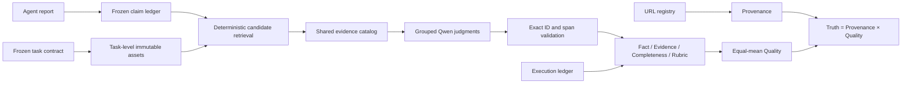

# DRA Qwen 评分器无语义变更扩展方案

日期：2026-07-30
状态：实施前设计与文献核验稿
适用分支：`feat/dra-world-index-scoring-v3`

## 1. 结论

DRA 当前的评分定义不需要因为调用量大而推翻。下一版只优化评分器的执行方式，不改变被评分的对象、四个轴的含义、聚合公式或 Judge 模型。

锁定的正式定义仍然是：

```text
Quality_t = mean(Fact_t, Evidence_t, Completeness_t, Rubric_t)
Truth_t   = Provenance_t × Quality_t
```

其中：

- `Fact`：报告中的 material claim 在冻结世界中是否成立；
- `Evidence`：报告引用是否与附近 claim 正确绑定、是否支持、是否为合适来源角色，并且是否在本次运行中被观察；
- `Completeness`：报告是否覆盖任务合同中的核心研究单元；
- `Rubric`：只检查 query 明示的任务遵循要求；
- `Provenance`：报告级全局乘数，继续承担 URL 合法性和来源真实性约束；
- 所有需要语义判断的正式项继续由同一个冻结版本的 Qwen3-8B 判断；
- 向量检索、BM25 和结构化查找只负责找候选证据，不直接产生分数。

可扩展性的核心不是“少评一些”，而是：

> 每条 material claim 仍然得到独立、可审计的 Qwen verdict，但多个 verdict 可以共享一次报告读取、一次证据读取和一次模型调用。

因此，下一版是计算图优化，不是指标改版。

## 2. 不允许改变的前提

以下内容是本方案的硬约束。

### 2.1 评分对象不变

- 不抽样 material claim；
- 不因规则置信度高而跳过正式 Qwen 判断；
- 不只核验报告已有引用，Fact 仍可通过冻结世界寻找其他证据；
- 不把向量相似度当作“支持”；
- 不把未引用的参数知识自动当作有证据；
- 不把写作 Elo 混入 Truth。

### 2.2 分数含义不变

优化前后的每个 item 都必须保留：

- 相同的 `claim_id`、`binding_id`、`unit_id` 或 `rubric_id`；
- 相同的候选证据范围；
- 相同的 verdict 标签空间；
- 相同的确定性后处理规则；
- 相同的轴内分母；
- 相同的四轴等权平均；
- 相同的报告级 Provenance 乘法。

### 2.3 Judge 不变

正式路径继续统一使用冻结的 Qwen3-8B：

- 固定模型文件哈希；
- 固定 prompt 与 JSON Schema 哈希；
- `temperature=0`；
- 固定 tokenizer 和 vLLM 版本；
- 禁用 Qwen thinking；
- 所有调用保留完整 request、response、解析结果和哈希。

MiniCheck、Gemini Flash 或其他小模型可以作为将来的对照实验，但不进入本轮正式实现。

## 3. 当前成本基线

当前完成的 R8 单题矩阵包含 11 份可评分报告。

| 项目 | 实测值 |
|---|---:|
| 成功评分报告 | 11 |
| 记录的 Judge call artifact | 3,176 |
| 其中缓存命中 | 1,875 |
| 本轮实际新推理 | 1,301 |
| artifact 大小 | 334 MB |
| 新推理时间窗口 | 2 小时 51 分 36 秒 |
| 每个新推理的表观平均间隔 | 约 7.9 秒 |

只读剖析器还得到以下阶段分布：

| 当前 artifact 阶段组 | logical calls | fresh calls | fresh 输入字符 |
|---|---:|---:|---:|
| Fact | 1,168 | 413 | 23,329,930 |
| Evidence/Completeness/Rubric 共用目录 | 434 | 161 | 4,953,396 |
| Claim structural | 550 | 276 | 1,557,561 |
| Claim NLI | 631 | 286 | 677,871 |
| Claim proposal | 393 | 165 | 553,576 |

Fact 只占约 31.7% 的 fresh calls，却占约 75.1% 的 fresh 输入字符。由此可见：

- 只减少 call 数不够，必须减少 Fact packet 中的重复 evidence text；
- Completeness/Rubric 大 batch 是低风险起点；
- Fact 的共享 evidence catalog 才是主要 token 优化点。

这里必须区分两个量：

1. `logical calls`：流水线认为发生了多少个判定调用，包括缓存命中；
2. `fresh inference calls`：GPU 实际重新执行了多少次推理。

R8 是经过多轮修复、重放和跨目录缓存复用后的结果，因此它不是干净的 cold-run 基线。用 3,176 或 1,301 直接外推都会有偏差。

如果只做数量级估算：

- 以 288.7 个 logical calls/报告外推，672 份报告约为 19.4 万次 logical calls；
- 以本轮 118.3 个 fresh calls/报告外推，约为 8.0 万次 fresh calls；
- 新报告不能保证获得 R8 的历史缓存命中，因此真实 cold-run 更可能落在两者之间。

所以第一项工程工作不是立刻跑 672 份报告，而是建立可复现的 cold-run 计量。

## 4. 同类工作如何处理成本

### 4.1 FActScore 与 SAFE：逐事实核验是合理骨架，但朴素实现很贵

[FActScore](https://aclanthology.org/2023.emnlp-main.741/)把长文本拆成 atomic facts，再计算被可靠来源支持的比例。这证明细粒度 claim 分母不是 DRA 独有的异常设计。

[SAFE](https://proceedings.nips.cc/paper_files/paper/2024/hash/937ae0e83eb08d2cb8627fe1def8c751-Abstract-Conference.html)同样使用“拆事实、搜索、逐事实判断”的自动化路径，并报告其相对人工评测的成本优势。两者共同说明：

- 长报告不能只给一个整体事实分；
- claim 级核验是合理的；
- 但如果每个 claim 都重复读取指令、报告和证据，调用量会随报告长度近似线性膨胀。

DRA 保留这条骨架，但利用冻结世界和共享执行减少重复计算。

### 4.2 DeepResearch Bench FACT：先去重，再逐对核验

[DeepResearch Bench](https://arxiv.org/pdf/2506.11763)的 FACT 路径先抽取 statement–URL pair，对相同事实和相同 URL 的重复 pair 去重，再逐一判断网页是否支持该 statement。

可直接兼容 DRA 的部分：

- 在语义核验前做严格的身份去重；
- 每个唯一 claim 或 binding 只贡献一次分母；
- 完整网页内容用于核验，不依赖 snippet；
- Judge 选择要通过人工样本校准。

该工作曾在 100 个 statement–URL pair 上比较较便宜的 Judge 与人工判断，并报告 support 与 not-support 的一致率。这说明“先做小规模人工校准，再决定大规模自动 Judge”是已有先例。

DRA 已经有 exact dedup 和 semantic dedup，但缓存与跨阶段复用还没有统一成全局内容寻址系统。

### 4.3 DeepResearch Bench II：一次判断 50 条 rubric

[DeepResearch Bench II](https://arxiv.org/pdf/2601.08536)共有 9,430 条细粒度二元 rubric。其正式评测不是每条 rubric 单独调用，而是将 rubric 分批送入同一个 Judge。

论文的 batch-size ablation 为：

| 每次 rubric 数 | 单任务成本 | ACC | F1 |
|---:|---:|---:|---:|
| full | 0.2025 | 90.80 | 87.06 |
| 80 | 0.2087 | 91.47 | 88.36 |
| 50 | 0.2513 | 91.75 | 89.57 |
| 10 | 0.4832 | 92.29 | 89.37 |
| 5 | 0.8298 | 90.39 | 85.66 |

作者最终采用 50 条/批。其[公开实现](https://github.com/imlrz/DeepResearch-Bench-II)还使用：

- 默认 `CHUNK_SIZE=50`；
- 默认 `MAX_WORKERS=10`；
- 每个 batch 返回逐 rubric 的独立 verdict、理由和原文证据；
- 严格核对返回条数和 rubric 原文；
- 失败时重试；
- 合并后再按维度聚合。

这与 DRA 的 Completeness/Rubric 最接近。它说明把 3 条或 7 条提高到更大 batch 是有文献依据的，但 DRA 仍需用 Qwen3-8B 做自己的 batch-size ablation。

### 4.4 DeepFact-lite：共享上下文联合核验相关 claim

[DeepFact](https://arxiv.org/pdf/2603.05912)专门研究 Deep Research Report 的事实核验。其 lite 版本把语义相关、证据重叠的 claim 放在一起，复用上下文和证据。

其公开结果为：

| 方式 | Accuracy | 输入 token | 输出 token | 成本 |
|---|---:|---:|---:|---:|
| 单 claim DeepFact-Eval | 83.4 | 516.9K | 18.6K | 1.16 |
| Group=5 | 77.9 | 131.4K | 4.9K | 0.30 |
| Group=10 | 76.3 | 93.5K | 3.5K | 0.21 |

结论不是“直接使用 10”。分组把成本降低约 74% 至 82%，但 Accuracy 下降 5.5 至 7.1 个百分点。

因此 DRA 可以采用“相关 claim 共享证据”的数据布局，却不能未经校准就把 batch=10 当作正式配置。

### 4.5 FaStFact：按文本块抽 claim，并使用完整页面证据

[FaStFact](https://aclanthology.org/2025.findings-emnlp.1295/)把 sentence-level extraction 改成 chunk-level extraction，减少重复调用，并使用抓取后的 document-level evidence，避免只依赖搜索 snippet。

DRA 可以采用：

- 更大的报告块做 claim proposal；
- 仍给每个 claim 保留精确 report span；
- 使用完整冻结页面的 span 作为核验材料。

DRA 暂不采用其 confidence-based pre-verification 跳过策略，因为这会改变“每条 material claim 都由 Qwen 裁决”的前提。

### 4.6 BatchPrompt：批处理存在顺序效应，必须审计

[BatchPrompt](https://proceedings.iclr.cc/paper_files/paper/2024/hash/5d8c01de2dc698c54201c1c7d0b86974-Abstract-Conference.html)显示，batch=32 可以大幅减少调用和 token，但也明确发现 item 在 prompt 中的位置会影响答案，因此使用 permutation 和 ensemble 恢复质量。

DRA 不需要对每个 batch 做昂贵的全量 ensemble，但必须增加：

- 固定、可复现的 item 排序；
- 分层抽取 5% 至 10% batch 做顺序置换复核；
- 置换 verdict 不一致时自动降级到更小 batch；
- 单 item 仍不一致时进入校准队列。

### 4.7 vLLM：前缀缓存已经启用，但当前 prompt 没有充分利用

[vLLM Automatic Prefix Caching](https://docs.vllm.ai/en/v0.10.1/features/automatic_prefix_caching.html)可以复用多个请求的相同长前缀，适合“同一长文档加多个不同问题”的负载。

DRA 当前启动脚本已经启用 `--enable-prefix-caching`。问题不是缺少该开关，而是：

- 多数调用串行提交，不能充分利用 continuous batching；
- 同一报告和同一证据在不同 JSON payload 中重复出现；
- 共享内容不一定处于完全相同的 token 前缀；
- 缓存只减少 prefill，不减少 verdict 输出的 decoding。

因此 APC 是辅助优化，不是主方案。

### 4.8 MiniCheck：可作为未来对照，不进入本轮

[MiniCheck](https://aclanthology.org/2024.emnlp-main.499/)表明专门训练的 770M fact checker 可以显著降低成本。这是以后训练或蒸馏 DRA verifier 的依据。

本轮不采用，因为用户已经锁定所有正式语义判断统一使用 Qwen3-8B。现在切换 Judge 会同时改变测量工具和成本，无法判断分数变化来自哪里。

## 5. 文献映射后的设计裁决

| 候选做法 | 是否采用 | 原因 |
|---|---|---|
| 多 item 一次 Qwen 调用 | 采用 | 不改变每个 item 的 verdict，只共享调用 |
| 相关 claim 共享证据目录 | 采用并校准 | 与 DeepFact-lite 一致，需验证 Qwen batch bias |
| task contract 每题构建一次 | 采用 | 完全不改变报告评分 |
| report claim ledger 每份构建一次 | 采用 | 后续各轴复用同一 claim 身份 |
| 全局内容寻址缓存 | 采用 | 完全相同的请求不应重复推理 |
| 有界并发提交 | 采用 | 改吞吐，不改 prompt 与分数 |
| 完整页面证据 | 保留 | 比 snippet 更适合 DR claim |
| confidence filtering | 不采用 | 会跳过部分正式 Qwen verdict |
| claim sampling | 不采用 | 会改变 Fact/Evidence 分母 |
| 更换小 Judge | 不采用 | 违反统一 Qwen 前提 |
| embedding 直接给分 | 不采用 | 相似不等于支持 |
| 修改四轴或 Truth 公式 | 不采用 | 超出本轮目标 |

## 6. 新执行架构



这里的 grouped judgment 只是运输方式。逻辑输出仍是：

```text
one input item -> one item ID -> one independent verdict -> one score contribution
```

## 7. 共享证据目录

当前 Fact packet 和 Evidence binding 往往重复携带相同页面片段。新格式把证据正文放在 batch 内一次，每条 claim 只引用允许使用的 span ID。

示例输入：

```json
{
  "shared_context": {
    "task_id": "dra_v3_dev_audio_0002",
    "world_version": "..."
  },
  "evidence_catalog": {
    "s_001": {
      "url": "https://...",
      "source_role": "product_listing",
      "text": "..."
    },
    "s_002": {
      "url": "https://...",
      "source_role": "encyclopedic",
      "text": "..."
    }
  },
  "items": [
    {
      "claim_id": "p_0001",
      "claim": "...",
      "allowed_span_ids": ["s_001", "s_002"]
    },
    {
      "claim_id": "p_0002",
      "claim": "...",
      "allowed_span_ids": ["s_001"]
    }
  ]
}
```

输出必须逐项返回：

```json
{
  "verdicts": [
    {
      "claim_id": "p_0001",
      "verdict": "true",
      "support_span_ids": ["s_002"]
    },
    {
      "claim_id": "p_0002",
      "verdict": "unresolved",
      "support_span_ids": []
    }
  ]
}
```

确定性验证器必须检查：

- 输出 ID 集合与输入 ID 集合完全相等；
- 每个 ID 恰好出现一次；
- 引用的 span 必须属于该 item 的 `allowed_span_ids`；
- true、false、conflicted 等 verdict 满足原有 span 合同；
- 任一条件失败时，该 batch 不直接计分，而是二分重跑。

这样可以共享证据，但不会让一个 claim 偷用另一个 claim 的证据。

## 8. 分阶段 batch 设计

不为所有阶段设置同一个 batch size。报告、claim 和证据的 token 结构不同，应按阶段校准。

### 8.1 第一轮不动 claim 集

最稳妥的顺序是先冻结当前 R8 claim ledger，再优化下游四轴判断。这样初期实验中：

- claim 数量不变；
- claim 文本不变；
- report span 不变；
- Fact/Evidence 分母不变；
- 任何分数变化只能来自 batch judgment。

### 8.2 候选 batch 网格

| 阶段 | 当前设置 | 第一轮候选 |
|---|---:|---:|
| Fact | 最多 4 条，70K chars | 4 / 8 / 12，token 动态封顶 |
| Evidence binding | 最多 8 条，70K chars | 8 / 12 / 16，按共享 URL 聚类 |
| Completeness atomic | 8 条 | 8 / 16 / 32 |
| Completeness research | 3 条 | 3 / 12 / 24 / 50 |
| Rubric | 7 条 | 7 / 16 / 32 / 50 |
| Claim NLI | 20 条 | 第一轮保持 20 |
| Claim structural | 18 条 | 第一轮保持 18 |
| Semantic dedup | 12 对 | 第一轮保持 12 |

批大小最终不按“条数”单独决定，而由两个上限共同控制：

```text
batch_size <= calibrated_item_cap
serialized_tokens <= calibrated_context_cap
```

### 8.3 第二轮再优化 claim proposal

当前 claim proposal 只有约 2,200 chars、最多 6 个 segment/次。这是调用量的明显来源。

第二轮测试：

- 2,200 chars / 6 segments，作为冻结基线；
- 6,000 chars / 12 segments；
- 10,000 chars / 16 segments。

无论 batch 多大，输出 claim 必须继续带原始 `segment_id` 和精确 report span，随后仍经过：

- NLI entailment gate；
- atomicity 和 qualifier fidelity gate；
- residual high-recall sweep；
- exact dedup；
- semantic dedup。

该阶段以 claim recall 为第一目标，不以调用数为第一目标。

## 9. 全局内容寻址缓存

当前 `AuditedJudge` 已按 request SHA-256 查缓存，但需要人工提供若干 cache root，并且只扫描指定目录的一层。下一版建立持久、不可变的全局 Judge CAS。

推荐 key：

```text
SHA256(
  judge_model_file_hash
  + tokenizer_hash
  + vllm_version
  + decoding_config
  + system_prompt_hash
  + response_schema_hash
  + canonical_payload_hash
  + world_version
)
```

缓存目录示例：

```text
judge-cas/
  qwen3-8b-r1/
    ab/
      abcdef.../
        request.json
        raw-response.txt
        parsed-response.json
        metadata.json
```

约束：

- 只读命中，绝不原地改写历史结果；
- 临时文件写完后原子 rename；
- 并发请求使用 lock，避免相同请求重复推理；
- model、prompt、schema、world 任一变化自动形成新 key；
- cache hit 仍复制或硬链接完整审计记录到本次 run；
- 排名结果同时报告 logical calls、fresh calls 和 cache hit rate。

这个缓存不改变 score。它只保证完全相同的问题不问 Qwen 第二次。

## 10. 并发与前缀复用

当前 vLLM 已启用 prefix caching。下一版增加 4 和 8 两档有界并发实验。

为了产生稳定前缀，payload 的字段顺序固定为：

1. task/world identity；
2. 完整报告或共享上下文；
3. evidence catalog；
4. 本 batch 的 item 列表。

同一报告的 batch 连续提交，使多个请求共享尽可能长的 token 前缀。

必须记录：

- queue wait；
- prefill tokens；
- cached tokens；
- decode tokens；
- wall time；
- batch split/retry 次数；
- GPU 峰值显存；
- 每分钟完成的 item 数。

并发度不是越高越好。最终取单位时间完成 item 数最高、且没有 OOM 和长尾恶化的档位。

## 11. 等价性验证

“公式没改”不等于“测量工具自动等价”。batch context 可能改变 Qwen verdict，因此必须把 instrument equivalence 当作正式实验。

### 11.1 验证集

第一层：R8 已冻结的 11 份报告

- 使用完全相同的 task contract；
- 使用完全相同的 claim ledger；
- 使用完全相同的 Fact packets；
- 对比 legacy-small-batch 与 optimized-batch。

第二层：人工校准 item

- Fact：true、false、conflicted、unresolved 分层；
- Evidence：support、unsupported、wrong binding、wrong role、unobserved 分层；
- Completeness：covered、partial、missing 分层；
- Rubric：fulfilled、partial、not fulfilled 分层；
- 特别增加数字、否定、条件、比较、跨来源综合和长上下文样本。

第三层：跨题型报告

- 从 56 题中选至少 6 个任务簇；
- 每题至少 3 个差异明显的 harness；
- 包含长报告、短报告、多引用、少引用、中文和英文。

### 11.2 预注册验收门槛

以下是实施前建议值，不是文献通用标准。正式实验前冻结，不能看完总榜后再调整。

| 检查 | 建议门槛 |
|---|---:|
| Provenance | bit-for-bit 相同 |
| item ID 保全率 | 100% |
| 非法 span 被接受 | 0 |
| claim extraction recall | 相对人工审计集不低于 98% |
| 每轴相对人工 gold 的 macro-F1 | 相对 legacy 非劣不超过 2 个百分点 |
| 单报告轴分绝对差中位数 | 不超过 0.02 |
| 未裁决的单报告轴分差 | 不超过 0.05 |
| Truth 排名相关 | Kendall/Spearman 至少 0.95 |
| 置换抽查 disagreement | 不超过 1%，否则降低该阶段 batch |
| fresh calls | 至少降低 4 倍为目标 |

若某个阶段没有通过：

- 不修改标签定义来追求通过；
- 降低该阶段 batch；
- 对不稳定类别保留小 batch；
- optimized scorer 继续标记为 diagnostic；
- 正式榜仍使用 legacy instrument。

### 11.3 顺序偏差处理

正式运行对 5% 至 10% 的 batch 做一次确定性置换：

1. 原顺序运行；
2. 按冻结 hash 排序后的另一顺序运行；
3. verdict 一致则接受；
4. 不一致则二分；
5. singleton 仍不一致则进入 `instrument_ambiguous` 或校准队列，沿用现有正式资格规则。

不是所有 batch 都做 ensemble，因此成本仍可控。

## 12. 实施顺序

### Phase 0：建立可信 cold-run 基线

- 新增统一 usage manifest；
- 清空临时 GPU KV cache，但保留并明确关闭/开启持久 CAS 两种模式；
- 在 11 份 R8 报告上记录 cold-run logical/fresh calls、tokens、wall time 和错误率；
- 不改任何 batch size。

交付物：

- `scorer-cost-baseline.json`
- `scorer-cost-by-stage.csv`
- `SCORER_COLD_RUN_BASELINE.md`

### Phase 1：持久 CAS 与有界并发

- 实现全局 request CAS；
- 实现相同 request 的并发去重；
- 加入 1/4/8 workers 吞吐实验；
- score 必须与 frozen artifact 重聚合结果完全一致。

这一阶段没有 semantic batching，风险最低。

### Phase 2：Completeness 与 Rubric 批处理

- 先优化 research units 和 rubric items；
- 完整报告仍对每个 batch 可见；
- 使用精确 ID、exact quote 和严格 Schema；
- 做 3/12/24/50 与 7/16/32/50 网格。

这是最接近 DeepResearch Bench II 的阶段。

### Phase 3：Fact 与 Evidence 的共享证据批处理

- 建立 batch 内 evidence catalog；
- 按 URL、source role 和语义相似性聚类；
- 每个 item 明示 allowed spans；
- 做 4/8/12 与 8/12/16 网格；
- 错误自动二分回退。

这是节省输入 token 的主要阶段，也是等价性风险最高的阶段。

### Phase 4：Claim proposal chunking

- 保持 NLI、structural、residual 和 dedup gates；
- 比较 2.2K/6K/10K 输入块；
- 优先满足 claim recall 门槛；
- 不因调用节省牺牲数字、否定和限定条件。

### Phase 5：扩大到现有报告

- 先评分已经成功交付的报告；
- 不为没有交付报告的 harness 伪造输入；
- 每完成一个任务立即封存 score packet；
- 生成旧 instrument 与新 instrument 的 crosswalk；
- 通过全部门槛后，才把新 instrument 标为 formal candidate。

## 13. 预期成本区间

本轮不承诺一个未经 cold-run 验证的精确倍数。合理目标为：

| 范围 | 当前数量级 | 优化目标 |
|---|---:|---:|
| 单报告 fresh calls | 约 118 至 289 的观测/外推区间 | 30 至 60 |
| 当前 108 份报告 | 约 1.3 万至 3.1 万 | 3,240 至 6,480 |
| 完整 672 份报告 | 约 8.0 万至 19.4 万 | 2.0 万至 4.0 万 |

这些是容量规划数字，不是实验结果。最终应以 Phase 0 cold-run 和 Phase 2/3 ablation 为准。

调用数也不是唯一成本指标。必须同时汇报：

- fresh input tokens；
- fresh output tokens；
- GPU-hours；
- wall-clock time；
- cache hit rate；
- item throughput；
- batch failure 和 fallback 比例。

## 14. 对论文方法章节的建议表述

可以表述为：

> DRA evaluates every extracted material claim and every citation-required binding with a frozen Qwen3-8B judge. To make exhaustive evaluation tractable without changing score semantics, the evaluator compiles item-wise decisions into audited semantic batches. Items may share immutable report context and deduplicated evidence spans, while each item retains its own identifier, admissible evidence set, verdict, and contribution to the original Fact, Evidence, Completeness, or Rubric denominator. Exact-set validation, recursive batch splitting, content-addressed caching, and batch-order audits prevent missing-item and cross-item leakage. Provenance remains a deterministic report-level multiplier, and the four semantic axes remain equally averaged.

同时必须诚实说明：

> Batching is an evaluator-instrument optimization, not assumed to be behaviorally neutral. We therefore calibrate batch size against human-labeled items and a frozen small-batch scorer, report per-axis non-inferiority and order-sensitivity tests, and version the optimized scorer separately until the acceptance criteria are met.

## 15. 最终决定

继续现有方案，但把“逐 claim 调一次模型”改成“逐 claim 得到一个 verdict，多个 verdict 共享一次模型调用”。

最先实施：

1. Phase 0 的 cold-run 计量；
2. 全局内容寻址缓存；
3. Completeness/Rubric 的大 batch；
4. Fact/Evidence 的共享证据 batch；
5. 最后才改 claim proposal chunk。

这条路径保留了 DRA 最重要的特点：

- 自动化；
- 可复现；
- 不依赖复杂的逐题人工 rubric；
- 能核验商品事实、网页获取、引用绑定和任务覆盖；
- 利用冻结环境；
- 12 个 harness 使用完全相同的程序；
- URL 真实性通过 Provenance 全局影响 Truth；
- 分数含义不随成本优化改变。
