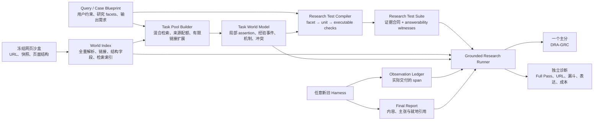
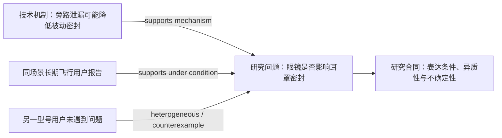

# DRA 沙盒原生 Deep Research 评测体系完整设计

> 版本：2026-07-18 Draft v3.1（LoHoSearch-informed redesign）  
> 状态：方法、数据构建、评分、验证与工程实施统一设计稿  
> 核心目标：利用冻结网页沙盒，在不全量理解所有网页语义、也不要求复现唯一答案路线的前提下，自动构建可审计的 Deep Research 任务，并衡量报告以本次真实观察证据完成了多少研究工作。  
> 关键变化：把旧版“全量 WCET/OFT 语义抽取”改为“全量轻量 World Index + 按题 Task World Model + 开放证据路线的 Research Test Compiler”；把 pivotality 从主分权重降为可选的建题与诊断工具。

---

## 0. 执行摘要：我们不需要拥有“所有事实”，需要拥有“评分协议所需的世界”

DRA 不应继续把 `Fact`、`ProofOfFetch`、`Completeness` 和 `Provenance` 压成几个报告级分数后加权或相乘；但也不应走向另一个极端：让 LLM 对 23 万页面逐页抽取所有自然语言事实，再把 Deep Research 报告降格成大量事实判断题。

[LoHoSearch](https://arxiv.org/abs/2606.12837) 提供了关键纠偏。它确实遍历完整英文 Wikipedia dump，但全量层只构建了约 762 万实体、2.65 亿超链接边以及来自 Wikidata 的实体类型；昂贵的关系描述抽取、问题生成、搜索验证和人工审核只发生在采样子图上。它采用的是：

$$
\text{全量廉价结构化}
\rightarrow
\text{局部昂贵语义处理}
\rightarrow
\text{自动与人工验证}
$$

DRA 应采用同一工程原则，但不能照抄 LoHoSearch 的唯一答案目标。LoHoSearch 评测“找到唯一实体”，DRA 评测“生成覆盖多个研究方向、综合多类证据、正确表达条件与冲突、最终对用户有用的报告”。因此新版采用三层资产：

1. **World Index（全量）**：URL、快照、哈希、页面类型、DOM 段落、结构化字段、链接和检索索引；
2. **Task World Model（按题）**：只对题目相关、协议可达的页面跨度抽取任务事实、经验事件、机制、冲突和证据角色；
3. **Research Test Suite（按题）**：从 query facets 与 Task World Model 编译“研究单元”，而不是把所有事实都变成得分项。

主分改名为：

> **DRA-GroundedResearchCoverage：报告以本次真实观察、正确绑定的网页证据，完成了多少用户要求的研究工作。**

每道题先从 query 得到一组平级研究方向 $\mathcal{F}_t$；每个方向包含若干研究单元 $\mathcal{U}_{t,f}$；每个研究单元再包含少量可执行检查 $\mathcal{K}_{t,f,u}$。检查可以是事实、比较、机制、冲突处理、跨来源综合、决策约束或行动建议，绝不只限于“一个说法是真是假”。

对第 $k$ 个检查：

$$
z_{t,f,u,k}
=
C_{t,f,u,k}\,E_{t,f,u,k}
$$

- $C=1$：报告完成该检查的内容合同；
- $E=1$：该检查的外部世界前提，沿任一合法证据路线通过 URL 在册、实际观察、就地绑定、语义支持和来源角色要求；
- 纯推理、格式和用户已给定信息可以声明为 evidence-exempt，此时 $E=1$，但其外部事实前提仍须通过其他检查。

研究单元、方向与任务分依次做等权 macro average。为便于执行摘要阅读，下式省略第 8 节定义的 applicability mask；正式 scorer 只平均适用且可归责的 checks/units/facets：

$$
R_{t,f,u}
=
\frac{1}{|\mathcal{K}_{t,f,u}|}
\sum_{k\in\mathcal{K}_{t,f,u}}z_{t,f,u,k}
$$

$$
F_{t,f}
=
\frac{1}{|\mathcal{U}_{t,f}|}
\sum_{u\in\mathcal{U}_{t,f}}R_{t,f,u}
$$

$$
\boxed{
\mathrm{DRA\text{-}GRC}_t
=
\frac{1}{|\mathcal{F}_t|}
\sum_{f\in\mathcal{F}_t}F_{t,f}
}
$$

这个层级平均有三个目的：

- 一个包含 30 个简单规格的方向不能淹没一个只有 3 个检查、但需要真正综合的方向；
- 部分通过来自“完成了多少检查”，不需要拍脑袋规定 0.5 分；
- 主分仍是一句话能说明白的比例，不重新发明复杂综合指数。

`Full Pass` 继续单独报告：所有核心研究方向和检查均完成、输出合同满足、无决定性矛盾。URL 造假、引用完整性、搜索—交付—利用漏斗、Research Quality Panel、成本和反事实证书仍然独立展示。

最核心的论文叙事改为：

> DRA does not semantically exhaust its entire sandbox. It exhaustively indexes the frozen world, compiles query-conditioned task worlds, and evaluates report-level research coverage through executable evidence contracts that accept any valid in-sandbox evidence route.

---

## 1. 我们究竟想评测什么

DRA 的研究对象不是“模型能不能背出一个答案”，也不是“报告是否写得像报告”。它要评测的是：

> 在一个有限、冻结、可完全审计的网页世界中，Deep Research agent 能否广泛发现任务所需信息，使证据进入可见上下文，在报告中正确综合并生成可追溯支持的结论。

这里必须严格区分四类任务：

| 任务 | 主要输出 | 主要难点 | DRA 是否等同于它 |
|---|---|---|---|
| Fact QA | 一个事实或短答案 | 找到并验证答案 | 否 |
| Deep Search | 少量难找答案 | 多跳定位与消歧 | 否 |
| Wide Search | 大规模实体/字段表 | 枚举完整性与去重 | 只覆盖 DRA 的部分“广度” |
| Deep Research | 长篇、结构化、有引用的综合报告 | 问题分解、跨来源证据、冲突与条件、综合和建议 | 是 |

[WideSearch](https://arxiv.org/abs/2508.07999) 明确把 Deep Research 描述为复杂叙事综合，而把自身任务定义为大规模原子信息收集；[DeepWideSearch](https://arxiv.org/abs/2510.20168) 又表明深度和宽度可以同时存在，但它仍以结构化表格的 Column/Row/Item F1 为主。DRA 的报告既包含可客观核验的底层事实，也包含不能用单一 exact match 表达的比较、因果解释、证据冲突、范围限定和决策取舍。

因此，新体系中的三个对象不能混为一谈：

- **Evidence atom**：网页中的一个结构化值、主张、机制说明或经验事件；
- **Research check**：对报告局部能力的可执行检查；
- **Research unit**：用户可感知的一个完整调研工作，例如“比较两款产品在十小时佩戴下的舒适风险并解释证据边界”。

Evidence atom 只作为证据和执行材料，不直接等于一分。真正进入主分分母的是 research units 及其少量 checks。

因此，评测必须同时覆盖四个层次：

1. **发现**：agent 是否找到了相关证据区域；
2. **观察**：支持内容是否真的被传递给了 agent；
3. **利用**：agent 是否在报告中正确使用并绑定了证据；
4. **完成**：报告是否基于证据完成了该研究要求。

DRA 还必须坚持以下工程原则：

- 自动化程度高；
- 结果可复现；
- 不依赖复杂的逐题人工 rubric；
- 能检查商品事实、页面获取、引用支持与答案键覆盖；
- 适合冻结环境；
- 对 12 个 harness 使用同一套语义和程序；
- 不要求 agent 复现出题者的唯一检索路线；
- 不要求 evaluator 预先枚举 agent 可能使用的全部 URL；
- 不把“世界模型没有抽到”自动判为报告错误；
- 不把 Deep Research 退化成唯一答案、事实数量或 URL 数量竞赛；
- 最终主排名简单、直观、可以一句话解释；
- 任何得分都能下钻到测试、证据和失败原因。

这些原则不是附加要求，而是 DRA 相对于开放网络、纯 LLM judge 基准的核心优势。

---

## 2. 当前方案与问题

### 2.1 旧公式

当前思路大致是：

$$
Q_t
=
0.39F_t+0.28PoF_t+0.33C_t
$$

$$
Truth_t
=
Provenance_t\times Q_t
$$

其中：

- $F_t$：结构化事实正确度；
- $PoF_t$：Proof of Fetch；
- $C_t$：答案键覆盖；
- $Provenance_t$：引用来源与运行轨迹的真实性。

### 2.2 旧方案不是“完全错误”，而是抽象层级不对

旧方案已经抓住了三个重要问题：

- 报告写了什么；
- agent 是否真的获取了网页；
- 答案是否覆盖了预期内容。

所以旧实现可以保留为历史 baseline，也可以把其中的检测器继续复用。但它不适合作为最终主公式，原因如下。

### 2.3 `Fact` 经常接近无效项

现有 Fact 主要检查价格、总评分等少量结构化字段。对于需要比较技术机制、长期体验、冲突观点和推荐取舍的 Deep Research 任务，这些字段并不能代表报告是否做好了研究。

如果某道题没有足够的可比结构化事实，Fact 会变得稀疏、失活，或只奖励任务外围的数字。

因此：

> Fact 不应继续作为固定权重的报告级主轴；它应下沉为若干研究测试的确定性验证器。

### 2.4 `ProofOfFetch` 是过程证据，不是报告质量

抓取过页面只说明页面进入了工具链，不说明：

- agent 看到了支持该命题的具体段落；
- 页面支持报告附近的说法；
- 引用正确绑定到该说法；
- agent 没有依靠参数记忆猜出答案。

把 PoF 独立加权，会奖励“抓了但没有用”，也无法充分惩罚“写对了但没看证据”。

### 2.5 `Completeness` 容易退化为答案键 URL 覆盖

如果答案键由出题时使用的页面生成，Completeness 很容易隐含要求 agent 复现出题者路线。这样测到的可能是：

> 是否找到了我们预先选定的页面。

而不是：

> 是否找到了任何真实、足够、适合支持同一研究结论的证据。

### 2.6 报告级乘法无法表达局部证据关系

`Truth = Provenance × Quality` 看似直观，但存在两个结构性问题。

第一，惩罚发生在报告级。一个关键结论无证据，可能只让总体 Provenance 小幅下降，却仍被其他部分的高质量抵消。

第二，Quality judge 往往已经受到“引用多、写得像研究报告”的光环影响，再乘 Grounded 可能重复计分。

证据门最合理的位置不是整篇报告末尾，而是每一个可验证研究要求内部。

### 2.7 任意权重与指数难以自圆其说

`0.39/0.28/0.33` 或 `Provenance^1.5` 的最大问题不是数值一定错，而是：

- 很难从评测构念推导；
- 换一组权重可能改变排名；
- 审稿人会追问为什么不是其他数字；
- 权重掩盖了不同错误的实际含义。

因此，新方案应该尽量把“分数”变成通过测试的比例，而不是人为混合多个不可比的量。

---

## 3. 文献地图：哪些工作真正解决了我们的问题，哪些只解决了相邻问题

新版设计不是从单篇论文照搬，而是把不同工作中能够互相兼容的部分组合起来。以下比较全部以论文原文描述为准。

### 3.1 LoHoSearch：全量的是链接图，不是所有页面语义

[LoHoSearch](https://arxiv.org/abs/2606.12837) 从完整英文 Wikipedia dump 构建图：页面是节点，正文超链接是有向边，Wikidata `P31` 是实体类型，入度是流行度。最终图约有 762 万节点和 2.65 亿条边。随后它采样两类局部子图：

- 树结构默认使用 $N=3$ 个一级关系、每个中间实体 $M=2$ 个二级关系，并要求删除任一一级关系后答案不再唯一；
- 图结构最多 10 个实体，通过全图回溯搜索检查是否存在满足相同类型与邻接约束的替代解。

只有被采样的边和叶属性才交给 DeepSeek-V3.2 做描述抽取、实体隐藏、问题生成和自动验证；最终问题再经多搜索 agent 排除替代答案，并由专业标注者审核。最终 544 题中，75.5% 直接通过人工审核、22.3% 轻微修改、2.2% 严重问题淘汰；只有 70.8% 被人工明确确认唯一，剩余 29.2% 是“未找到替代答案”而非严格证明不存在。

这对 DRA 有两条直接启示：

1. 大世界可以全量建廉价结构索引，但不应全量做开放式语义抽取；
2. 即使目标只是唯一实体，自动构建仍需要多轮验证和人工抽查，因此 DRA 必须报告 compiler 的误差边界，不能把自动抽取称为绝对真理。

### 3.2 DEEPRUBRIC：先有证据结构，再共同生成 query 和评价目标

[DEEPRUBRIC](https://arxiv.org/abs/2606.17029) 从种子主题出发，逐层检索并扩展 evidence tree；每个叶节点包含子问题和支持文档，再自底向上共同生成 query 与 rubrics。其树最大深度为 3，分支预算随层级下降，最终树平均约 54.48 个节点、38.66 个叶子。这个机制证明了“证据优先、query 与评价目标同源”可以显著改善对齐。

但它面向 RL 训练数据，叶子 rubric 与构造证据天然耦合，而且最终仍用 rubric reward。DRA 应借它保证 query—evidence—test alignment，不应把叶子 witness URL 变成运行时白名单。

### 3.3 QUBRIC：query 结构决定 rubric 是否可判，但 probe 只能用于构建期过滤

[QUBRIC](https://arxiv.org/abs/2606.03968) 指出，欠结构化 query 会生成模糊、不可验证的 rubric；它通过 query–rubric co-design 和 learnability filtering 保留策略通过率处在一定区间的样本。DRA 可以借鉴“全过/全挂均需检查”的原则，但不能用正式 12 个 harness 的输出来动态修改正式测试，否则 benchmark 会绑定当前参赛者。

正式做法应是：使用固定、公开披露的 construction probes 与合成好坏报告过滤开发题；正式提交开始前冻结测试；新 harness 只被评分，不参与重写测试。

### 3.4 WideSearch 与 DeepSearchQA：广度必须有分母，但它们的答案形态比 DRA 简单

[WideSearch](https://arxiv.org/abs/2508.07999) 把广度写成实体集合和表格字段，通过 Row F1、Item F1 与严格 Success Rate 衡量；[DeepSearchQA](https://arxiv.org/abs/2601.20975) 对穷尽答案集合使用 precision、recall 和 F1，并同时报告完全正确率。二者都证明只报 full success 会掩盖“最后一公里”差距，连续完成度非常必要。

但是 DRA 的自然输出不是表格集合。我们不能直接把报告拆成所有 noun phrase 后算 F1，而应先把 query 编译成平级 research facets，再衡量每个方向中的研究单元完成度。

### 3.5 DeepWideSearch：深度与宽度需要分解诊断，不能由篇幅代替

[DeepWideSearch](https://arxiv.org/abs/2510.20168) 同时报告 Column F1、Row F1、Item F1、核心实体准确率和 Success Rate，并发现强 depth 表现并不保证强 width 表现。其错误分析还区分了反思不足、依赖参数知识、检索不充分和上下文溢出。

DRA 应同样分别报告：

- facet 覆盖和 research-unit 覆盖；
- 单页事实、跨页比较、跨来源综合、冲突处理和决策测试；
- 发现、观察、利用和最终通过漏斗。

但这些是诊断分解，不应重新加权成多个竞争性主分。

### 3.6 DeepResearchGym：冻结检索环境并不要求全量语义 ground truth

[DeepResearchGym](https://arxiv.org/abs/2505.19253) 索引 ClueWeb22 和 FineWeb 的大规模冻结语料，提供稳定的 `/search` 与 `/fetch`，但它没有把数亿页面全部编译成事实图。其评测使用用户点击文档抽取 key points，分别报告 Key Point Recall、Key Point Contradiction、citation recall、citation precision、clarity 和 insightfulness。

它说明冻结环境首先解决的是检索可复现、快照可访问和运行可审计；语义评价仍然可以按任务或参考集合局部构建。DRA 的差异是我们还掌握 observation ledger，可以判断支持跨度是否真的交付给 agent。

### 3.7 DeepResearch Bench：报告质量和引用事实性确实会分离

[DeepResearch Bench](https://arxiv.org/abs/2506.11763) 使用 RACE 评估 comprehensiveness、depth、instruction following 和 readability，使用 FACT 评估 citation accuracy 与 effective citations。论文结果显示，不同系统在报告质量和引用准确性上的排序并不相同；它的人类一致性实验也提示，开放式报告 judge 必须校准。

DRA 不采用参考报告相似度作为主分，但保留两点：研究完成度与引用支持必须区分建模；长报告的综合、冲突表达、用户效用和 Presentation 需要独立面板与人工一致性报告。

### 3.8 ALCE 与 FActScore：claim precision 不能替代 query-conditioned recall

[ALCE](https://aclanthology.org/2023.emnlp-main.398/) 分开 citation correctness 与 citation completeness；[FActScore](https://aclanthology.org/2023.emnlp-main.741/) 衡量输出中原子事实被来源支持的比例。两者都很适合检查“已经说出的内容”，却不能自动得到“用户要求但报告遗漏的研究方向”。

因此 DRA 仍需由 query 和任务世界生成分母。全报告 claim audit 只作事实性与引用诊断，不能承担主广度分。

### 3.9 BrowseComp-Plus：冻结证据集有价值，但固定 gold documents 会绑定路线

[BrowseComp-Plus](https://arxiv.org/abs/2508.06600) 通过固定语料、支持文档和困难负例把答案、检索与引用拆开评估。这证明冻结语料可以做精确审计，但它主要处理少量答案和预验证支持文档。

DRA 必须更开放：已知 witness 只证明测试可答，不是运行时允许列表。任何在册、已观察、角色合适且确实支持同一前提的页面都应能通过。

### 3.10 G-Retriever：相关子图可以按问题选择，不必把整图塞给语义模型

[G-Retriever](https://arxiv.org/abs/2402.07630) 将问题相关子图检索写成 Prize-Collecting Steiner Tree，说明大型文本图可以先做结构检索，再把紧凑子图交给生成模型。DRA 第一版不必直接采用 PCST，但应保留相同原则：全量索引、局部选择、有限语义编译。

### 3.11 Correctness is not Faithfulness：正确引用不等于结论因果依赖证据

[Correctness is not Faithfulness in RAG Attributions](https://arxiv.org/abs/2412.18004) 区分 citation correctness 与 attribution faithfulness。DRA 的 observation ledger 能排除“引用了本次根本未交付的页面”，反事实双胞胎世界还能进一步检查结论是否随证据改变。该能力应作为独立审计证书，而不是强行乘入所有任务主分。

### 3.12 其他 DR 基准：为什么仍然需要“研究广度 + 运行内证据 + 长报告质量”三者并存

| 工作 | 值得吸收的机制 | 仍未解决的 DRA 问题 |
|---|---|---|
| [ResearcherBench](https://arxiv.org/abs/2507.16280) | 专家 insight rubrics、Faithfulness/Groundedness 分解，重视研究洞察 | 领域窄、人工成本高；“有引用”不等于本次交付且真实支持 |
| [Mind2Web 2](https://arxiv.org/abs/2506.21506) | 树状 evaluator 同时报 partial completion 与 full success | 叶节点多、人工构造昂贵；不是引用真实性和长报告综合评测 |
| [FutureSearch DRB / RetroSearch](https://arxiv.org/abs/2506.06287) | 冻结网页集合证明离线可复现研究环境有现实价值 | 任务答案形式混合，语料召回仍可能漏掉新路线；没有 DRA 的 span delivery audit |
| [DeepResearch Bench II](https://arxiv.org/abs/2601.08536) | 从专家 survey 反向构题，并细分 information、analysis、presentation | 大量专家 rubric 成本高，也可能继承单篇参考报告的内容路线 |
| [DREAM](https://aclanthology.org/2026.acl-long.448/) | 关键内容、事实性、引用与写作分开评估，承认报告是多维产物 | 开放网络 evaluator 本身会形成检索偏差；关键点分母仍由 evaluator 生成 |
| [DeepFact](https://aclanthology.org/2026.acl-long.1586/) | 允许 challenger 用证据挑战 gold，说明复杂事实审计需版本化治理 | 专注高风险 claim，不测完整报告广度、综合和用户效用 |

这些工作共同支持两个结论。第一，完整 DR 不能压成单一事实准确率；第二，多维度值得报告，但不意味着必须把所有维度加权成一个总分。DRA 的主分聚焦“有证据研究覆盖”，长报告综合质量、完整通过、integrity、成本与反事实敏感性分别提供互补证书。

### 3.13 综合裁决

| 文献机制 | DRA 采用 | DRA 不照抄 |
|---|---|---|
| LoHoSearch 全量链接图、局部问题生成 | 全量 World Index、局部 Task World | 唯一答案与全图回溯唯一性 |
| DEEPRUBRIC evidence-first co-generation | 证据组合、query、research tests 同源 | witness URL 绑定和训练 reward 公式 |
| WideSearch / DeepSearchQA 连续覆盖 + strict success | Grounded coverage + Full Pass | 把长报告当成集合表格 exact match |
| DeepResearchGym 冻结搜索和多轴评测 | 稳定检索、key-point 思想、引用 P/R 诊断 | 依赖用户点击文档作为完整任务分母 |
| DeepResearch Bench 多维报告 judge | Research Quality Panel 与人工校准 | 参考报告相似度和多维加权主分 |
| ALCE / FActScore claim audit | 支持性、引用完整性诊断 | 用 claim precision 代替研究广度 |
| BrowseComp-Plus 固定语料审计 | hard negatives、oracle retrieval 消融 | 固定 gold URL 路线 |

由此得到的设计原则是：**世界层尽量确定性，语义层按题构建；任务分母来自 query-conditioned research structure；证据接受按合同而不是 URL 白名单；主分测有证据研究覆盖，报告表达与系统成本独立展示。**

---

## 4. 核心架构：Closed Documents, Task-Scoped Semantics, Open Evidence Routes

### 4.1 我们真正“闭合”的是什么

DRA 可以穷尽和冻结的是文档世界，而不是自然语言的全部语义：

$$
\boxed{
\text{Closed document universe}
\neq
\text{complete semantic universe}
}
$$

可辩护的闭合对象包括：

- benchmark 版本允许访问的 URL 集合；
- 每个 URL 的冻结快照、状态、跳转和内容哈希；
- 页面被解析出的稳定 span、表格、帖子和链接；
- 本次运行实际向 agent 交付的文本跨度；
- 固定 compiler 在单题范围内生成的语义资产和研究测试。

不可声称闭合的对象包括：

- 每张网页中所有可能的自然语言命题；
- 所有合理人类解释；
- agent 可能生成的无限搜索词；
- 所有可能的综合路线；
- 沙盒之外的现实世界真理。

因此停止使用 `Omniscient Fact Table`。`WCET` 也不再指一个全语义总表，而只作为历史术语保留。新版正式资产为 `World Index`、`Task World Model` 和 `Research Test Suite`。

### 4.2 三层资产与一层运行审计

#### Layer 1：World Index（WI）

对全部冻结页面做一次性、廉价、版本化处理：URL、页面结构、span、表格、帖子、结构化字段、链接图、稀疏/稠密检索索引和来源角色。它回答“世界里有哪些文档，文档结构是什么，如何找到它们”。

#### Layer 2：Task World Model（TWM）

针对某一道题，只在候选页面跨度上抽取任务语义：实体、规格、厂商主张、测量、技术机制、社区经验、限定条件、冲突和不确定性。它回答“这道题的可达证据区域里说了什么”。

#### Layer 3：Research Test Suite（RTS）

从 query facets、Case Blueprint 与 TWM 生成少量 research units 和 executable checks。它回答“怎样才算把这项调研工作完成”。

#### Layer 4：Execution Audit

使用 report、citation、URL registry 和 observation ledger 执行测试。它回答“足够证据是否在本次运行被交付，并在报告中正确绑定和使用”；不声称直接观察模型内部阅读过程。

### 4.3 与 LoHoSearch 的同与不同

| 维度 | LoHoSearch | DRA v3.1 |
|---|---|---|
| 全量世界层 | Wikipedia 节点、链接、类型、入度 | 所有沙盒页面、span、结构字段、链接、检索索引 |
| 局部语义层 | 采样子图的关系描述 | 单题相关 span 的事实、经验、机制、冲突和证据角色 |
| query 目标 | 隐藏实体，唯一答案 | 多 facet 用户研究需求，多种合理结论 |
| 构造保证 | 删除关系后的唯一性与全图回溯 | facet 对齐、可答性、来源组合、替代路线与报告效用 |
| 评分对象 | 最终实体答案 | 有证据的研究覆盖、完整通过和报告诊断 |
| 路线政策 | 满足图约束即可找到唯一实体 | witness 只证可答，任意合格在册证据均可通过 |

### 4.4 为什么这是 Deep Research，而不是复杂 QA

TWM 中的底层 assertion 可以有 `entailed / contradicted / unknown` 状态，但 RTS 不把整篇报告变成 assertion accuracy。一个研究单元可以要求：

- 在共同维度比较多个候选；
- 解释参数的物理意义及不能推出的结论；
- 区分厂商主张、独立测量和社区经验；
- 识别证据在不同条件下表面冲突；
- 将证据与用户预算、场景和风险偏好连接；
- 给出多个合理分支或明确的不确定结论；
- 提供可执行教程、预算拆分或购买建议。

所以原子真假只是证据层，研究完成度才是评分层。

### 4.5 Open-route, closed-world

“不绑路线”不要求提前穷尽所有等价 URL。对测试 $u$，compiler 冻结的是证据合同 $\Gamma_u$：需要支持哪些前提、允许什么来源角色、证据如何组合、哪些推断不允许。

$$
\mathcal{A}_u
=
\{E\subseteq W:\ E\models\Gamma_u\}
$$

构题时保存的 `answerability_witnesses` 只是一个已知子集：

$$
K_u\subseteq\mathcal{A}_u
$$

运行时，agent 使用一个从未出现在 $K_u$ 的页面也可以通过，只要它：

1. 属于冻结 registry；
2. 支持跨度本次确实交付；
3. 引用与报告附近 claim 正确绑定；
4. 语义上满足合同中的前提；
5. 来源角色和范围适合该推断。

第一次遇到的替代证据由冻结 matcher 在线判定并缓存为证书；它不需要等待 benchmark 作者修改 rubric。这样“正式测试固定”和“未来 harness 路线开放”可以同时成立。

### 4.6 执行流程图



### 4.7 rubric 并没有消失，而是换了形态

传统 rubric：

> 应充分讨论技术、价格、用户体验和推荐；由 judge 给 0—5 分。

新版 research unit：

> 对“技术是否只是营销”这一 facet，报告须完成三个 checks：准确转述产品主张；用合格机制或测量证据说明它能与不能推出什么；把结论连接到用户场景。所有外部前提必须由本次观察、就地引用且角色合适的 span 支持。

它仍包含语义判断，但判断被约束到具体 report span、具体 evidence span 和具体合同，不再让 judge 凭整体印象打一个分。

---

## 5. World Compiler：每一层到底抽什么、怎么抽、抽错了怎么办

### 5.1 输入与版本边界

World Compiler 的根输入不是网页 URL 列表，而是一个完整 `WorldSnapshot`：

```json
{
  "snapshot_id": "dra-world-2026-07",
  "registry_hash": "sha256:...",
  "allowed_source_families": ["shop", "forum", "wiki", "technical"],
  "search_index_version": "search-v3",
  "parser_version": "page-parser-v1",
  "embedding_version": "embed-v1",
  "ontology_version": "dra-ontology-v1"
}
```

任何 URL、页面正文、parser、retriever、ontology 或 semantic matcher 改变，都必须生成新的 manifest。正式榜单结果绑定完整 manifest hash，不能只写“使用 2026 年 7 月语料”。

### 5.2 World Index：全量执行的九件事

对 registry 中每个 URL 全量执行：

1. URL canonicalization、redirect chain 与 source identity；
2. HTTP 状态、MIME、语言、抓取时间和内容哈希；
3. 主体正文解析，同时保存原始 DOM/结构化响应引用；
4. section、paragraph、list item、table cell、forum post 等稳定 span；
5. 页面级与 span 级出链；
6. JSON-LD、商品规格表、论坛层级等确定性结构字段；
7. 页面类型、来源 family 和初始 source role；
8. BM25、dense embedding 和实体别名检索索引；
9. exact duplicate 与 near-duplicate 页面簇。

这里不调用开放式 LLM 去列举页面所有事实。全量成本应主要是线性解析、索引和 embedding，而不是每页几十次语义推理。

### 5.3 页面与 span schema

```json
{
  "page_snapshot_id": "ps_...",
  "canonical_url": "http://localhost/...",
  "redirect_chain": [],
  "http_status": 200,
  "source_family": "shop",
  "page_type": "product",
  "snapshot_id": "dra-world-2026-07",
  "content_hash": "sha256:...",
  "parser_version": "page-parser-v1"
}
```

```json
{
  "span_id": "span_...",
  "page_snapshot_id": "ps_...",
  "section_path": ["Specifications", "Battery"],
  "block_type": "paragraph|table_cell|post|jsonld",
  "dom_path": "...",
  "char_start": 1024,
  "char_end": 1217,
  "text_hash": "sha256:...",
  "outgoing_url_ids": [],
  "embedding_id": "emb_..."
}
```

复杂表格不能只扁平化成一段文字；必须保留 header、row、column 和 cell 关系。论坛也必须保留 post、reply、quote 与 author 结构。否则后续证据绑定看似 span-level，实际已经丢掉语义上下文。[FEVEROUS](https://aclanthology.org/2021.fever-1.1/) 证明了文本与表格联合证据在事实验证中的必要性。

### 5.4 Query / Case Blueprint 先编译成 Task Contract

对于自动生成题，优先读取构题时保存的 `Case Blueprint`；对于前 14 道人工 seed query，使用冻结 parser 提取并由双人抽样审核。Task Contract 至少包含：

```json
{
  "task_id": "...",
  "intent_type": "buying_dilemma",
  "entities": ["product_a", "product_b"],
  "user_constraints": ["budget", "noisy_environment"],
  "requested_facets": [
    "technology",
    "price_value",
    "community_experience",
    "recommendation"
  ],
  "requested_outputs": ["comparison", "honest_conclusion", "recommendation"],
  "time_scope": "snapshot"
}
```

注意：`requested_source_roles` 不能凭 benchmark 偏好机械写成“三源齐全”。只有当某个 facet 的认识论功能确实需要官方主张、机制解释或社区经验时，compiler 才生成对应角色合同。

### 5.5 Task Candidate Pool：全库召回，但语义只在局部抽

对每个 `entity × facet × source_role` 组合建立候选池。初始集合为：

$$
P_t^{(0)}
=
\bigcup_{q\in Q_t^{compiler}}
\left[
\mathrm{Exact}(q)
\cup
\mathrm{BM25TopK}(q)
\cup
\mathrm{DenseTopK}(q)
\right]
$$

第 $\ell+1$ 轮扩展：

$$
P_t^{(\ell+1)}
=
P_t^{(\ell)}
\cup
\mathrm{Links}\bigl(P_t^{(\ell)}\bigr)
\cup
\mathrm{Search}\bigl(\mathrm{UncoveredFacets}_\ell\bigr)
$$

工程步骤为：

1. 商品型号、SKU、品牌—型号别名精确匹配；
2. 扫描商品结构化字段；
3. BM25 高召回检索；
4. dense 检索补语义改写；
5. 独立 reranker 重新排序；
6. 对高相关页面做 1—2 hop 链接扩展；
7. 按 source role 和 facet 设置最低配额；
8. exact model match 不得因 dense 分数低被裁掉；
9. 去除同页重复 span 与镜像内容；
10. 记录每个 span 被召回的原因和 rank。

停止条件不是“我们已经找到了世界上所有相关页面”，而是满足任一冻结规则：

- 达到页面/span 预算；
- 连续两轮没有新增 facet 或 source-role coverage；
- 新 assertion、新证据合同候选和新冲突簇的边际增量低于阈值；
- 独立 retriever 的池外抽样不再发现高影响新证据。

必须画 saturation curve：横轴为候选页或语义调用预算，纵轴为新增 facet、assertion、route family 和 research checks。用曲线说明预算足够，不能用“BFS 完成”冒充自然语言搜索闭包。

### 5.6 两阶段局部语义抽取

#### 阶段 A：高召回 assertion proposal

只向 extractor 提供 task candidate span、必要的局部上下文和目标 ontology。输出自包含 assertion，并保留：

- 主体与型号；
- 谓词和对象；
- 极性、否定和量词；
- 时间、版本、人群和使用条件；
- 说话者或发布者；
- source role；
- 原始 span ID。

#### 阶段 B：高精度 verifier

独立 verifier 逐条检查：

1. assertion 是否能从给定 span 推出；
2. 是否补入了页面没有的实体、条件或因果；
3. 是否遗漏否定、概率、时间和范围限定；
4. 是否把“页面宣称”错误提升成“客观测量”；
5. 是否应当 `abstain`。

[Claimify](https://aclanthology.org/2025.acl-long.348/) 和 [Document-level Claim Extraction](https://aclanthology.org/2024.acl-long.645/) 都说明 claim extraction 的覆盖与去语境化本身就是需要校准的任务，不能把 extractor 输出默认当 gold。

### 5.7 Assertion schema：保存“谁在何种条件下说了什么”

```json
{
  "assertion_id": "a_audio_ipx7_001",
  "subject_id": "soundcore_flare_2",
  "predicate": "has_ingress_rating",
  "object": {"type": "categorical", "value": "IPX7"},
  "polarity": "positive",
  "modality": "manufacturer_claim",
  "qualifiers": {
    "variant": null,
    "time": "snapshot",
    "condition": null,
    "population": null
  },
  "source_role": "product_primary",
  "support_span_ids": ["span_..."],
  "extractor_version": "task-extractor-v1",
  "verification_status": "accepted",
  "confidence": 0.96
}
```

`modality` 至少区分：

- `structured_fact`；
- `manufacturer_claim`；
- `retailer_claim`；
- `measured_result`；
- `community_experience`；
- `mechanism_explanation`；
- `derived_inference`。

这使“产品页写着 IPX7”和“独立测试证明某次浸水后仍工作”成为两个不同命题，而不是一个布尔事实。

### 5.8 商品页具体怎么抽

优先确定性解析：

- 品牌、规范型号、SKU 和 variant；
- 冻结时价格、币种和促销状态；
- 尺寸、重量、功率、电池、连接、编解码器、防护等级；
- 保修、兼容性、评分与评论量；
- JSON-LD、数据库字段、规格表和明确标签。

对正文只局部抽取：

- 营销声明；
- 性能承诺；
- 比较性语言；
- 测试条件；
- caveat、兼容限制和例外。

单位规范化保存原值与标准值，例如 `2 × 20W Max` 不能在没有规则时规范成 `40W continuous`。`THD+N < 1%` 也不能自动推出“高音量更干净”，除非页面提供可比较的测量条件。

### 5.9 论坛和社区页具体怎么抽

先做结构恢复：thread、post、author、timestamp、reply、quote block。抽取前剔除引用文本，防止把前帖观点归给回复者。每条经验保存为事件：

```json
{
  "product_id": "...",
  "speaker_id": "...",
  "experience_type": "ownership|trial|hearsay",
  "duration": "10 months",
  "use_context": ["long_flight", "wears_glasses"],
  "reported_outcome": "seal_loss",
  "sentiment": "negative",
  "hedging": "sometimes",
  "comparison_target": null,
  "post_span_id": "span_..."
}
```

一条论坛证据默认只支持：

> 某位用户在某个条件下报告了某种体验。

它不支持“所有用户必然如此”。聚合 community pattern 前必须：

- 按作者、转贴和引用去重；
- 区分同型号、同品类和无明确型号；
- 区分长期持有、短暂试听和转述；
- 保留场景与持续时间；
- 不在没有明确样本分母时生成百分比。

不同用户在不同条件下的不同体验首先标为 `heterogeneous_reports`，不是自动标成逻辑矛盾。

### 5.10 Wikipedia、标准和技术页具体怎么抽

全量层只保存 section、paragraph、table、anchor、infobox 与 page-link graph。Task World 层按候选 span 抽取：

- 定义；
- 机制或因果关系；
- 标准含义；
- 测量方法；
- 物理限制；
- 适用条件、例外和边界。

标准或技术 assertion 还要保存文档版本、clause/section、normative/descriptive、作用对象和适用范围。

一般机制不能直接证明具体商品表现。应用必须存在 bridge：

$$
\mathrm{ProductUses}(p,x)
\land
\mathrm{Mechanism}(x,c\Rightarrow y)
\Rightarrow
\mathrm{ConditionalInference}(p,c\Rightarrow y)
$$

如果 `ProductUses` 或条件 $c$ 没有证据，就不能从百科机制页推出该商品结论。

### 5.11 证据合同、Evidence Class 与 Route Family

预先“枚举所有等价页面”不可证明，也没有必要。新版分三层：

1. **Evidence contract**：测试需要什么命题、角色、范围和聚合关系；
2. **Evidence class**：已经确认可以替代支持同一叶前提的 span；
3. **Route family**：共同完成复合结论的一组最小证据角色或前提。

例如审核 IPX7：

```text
Route family A
  同型号商品页的 IPX7 声明
  AND
  合格技术/标准页对 IPX7 范围的解释

Route family B
  同型号、角色合格的零售规格
  AND
  另一份合格技术解释
```

测试不保存“只能 URL A + URL B”。[Minimal Evidence Groups](https://aclanthology.org/2025.trustnlp-main.8/) 同样强调一个复合 claim 可能由不同最小证据组完整支持。

运行时若报告引用了 registry 中、但 Task Candidate Pool/TWM 未收录的页面，不能因“不在 gold”直接失败。开放路线 fallback 固定为：

1. 解析引用 URL 与局部 report claim；
2. 从 World Index 取回本次真正交付的 cited span 与相邻上下文；
3. 使用同一冻结版本的按需 extractor 生成带 span 的候选 assertion；
4. 用 frozen matcher 检查它能否满足 evidence contract 的命题、范围、角色与组合要求；
5. 通过则写入只读 evidence certificate cache，不修改 RTS；
6. 反驳、不支持或角色不合适则按失败码拒绝；
7. matcher `abstain` 且该证据决定分数时，标为 `withheld_for_review`，不能把 evaluator 不确定性算作 agent 错误。

因此 Evidence Class 是“已经认证的可替代 spans 集合”，其数量只是已知下界，不代表语义完备；真正的开放性由这条 on-demand 路径和 held-out route FRR/FAR 验证。

### 5.12 冲突检测不是所有 assertion 两两 NLI

先用确定性 blocking 生成候选对：

- subject 与 variant 相同；
- predicate 相同或 ontology 中互斥；
- 时间范围重合；
- 条件与人群可比较；
- 数值单位已规范化。

再判定关系：

```text
equivalent
supports
narrows
qualifies
contradicts
temporally_supersedes
heterogeneous_reports
independent
unknown
```

只有在同一个 frame 下不能同时成立，才叫 `contradicts`。数值冲突优先用区间和单位规则；类别冲突优先用 ontology；剩余语义才交给冻结 judge。[AmbiFC](https://aclanthology.org/2024.tacl-1.1/) 提醒我们，概率语言、欠说明和不同解释会制造表面冲突；[VitaminC](https://aclanthology.org/2021.naacl-main.52/) 则适合用于构造最小证据变化测试。



冲突图保存双方，不自动选择赢家。真正进入报告测试的是“是否正确呈现双方、条件差异和结论置信度”。

### 5.13 有界否定与缺失证据

自然语言中的“没有任何页面说 X”通常不可证明。只允许对明确可枚举范围做 bounded absence：

```json
{
  "absence_claim": "no_hi_res_claim_found",
  "scan_scope": ["product_a_listing", "product_b_listing"],
  "fields": ["title", "bullets", "spec_table", "description"],
  "snapshot_hashes": ["sha256:..."],
  "scanner_version": "absence-scanner-v1",
  "delivery_complete_for_scope": true
}
```

`delivery_complete_for_scope` 要求指定页面/字段被扫描器完整读取，并且运行时 agent 收到足以作该有界判断的结果或相关字段；只看搜索摘要或页面一段不能通过。合法结论是“在这两个冻结 listing 的指定字段中未发现”，不能扩张成“该产品从未支持”或“互联网没有相关证据”。

### 5.14 三值状态只属于底层 assertion

$$
\mathrm{ProtocolEvidenceStatus}(c)
\in
\{\text{supported},\text{contradicted},\text{unresolved}\}
$$

它用于 claim audit 和 research checks 的前提验证。`unresolved` 不等于 false，也不证明整个冻结世界不存在证据；它可能来自候选召回、语义抽取、条件歧义或协议本身的边界。对 query 要求但当前证据不足的方向，优秀报告可能因正确表达“按本协议仍未解决”而通过 uncertainty check。由此可见 DRA 的目标不是让所有结论落成 true/false。

### 5.15 缓存、增量与成本公式

缓存键至少为：

```text
span_hash × ontology_version × extractor_version × verifier_version
```

多题命中同一 span 时复用抽取；页面 hash 不变时不重跑；ontology 或 matcher 改变时生成新 benchmark 版本。总成本近似为：

$$
C
=
C_{parse}(N_{pages})
+
C_{embed}(N_{spans})
+
C_{semantic}\left(\left|\bigcup_t CandidateSpans_t\right|\right)
+
C_{relation}(BlockedPairs)
$$

而不是：

$$
C_{wrong}=C_{LLM}(\text{all pages}\times\text{all possible claims})
$$

正式评分时只需处理报告命中的 checks、实际引用和少量在线替代证据，成本与报告/任务相关，而不与全 registry 语义规模线性增长。

### 5.16 World Compiler 质量证书

| 层 | 必须报告的质量 |
|---|---|
| 页面解析 | 正文、表格、链接、forum post/quote precision 与 recall |
| 结构化抽取 | 型号、variant、字段、单位规范化准确率 |
| Assertion 抽取 | coverage、span entailment、decontextualization、abstain rate |
| 来源角色 | role classification macro-F1 与高风险误标率 |
| 冲突关系 | relation macro-F1、false contradiction rate |
| Task Candidate Pool | 人工相关页 recall、source-role coverage、saturation curve |
| Evidence Contract | false merge、false split、alternative-route FRR |
| TWM | facet answerability、witness sufficiency、unknown rate |

正式测试只允许使用达到预注册质量门槛的 assertion 类型。低置信条目可用于检索提示和人工审计，但不能悄悄进入主分分母。

---

## 5A. Decision Envelope 插件：只服务于决策类题，不支配整个 DR 评测

Decision Kernel 仍然有价值，但新版不再把它当成所有任务的中心，也不再用反事实 pivotality 给主分生成连续权重。它只用于购物选择、预算分配、是否购买和方案比较等能够明确写出候选行动与约束的任务。

在这些任务中，它承担四个角色：

1. 过滤明显违反硬约束的推荐；
2. 输出多个可接受行动及其条件，而不是固定赢家；
3. 识别哪些事实可能影响推荐或用户要求的回答 facet；
4. 生成反事实审计和难度诊断。

解释、历史演化、真假审计、教程和开放探索题不强行构造 Decision Kernel。

### 5A.1 决策核

对购物、选择、预算分配和方案比较类 query，定义一个小型、可审计的决策核：

$$
D(W,U)\rightarrow 2^A
$$

- $W$：冻结 world snapshot 与该题 Task World Model 所表示的当前任务状态；
- $U$：用户硬约束、软偏好、预算和场景；
- $A$：候选行动集合；
- $D(W,U)$：可接受行动集合，而不是唯一答案。

但完整 query 往往不只要求“选哪个”，还明确要求审计若干维度。因此正式实现使用扩展的 Task Kernel：

$$
K(W,Q)
=
\langle
A^*,Y_1,Y_2,\ldots,Y_m
\rangle
$$

- $A^*=D(W,U)$：可接受行动集合；
- $Y_j$：query 明确要求的第 $j$ 个回答 facet 的正确答案谓词集合；
- $Q$：完整 query contract，包括“必须审计什么、比较什么、解释什么”。

例如某项 360° 宣传不改变最终推荐，但 query 明确要求审核它，那么它会改变 $Y_{360}$ 的正确答案，仍然具有任务影响力，不能因对 $A^*$ 的影响为 0 而被删除。

决策核不负责模仿人类所有偏好，只实现 query 中可明确表达的决策规则：

1. 过滤违反硬约束的行动；
2. 计算各候选在用户关心维度上的证据状态；
3. 删除被其他候选全面支配的行动；
4. 对不可比较的权衡保留多个可接受行动；
5. 输出每个可接受行动所需的理由条件。

### 5A.2 决策核 DSL

示意 DSL：

```yaml
task_id: dra_v3_dev_audio_0002
actions:
  - soundcore_flare2
  - ortizan_x10
constraints:
  hard:
    - price_usd <= 80
    - portable == true
  soft:
    - prefer: water_resistance
      priority: high
    - prefer: usable_volume
      priority: medium
dimensions:
  - price
  - water_resistance
  - battery
  - sound_claims
  - community_evidence
decision_rule:
  feasible_first: true
  remove_strictly_dominated: true
  allow_tradeoff_branches: true
unknown_policy:
  hard_constraint: reject
  soft_preference: retain_with_uncertainty
```

DSL 可以主要由现有 GeneratorView/query schema 自动生成，再由通用 parser 校验；开发阶段只对 DSL compiler 抽样审计，而不是为每题手写长 rubric。

### 5A.3 合法世界干预

“翻转事实”不能简单把 true 改成 false。价格、续航、规格和社区经验有不同取值空间，而且镜像页面之间可能互相依赖。

对事实变量 $f_i$ 定义合法干预集合 $\Omega_i(W)$。每个干预 $\delta$ 必须生成一个一致世界补丁：

$$
W_{i,\delta}=do(W,f_i\leftarrow\delta)
$$

例如修改电池时长时，需要同步修改：

- 商品结构化字段；
- 页面正文中的相同规格；
- 直接复制该规格的比较页；
- 由它机械推导出的结论；
- 内容哈希和 registry 版本。

主观社区体验通常不能做任意反转，只能使用语料中存在的合理替代分布，或不参与形式化干预。

### 5A.4 单事实任务影响力：用于选择与诊断，不用于主分加权

令可接受行动集合的距离为 Jaccard distance：

$$
d(A,B)=1-\frac{|A\cap B|}{|A\cup B|}
$$

对完整任务输出，使用 query facet 的 macro distance：

$$
d_Q(K,K')
=
\frac{1}{m+1}
\left[
d_A(A^*,A^{*'})
+
\sum_{j=1}^{m}d_j(Y_j,Y'_j)
\right]
$$

facet 由 query contract 自动解析；默认 facet 等权，避免长文本维度产生更多原子事实后自然占据更大权重。对于没有最终行动要求的任务，去掉 $d_A$ 项。

事实 $f_i$ 的反事实任务影响为：

$$
I_i
=
\mathbb{E}_{\delta\sim\Omega_i(W)}
\left[
d_Q\left(K(W,Q),K(W_{i,\delta},Q)\right)
\right]
$$

如果只研究行动推荐的因果影响，也可以单独定义：

$$
I_i^{total}
=
\lambda\,d(A,A')
+
(1-\lambda)\,d(R,R')
$$

其中 $R$ 是决策核输出的理由条件集合。新版不把 $I_i$ 直接变成主分权重。它用于：删除任务外围事实、发现边界事实、选择反事实变异、解释任务难度，并帮助 compiler 把多个低层事实聚合成少量 research checks。

原因是同一个研究方向中 assertion 数量与语义重要性并不成比例，而且 $I_i$ 依赖干预分布、距离与 Decision Kernel。主分采用 facet 层级等权，避免把模型选择变成隐蔽价值权重。

### 5A.5 Pivotality 不是完全免参数

反事实影响诊断比纯粹凭印象挑边界事实更可审计，但仍依赖：

- 合法干预空间；
- 干预采样分布；
- 可接受集合距离；
- 决策核规则；
- 未知值策略。

因此论文只能说“影响诊断由公开决策模型计算”，不能说“主分权重完全客观”。必须冻结这些选择并做敏感性实验；$I_i$ 不进入 DRA-GRC。

### 5A.6 多事实交互

只翻转一个事实会漏掉交互。例如两个条件单独变化都不改变推荐，但同时变化会改变。因此还要计算候选事实组的 group pivotality：

$$
I_S
=
\mathbb{E}_{\delta\sim\Omega_S(W)}
\left[
d_Q\left(K(W,Q),K(do(W,S\leftarrow\delta),Q)\right)
\right]
$$

工程上不穷举所有子集，只对以下组合计算：

- 同一用户约束关联的事实；
- 决策图上共同指向同一比较节点的事实；
- 单事实无影响但联合可能跨越阈值的边界事实；
- compiler 发现的二阶或三阶交互。

### 5A.7 有界充分决策证书

在 Decision Envelope 明确建模的有限变量和冻结干预域内，可以寻找多条有界充分理由集合。集合 $C$ 是充分证书，当且仅当在**该显式模型允许的补全**中，完整任务输出保持不变：

$$
\forall W'\in\mathrm{Completions}(C),
K(W',Q)=K(W,Q)
$$

且删除 $C$ 中任一元素后不再满足该性质，则 $C$ 是该模型内的最小充分证书。

每道题可能有多个证书：

$$
\mathcal{C}_t=\{C_1,C_2,\ldots,C_m\}
$$

它们可以提示多种决策理由组合，但不能证明已经枚举现实语言中的所有合理研究路线。agent 也不需要复现任何证书；正式通过仍由 research checks 与开放 evidence contracts 决定。

### 5A.8 如何参与 Research Test Compiler

推荐逻辑是：

1. 使用 $I_i$ 标记可能改变行动或回答 facet 的边界事实；
2. 使用 group pivotality 补回联合跨阈值事实；
3. 使用有界充分证书提示多种决策理由组合；
4. 将事实组合聚合成比较、trade-off 和 decision-justification checks；
5. 所有 checks 仍归入 query facet，facet 与 unit 在主分中等权；
6. pivotality 值只进入 `decision_sensitivity` 诊断，不直接进入分数。

因此，不是“高 pivotal fact 值更多分”，而是“pivotality 帮助我们避免把与决策无关的外围事实编译成测试”。

### 5A.9 四种任务插件

正式集至少区分：

#### Decision tasks

购物选择、预算分配、是否购买、方案比较。启用 Decision Envelope、约束求解、Pareto 与可选 pivotality。

#### Audit / explanation tasks

技术与广告差距、真假审计、尺寸物理意义、产品形态限制。使用 claim—mechanism—measurement—boundary 结构，不要求推荐唯一。

#### Experience / durability tasks

长期使用、故障原因、消耗品属性和社区经验。使用事件聚合、异质性、时间范围和证据强度合同。

#### Tutorial / action-plan tasks

冲泡教程、预算拆分、学习路径和执行计划。使用步骤完整性、条件分支、安全边界和资源分配 checks。

四类任务都输出 `DRA-GRC`，但启用的 test templates 不同，并分别报告分层结果。

---

## 5B. 单题推演：`dra_v3_dev_audio_0002`

> 本节是基于当前冻结 case 中已有事实的设计推演，不是已经运行完的正式 influence 数值。若启用 Decision Envelope，影响诊断必须由版本化干预引擎计算；下表中的“高/中/低”不能写入主分权重或答案键。

### 5B.1 Query

用户有 60 美元预算，在阳台和泳池边使用便携音箱，比较 Soundcore Flare 2 与 Ortizan 40W。用户把 claim auditability 放在第一位，把失真风险放在原始 wattage 之前，并明确要求审计：

- 两个 listing 的价格；
- 输出与失真措辞；
- 360° 与 passive-radiator 主张；
- IPX7 的边界；
- 电池 caveat；
- 是否存在 hi-res-over-Bluetooth 主张；
- 论坛证据是否为同型号涉水验证；
- 最终推荐、取舍和测量限制。

这说明 Task Kernel 不能只返回推荐商品，还必须返回上述 audit facets。

### 5B.2 当前 Task World Model 中的关键 assertion

| Fact | 冻结世界中的内容 | 证据角色 |
|---|---|---|
| F1 | Soundcore 价格为 USD 53.49 | product fact |
| F2 | Ortizan 价格为 USD 57.99 | product fact |
| F3 | Soundcore 写明 20W、两个 10W 声道 | product claim |
| F4 | Soundcore 写明 THD+N 低于 1%，但未给测试条件 | product claim + limitation |
| F5 | Ortizan 写明 2 × 20W Max，并宣称最大音量无失真，但没有连续功率/THD 条件 | product claim + limitation |
| F6 | 两者均宣称 IPX7 | product claim |
| F7 | IPX7 是有边界的临时浸水等级，不等于任何泳池/海滩条件下无限防水 | technical scope |
| F8 | Soundcore 宣称 12 小时，且音量、灯效、BassUp 会影响时长 | product claim + caveat |
| F9 | Ortizan 宣称 15 小时，且音量和内容会影响时长 | product claim + caveat |
| F10 | passive radiator 是真实机制，但其存在不单独证明低频质量更好 | mechanism + inference limit |
| F11 | 360° 标签不单独证明均匀指向性或更好声音 | mechanism + inference limit |
| F12 | 捕获论坛只提供一般蓝牙/音箱讨论，不构成两个同型号泳池或海滩验证 | community scope |
| F13 | watt 数字不单独证明主观响度或最大音量下的干净输出 | technical mechanism |

对 hi-res/LDAC 的正确处理需要先检查两个 listing 是否真的提出该主张。如果都没有，任务输出应是“在这两个冻结 listing 中未发现该主张，因此该维度不影响选择”，而不是强制研究一个预选 LDAC 页面。

### 5B.3 Task Contract 与可选 Decision Envelope 输出

下列示意只表达“要判什么”，不把 snapshot 下的具体结论写成不可替代的答案：

```yaml
acceptable_actions:
  computed_from_world: true
required_facets:
  price_feasibility:
    predicate: compare_each_price_against_budget
  output_and_distortion:
    predicate: compare_claim_auditability_and_test_conditions
  wattage_interpretation:
    predicate: distinguish_headline_power_from_measured_clean_output
  ipx7_scope:
    predicate: state_rating_scope_and_application_limits
  battery:
    predicate: compare_claimed_runtime_with_usage_conditions
  design_claims:
    predicate: separate_mechanism_presence_from_performance_inference
  hi_res_bluetooth:
    predicate: audit_bounded_presence_before_codec_analysis
  community_scope:
    predicate: distinguish_model_specific_experience_from_general_discussion
  recommendation:
    predicate: any_admissible_action_with_supported_user_specific_tradeoff
```

作为一次**说明性、非 gold**的 snapshot 推演，若用户把 claim auditability 置于最高优先级，Soundcore 可能处在更有利的分支，因为 Ortizan 的 40W 是 Max 措辞且“最大音量无失真”缺少测试条件。但 Case Spec 不保存这个赢家；正式 scorer 只检查推荐是否满足明示硬约束、没有在明示维度上被已证实严格支配，并由已通过 checks 支持取舍。改变软偏好后 Ortizan 或“不买、继续测量”也可以成为合法分支。

### 5B.4 合法干预与预期影响

| 干预 | 可能改变的 Task Kernel 输出 | 用途 |
|---|---|---|
| Soundcore 价格改为 USD 63 | 预算 facet、可行集合、推荐 | 验证 F1 高影响 |
| Ortizan 价格改为 USD 63 | 预算 facet、Ortizan 可行性 | 即使推荐不变，仍影响明确要求的价格审计 |
| 删除 Soundcore THD+N 披露 | auditability、失真比较、推荐集合可能扩大 | 验证 F4 |
| 为 Ortizan 加入有条件的 continuous power 与 THD 测试 | auditability、推荐集合可能改变 | 验证 F5/F13 |
| 将某候选 IPX7 改为 IPX4 | poolside 风险、可行集合或取舍 | 验证 F6/F7 |
| 删除 passive-radiator 宣传 | design-claim facet 改变，但推荐可能不变 | 证明完整 $K$ 优于只看推荐的 $D$ |
| 删除全部 hi-res 宣传 | bounded-absence 答案改变 | 防止无条件强制 LDAC 路线 |
| 将一般论坛帖替换为同型号实测 | community-scope facet 与水风险判断改变 | 验证来源角色与同型号约束 |

### 5B.5 从 facets 自动生成研究单元与 checks

候选结构不再是固定 E1—E9 URL 路线。先建立 `budget_value / claims_measurement / durability_water / community / decision` 等 facets，再在各 facet 下生成 units：

| Unit | Content contract | Evidence contract 示例 |
|---|---|---|
| U1 预算可行性 | 正确比较两个冻结价格与 USD 60 预算 | 任一能支持两价格、且本次已交付的合格 product evidence bundle |
| U2 输出披露 | 正确区分 20W/2×10W 与 2×20W Max | 任一分别支持两产品规格的合格 evidence bundle |
| U3 失真可审计性 | 不把“THD+N 低于 1%”或“无失真”过度推出为实测优胜 | 产品措辞 + 任一合格测量语境证据 |
| U4 watt 含义 | 不从 headline watts 直接推出响度/干净输出 | 任一满足技术机制合同的合格证据 |
| U5 IPX7 | 表达测试范围，避免无限防水推断 | 产品宣称 + 任一满足 IPX7 scope 合同的证据 |
| U6 电池 | 比较 12h/15h 并保留使用条件 | 两产品电池证据类 |
| U7 设计宣传 | 区分真实机制与未证实性能结论 | listing claim + mechanism/measurement evidence |
| U8 Hi-Res | 若 listing 无主张，报告 bounded absence；若有，再审计 codec 条件 | presence route OR bounded-absence route |
| U9 社区证据 | 区分一般讨论与同型号涉水验证 | 任一合格论坛证据 OR 范围明确且扫描完整的有界未发现路线 |
| U10 推荐 | 推荐属于 query-derived admissible set，理由由已通过测试支持 | 任一与明示约束一致的证据化 trade-off 路线 |

每个 unit 再拆成 2—5 个 checks。以 U7 为例：

1. 正确识别 listing 中的 360° / passive-radiator 主张；
2. 解释相关机制真实存在；
3. 不把机制存在直接推出声音质量更好；
4. 将该不确定性放回本用户的阳台/泳池边决策。

这四项完成多少决定 U7 的部分完成度；前 3 项的外部事实前提分别经过证据门。它比把四个网页 fact 当四分更接近“完成了一个 claim audit research unit”。

### 5B.6 多路线不等于强行保证每个事实都有多个网页

如果当前构建阶段只找到一处官方 listing 支持某个价格，只能报告 `known witness count = 1`：它证明至少存在一条可答路线，不能证明世界里没有第二个合法页面。运行时的新证据仍由冻结 matcher 按合同判定。

“无唯一路线”的含义是：

- scorer 接受冻结 registry 中任何本次已观察、并经冻结 matcher 证明满足同一 claim 与 source-role 合同的跨度；
- 一个复杂结论可以由多组满足合同的证据 bundle 和条件化理由完成；
- bounded absence 可以替代不必要的概念页路线；
- 推荐由约束与证据计算，而不是预存产品名。

它不意味着评测方必须人为伪造第二个网页来让每项事实都有两条路线。

### 5B.7 一份报告如何得分

假设报告完成 U1、U2、U5、U6、U8、U10，其中：

- U1、U2、U6 的支持跨度确实被观察且就地引用；
- U5 写对了，但引用的 URL 本次未交付；
- U8 正确做了 bounded absence 且检查范围完整；
- U10 推荐合理，但理由依赖未通过的 U5；

则：

- U1、U2、U6、U8 通过；
- U5 因 `unobserved_citation` 失败；
- U10 因决定性理由证据链不完整失败；
- 未回答的其他测试失败；
- 主分先在每个 facet 内平均 checks 与 units，再对 facets 做宏平均；
- ContentCoverage 可以高于主分，差值显示“说到了但证据链没闭合”；
- fabricated URL 仍为 0，不应把 unobserved citation 错报成 URL 造假。

这比旧固定路线的 0/15 更符合直觉，也比简单的 5/9 内容覆盖更严格，因为每一分都能回到 agent 实际看到的证据。

---

## 6. Query 与 Research Test 的共同构建：不是随机采事实，而是采研究结构

### 6.1 两条数据构建路线

#### Route S：前 14 道人工 seed query

保留前 14 道自然 query 作为 seed subset。对它们执行 query-first Task Contract 解析、Task World 构建和 research-unit compilation，再做双人抽样审核。人工不逐条写答案 rubric，只确认：用户真正要求的 facets、是否有隐形义务、research units 是否必要且自然。

#### Route G：其余自动生成题

采用 evidence-first / graph-first 流程：先从 World Index 构造 `Case Blueprint` 和可答 Task World，再由 LLM 把 blueprint 写成自然用户 query。query 与 tests 从同一 blueprint 产生，因此不存在“先让模型随机写题，之后再猜它想测什么”的错位。

两条路线在正式集必须标注并分别报告分数，防止人工 seed 与自动生成题的分布差异被掩盖。

### 6.2 Case Blueprint 不是答案路线

```yaml
task_id: dra_v3_generated_audio_...
research_shape: claim_audit_plus_decision
entities:
  candidates: [product_a, product_b]
user_scenario:
  budget_usd: 80
  environment: outdoor_noisy
facets:
  - id: value
    role: comparison
  - id: marketing_vs_measurement
    role: audit
  - id: water_resistance
    role: boundary
  - id: community_experience
    role: evidence_scope
  - id: recommendation
    role: synthesis
required_outputs:
  - honest_conclusion
  - tradeoffs
  - recommendation
answerability_witnesses:
  - private_ref_only
```

Blueprint 保存 query 意图、facet portfolio、用户约束、输出合同和至少一条可答证书；不把 witness URL、固定推荐或逐步搜索计划写入 agent prompt。

### 6.3 先选择 research shape，再选择证据子图

禁止从大事实池随机抽几个节点拼题。先选择任务原型：

- buying dilemma；
- claim / marketing audit；
- community versus specifications；
- durability / lifecycle；
- budget allocation；
- evolution / explainer；
- use-case fit；
- tutorial / action plan。

每种 shape 定义需要的 facet 类型和图模式。例如 `claim_audit_plus_decision` 通常需要：

1. 至少两个候选或两种方案；
2. 一个厂商/零售主张；
3. 一个机制、标准或测量边界；
4. 一个用户场景约束；
5. 可选的社区经验或冲突；
6. 一个必须综合前述证据的输出。

只有当语料真实支持这种结构时才生成题，不能为追求模板齐全而伪造第三来源或冲突。

### 6.4 子图采样目标

LoHoSearch 优化唯一答案的搜索空间和结构复杂度；DRA 应优化“研究组合”的质量：

$$
J(G_t)
=
\alpha B_t
+
\beta D_t
+
\gamma R_t
+
\eta C_t
+
\xi A_t
-
\lambda Red_t
$$

这里不是主评分公式，只是构题目标：

- $B_t$：facet breadth；
- $D_t$：跨页、跨角色和条件推理深度；
- $R_t$：合法证据路线多样性；
- $C_t$：真实冲突、限定或不确定性；
- $A_t$：answerability 与可达性；
- $Red_t$：近重复事实和来源冗余。

这些系数只用于候选题筛选并做敏感性分析，不进入 agent 得分。第一版也可以使用明确的离散约束而不是优化器，例如 4—7 个 facets、至少一个综合 unit、不得单页完成、简单规格 unit 不超过总 unit 的三分之一。

### 6.5 三种“唯一性”必须分开

1. **Material interpretation stability**：允许自然语言存在非实质歧义，但不能出现会改变核心 Task Contract、用户约束或输出类型的多种理解；必须审计；
2. **Evidence-obligation answerability**：每个核心 facet 至少存在一组可达支持；必须保证；
3. **Recommendation uniqueness**：通常不要求；使用 set-valued decision envelope。

LoHoSearch 的全图回溯适合第一类中的实体歧义检查和结构重复检查，不适合证明第三类唯一。

### 6.6 Query 合成：隐藏答案，但不能隐藏用户需求

LLM 看到的是经过筛选的 Blueprint 摘要，而不是 URL 和标准答案。生成要求：

- 写成自然用户场景；
- 明确预算、环境、对象和期望输出；
- 把 facets 转成自然问题，不列 rubric 编号；
- 不泄露结论、支持页面、预期赢家和搜索步骤；
- 不增加 Blueprint 中不存在的新义务；
- 不省略 Blueprint 中的核心 facet；
- 控制长度，避免 scorer-shaped prompt。

随后做双向 round trip：

$$
Blueprint\rightarrow Query\rightarrow \widehat{Blueprint}
$$

检查 $\widehat{Blueprint}$ 是否覆盖原核心 facets、是否引入额外义务、约束是否保持。如果不一致，先自动修订，仍不一致则丢弃。

自动 round trip 之后还要按 task type 分层抽样做人类审计：问题是否像真实用户会问的问题、是否过度贴合语料中的专有词、是否暗示特定来源/结论、是否可由通用常识直接回答、以及读者能否在不看 Blueprint 时恢复核心需求。该自然性审计与 answerability 同等重要；否则 evidence-first 构题会得到“非常可判，但不像真实研究”的问题。

### 6.7 从 facet 到 research unit，再到 executable checks

编译层级固定为：

```text
Query
  → Facet
      → Research Unit
          → 2–5 Executable Checks
              → Evidence Contract / evidence-exempt
```

例如“贵的是不是真的好”不能直接变成一个 judge 印象项。它可以编译为：

- facet：price–performance value；
- unit 1：比较候选的冻结价格和关键能力；
- unit 2：区分规格/宣传与可证实效果；
- unit 3：说明溢价在哪些用户场景有意义；
- checks：共同维度比较、证据边界、条件化结论、用户约束连接。

Research unit 必须是用户可理解的一项研究工作；低层 facts 只为 checks 提供证据。

### 6.8 九类通用 research-unit 模板

1. **Facet coverage**：是否有证据地覆盖用户明确维度；
2. **Candidate coverage / comparison matrix**：是否用共同维度比较所有必要候选；
3. **Mechanism application**：是否把一般机制正确、带条件地应用到具体对象；
4. **Claim audit**：是否区分宣传、规格、测量和不能推出的结论；
5. **Community evidence scope**：是否区分同型号直接经验、品类讨论和传闻；
6. **Conflict and uncertainty**：是否识别条件差异、异质性和证据不足；
7. **Cross-source synthesis**：是否把不同认识论角色组合成结论；
8. **Trade-off / decision justification**：是否把证据连接到用户约束并给出合法分支；
9. **Tutorial / action plan**：步骤、条件分支、预算分配、风险与防吃灰建议是否完整。

### 6.9 六类必要性与捷径测试

#### Query-contract deletion

删除一个 facet 后，是否丢失用户明确要解决的研究问题。若没有，降级或删除。

#### Evidence-bundle deletion

删除某 facet 的全部合格 evidence bundles 后应变得不可答；只删除一张可替代页面不应变得不可答。

#### Decision sensitivity

对决策题，删除或翻转一个 claim group 后是否改变 decision envelope、理由条件或置信度。它只判断该信息是否边界相关，不要求唯一推荐。

#### Shortcut test

只看一张商品页、只复制规格或只写通用常识的浅报告不能获得高 GRC。

#### Source-role deletion

只有当某来源角色承担不可替代的认识论功能时才要求它。删除论坛仍能充分回答的题，不应强制论坛。

#### Counterfactual unanswerability

在审计副本中删掉某维度证据，合格报告应表达 bounded uncertainty，而不是用参数知识补出确定结论。

### 6.10 每题 Answerability Certificate

每道正式题必须保存：

1. query 每个显式 facet 到图节点的映射；
2. 每个 core unit 至少一个可达 witness bundle；
3. witness 中每个 assertion 的支持 span；
4. 需要的 source role 确实存在；
5. bounded absence 的扫描范围与 hash；
6. query—blueprint round-trip 结果；
7. 在标准工具预算下的 oracle/probe 可行性；
8. 已认证 route-family 下界、known witness count 与单源风险；
9. compiler、matcher 和 world manifest hash。

证书只证明“至少有一条路线可以完成”，不声明它列出了所有合法路线。

### 6.11 构建期 probes 不能变成参赛者白名单

使用以下固定 probes 过滤题：

- oracle report；
- closed-book report；
- shallow fact dump；
- URL dump；
- 有内容无引用；
- 真实但未交付引用；
- 不支持/错绑/反驳引用；
- 合法替代路线；
- 不同合理推荐；
- 流畅但无研究的报告。

可以再使用 2—4 个固定、跨家族 construction agents 做难度探测，但必须：

- 在正式集收取提交前运行；
- 与 12 个最终被评 harness 分开；
- 公开模型和版本；
- 不因为单一 probe 失败就删除；
- 不因未来新 harness 输出修改已冻结正向测试。

12 个 harness 的作用是冻结前压力测试 evaluator 和观察协议，不是证明“所有未来路线都已覆盖”。真正的路线泛化由替代路线 FRR 和 open-route evidence matcher 证明。

### 6.12 Research Test schema

```json
{
  "test_id": "dra_audio_0002_claim_audit_u07",
  "facet_id": "marketing_vs_measurement",
  "unit_type": "claim_audit",
  "query_basis": ["explicit_facet_3", "constraint_2"],
  "checks": [
    {
      "check_id": "identify_listing_claim",
      "content_contract": "report_identifies_claim_without_strengthening",
      "evidence_contract_ids": ["ec_product_claim"]
    },
    {
      "check_id": "state_inference_limit",
      "content_contract": "report_distinguishes_mechanism_from_measured_outcome",
      "evidence_contract_ids": ["ec_mechanism_or_measurement"]
    },
    {
      "check_id": "connect_user_constraint",
      "content_contract": "report_applies_uncertainty_to_user_scenario",
      "evidence_exempt": true,
      "premise_check_ids": ["identify_listing_claim", "state_inference_limit"]
    }
  ],
  "answerability_witnesses": ["private_witness_bundle_1"],
  "disallowed_inferences": ["mechanism_implies_superior_quality"],
  "applicability": "core",
  "world_version": "dra-world-2026-07",
  "compiler_version": "rtc-v1"
}
```

### 6.13 正式集公开策略

- 公开任务类型学、公式、schemas、compiler 代码和完整开发题；
- 正式集公开 query，但隐藏具体 checks、witnesses 和对抗样本；
- 被评 harness 永远看不到 answerability witnesses；
- 新替代页面由合同 matcher 直接判，不要求修改测试；
- 合同或 judge 的真实错误进入 erratum 和下一 benchmark 版本；
- 旧榜永远绑定旧 manifest，不静默重算。

---

## 7. 第三步：统一 12 个 Harness 的“交付/观察”语义

### 7.1 不按工具名称判定

不同 harness 获得网页的方式可能不同：

- 搜索结果摘要；
- 完整网页抓取；
- 浏览器打开；
- API 返回结构化字段；
- 中间代理抽取正文；
- 直接跟随链接。

如果评分器只识别某个 `fetch` 事件，就会偏向某类 harness。

统一定义应该是：

> 某个证据跨度的内容是否在本次运行中实际被传递到了 agent 的可见上下文。

为兼容现有代码，本文件仍使用 `ObservedSpan` 和 observation ledger 字段；其严格操作定义始终是 `delivered/exposed to the model context`。它不能证明模型在内部真正注意、理解或因果使用了该跨度。

### 7.2 Span-level Observation Ledger

每次工具返回都标准化记录：

```json
{
  "run_id": "...",
  "harness": "...",
  "event_id": "...",
  "canonical_url": "...",
  "delivery_mode": "search_snippet|full_page|structured_api|browser_text",
  "delivered_span_hashes": ["sha256:..."],
  "delivered_text_hash": "sha256:...",
  "timestamp": "...",
  "status": "success"
}
```

### 7.3 搜索摘要与完整页面的区别

如果搜索结果只向 agent 展示了两句摘要，那么只有这两句中的证据算“已交付/ObservedSpan”；不能因为摘要附带了一个 URL，就认为该 URL 整页内容都进入了模型上下文。

如果完整正文被传递，则其中匹配的支持跨度可以算 ObservedSpan。

这正是区分以下集合的关键：

- $S$：搜索接口本次返回过的 URL；
- $F$：本次成功抓取并向 agent 交付正文的 URL；
- $L$：已交付页面正文中出现过的链接。

三者分别表示“搜索暴露”“正文交付”“作为页面中的链接出现”，不能互相替代。这里不使用“被读取”，因为评测器无法观察模型内部注意。

### 7.4 仪器盲区不能算 agent 失败

如果某 harness 的日志无法证明某段内容是否被交付，应该标记：

`instrumentation_blind / withheld`

而不是直接记为 0。正式榜单要求各 harness 达到最低观测协议，否则该 harness 不具备正式评分资格。

---

## 8. Grounded Research Coverage 如何计算

### 8.1 最小评分对象是 check，不是整篇报告，也不是每条网页事实

每个 check $k$ 有两个判定：

$$
C_{t,f,u,k}\in\{0,1\}
$$

表示报告内容是否满足冻结的 typed content contract；以及：

$$
E_{t,f,u,k}\in\{0,1\}
$$

表示所有需要外部证据的决定性前提是否通过 evidence contract。check 得分为：

$$
z_{t,f,u,k}=C_{t,f,u,k}E_{t,f,u,k}
$$

部分完成不是让 judge 随意给 0.5，而是一个 unit 的 2—5 个 checks 中完成了多少。例如一个 claim audit unit 完成“识别主张”和“解释机制”，却没有说明“不能推出的效果”和“对用户决策的意义”，则完成 2/4。

### 8.2 Evidence gate 的精确定义

设 check $k$ 的决定性外部前提集合为 $\mathcal{P}_k$，报告为前提 $p$ 绑定的候选证据跨度为 $\mathcal{A}(p)$：

$$
E_k
=
\prod_{p\in\mathcal{P}_k}
\max_{e\in\mathcal{A}(p)}
\left[
V_eO_eB_eS_eR_e
\right]
$$

- $V_e$：URL 与页面快照属于冻结 registry；
- $O_e$：支持 span 本次确实交付给 agent；
- $B_e$：引用就地绑定到该前提；
- $S_e$：span 语义支持前提，未偷换范围；
- $R_e$：source role 满足合同，例如营销页不能替代独立测量。

如果一个前提需要多份证据联合支持，$\mathcal{A}(p)$ 中的元素是一个 evidence bundle，bundle 内部取 AND；不同 bundles 之间取 OR。这就是 OR-of-AND，但路线由合同在线接受，不是 URL 白名单。

### 8.3 纯分析、格式和用户已给信息如何处理

以下 check 可以 `evidence_exempt=true`：

- 用户 query 已直接给出的事实；
- 纯逻辑连接；
- 输出格式；
- 在已通过证据前提上的预算计算；
- 可读性或组织要求。

但“纯分析”不能成为无证据事实的逃生口。若一个 recommendation check 依赖价格、耐久或技术效果，则这些前提必须由其他 checks 通过 evidence gate，recommendation check 只检查推理和约束连接。

### 8.4 层级 macro average

先为每个 check 冻结 applicability mask：

$$
a_{t,f,u,k}in\{0,1\}
$$

$a=1$ 表示该 check 对当前 task snapshot 适用且 benchmark 侧可归责；$a=0$ 只允许来自预声明 conditional 条件不成立，或发布前已确认的 benchmark-side `withheld`。它不能根据报告写得好坏动态改变。若某 harness 在运行时发生 instrumentation blind，整道任务对该 harness 不进入共同 eligible 集，不能只删掉困难 check。

Research unit：

$$
R_{t,f,u}
=
\frac{
\sum_{k\in\mathcal{K}_{t,f,u}}a_{t,f,u,k}z_{t,f,u,k}
}{
\sum_{k\in\mathcal{K}_{t,f,u}}a_{t,f,u,k}
}
$$

令 $\mathcal{U}^{+}_{t,f}$ 为至少包含一个 applicable check 的 units，则 Facet：

$$
F_{t,f}
=
\frac{1}{|\mathcal{U}^{+}_{t,f}|}
\sum_{u\in\mathcal{U}^{+}_{t,f}}R_{t,f,u}
$$

令 $\mathcal{F}^{+}_t$ 为至少包含一个 applicable core unit 的 core facets，则 Task：

$$
\mathrm{DRA\text{-}GRC}_t
=
\frac{1}{|\mathcal{F}^{+}_t|}
\sum_{f\in\mathcal{F}^{+}_t}F_{t,f}
$$

所有 applicable core facets 等权；facet 内 units 等权；unit 内 checks 等权。这样权重来自 query 结构而不是事实数量。每个 unit 限制为 2—5 个 canonical checks，每个 facet 限制 unit 数，冻结 merge/split 规则并发布 raw counts，防止 compiler 通过拆分粒度改变分数。任何层级空分母都标为 `withheld`，不能设为 0 或 1。

### 8.5 为什么不使用 pivotality 权重

Pivotality 对决策题有助于找边界事实，但它依赖干预空间、概率分布和距离函数，而且“是否改变最终推荐”不能覆盖 explainer、tutorial、durability 和 claim-audit 的全部用户需求。

因此：

- 主分使用预先声明的层级等权；
- pivotality 只用于测试选择、反事实审计和难度诊断；
- 发布 facet、unit 和 check 数量分布；
- 做拆分/合并不变性测试，确保合理改变粒度不会显著翻榜。

### 8.6 内容写到了但没有证据

去掉 evidence gate，计算内容覆盖：

$$
\mathrm{ContentBreadth}_t
=
\frac{1}{|\mathcal{F}^{+}_t|}
\sum_{f\in\mathcal{F}^{+}_t}
\frac{1}{|\mathcal{U}^{+}_{t,f}|}
\sum_{u\in\mathcal{U}^{+}_{t,f}}
\frac{
\sum_k a_{t,f,u,k}C_{t,f,u,k}
}{
\sum_k a_{t,f,u,k}
}
$$

并报告：

$$
\mathrm{UnsupportedBreadthGap}_t
=
\mathrm{ContentBreadth}_t
-
\mathrm{DRA\text{-}GRC}_t
$$

它区分：没研究、写到了但没证据、证据未观察、引用错绑、页面不支持和完整完成。ContentBreadth 与 gap 都是诊断，不参与主排序。

### 8.7 完整通过与 Task Solve Rate

$$
\mathrm{FullPass}_t
=
\mathbb{1}
\left[
\forall f,u,k\in Core_t,\ z_{t,f,u,k}=1
\land
\mathrm{OutputContract}=1
\land
\mathrm{NoCriticalError}=1
\right]
$$

$$
\mathrm{TaskSolveRate}
=
\frac{\sum_t\mathrm{FullPass}_t}{N_{eligible}}
$$

Deep Research 范围广，Full Pass 很可能远低于连续覆盖。这不是 benchmark 失败。[WideSearch](https://arxiv.org/abs/2508.07999) 与 [DeepSearchQA](https://arxiv.org/abs/2601.20975) 都表明严格完全成功和细粒度完成度会出现明显差距。因此主排序使用 DRA-GRC，同时报告 Task Solve Rate。

### 8.8 Core、conditional、optional 和 pitfall

- `core`：来自 query 明确 facet 或构造时不可删除的研究要求，进入主分；
- `conditional`：只有报告或世界满足预声明条件时适用；适用性由 query/TWM 判，不由被评报告自由触发；
- `optional`：增强性内容，只作诊断；
- `pitfall`：过度概括、营销偷换、型号混淆等错误检测，不提供正向覆盖分，但可触发 critical error。

主分只统计适用 core checks。若 TWM 本身不足以归责，在发布前将相应 check/task 标为 benchmark-side `withheld`；若 observation instrumentation 对某 run 不足以归责，则该 harness-task 从共同 eligible 集排除并显示资格问题。两者都不能悄悄记 0，也不能为单个 harness 临时缩小 check 分母。

---

## 9. Research Unit 与 Check 类型

### 9.1 原子事实 check

检查 query 真正需要的结构化或文本事实，例如：

- 价格、评分、重量；
- 电池时长；
- 防水等级；
- 连接方式；
- 某项功能是否存在。

这继承了旧 Fact 的确定性优势，但原子事实通常只是 comparison、audit 或 decision unit 的前提，不应因网页字段多就自动得到更多主分。

### 9.2 比较与关系测试

检查报告是否正确比较两个或多个对象：

- 哪个更轻；
- 哪个满足硬约束；
- 某个差异是否足以影响使用场景；
- 技术参数差异与实际体验之间的关系。

答案合同应是关系谓词，而不是关键词命中。

### 9.3 冲突与不确定性测试

当 Task World Model 中存在冲突证据时，测试报告是否：

- 识别不同证据结论；
- 区分厂商主张与用户经验；
- 说明适用条件；
- 避免把少数案例泛化为必然规律。

### 9.4 跨来源综合测试

当 query 明确需要将产品页、技术机制和社区体验结合时，测试可以要求不同证据角色共同满足。

注意：只有用户问题真正需要该来源角色时才设置，不能为了“三源对称”强制每道题都引用论坛或百科。

综合 check 不只是“引用过三类 URL”，而是报告是否利用不同来源承担不同作用，例如商品页证明厂商怎么说、技术页解释该说法的边界、论坛说明某种场景经验是否出现。

### 9.5 决策与推荐测试

不能固定唯一推荐商品。推荐测试应先从 query 编译用户约束：

- 硬约束；
- 预算；
- 场景；
- 偏好；
- 风险容忍度。

构造 query-derived 可接受集合 $A_{admissible}$。推荐通过条件至少为：

$$
\mathrm{DecisionPass}
=
\begin{aligned}[t]
&\mathrm{HardConstraintsSatisfied} \\
&\land\ \mathrm{NoEstablishedStrictDominance} \\
&\land\ \mathrm{TradeoffSupported} \\
&\land\ \mathrm{UncertaintyCalibrated}
\end{aligned}
$$

“NonDominated”本身不够：如果 comparison dimensions 不完整，荒唐选项也可能没有被形式上支配。因此只在 query 明示维度、偏好和已通过 checks 范围内判断严格支配；trade-off 理由必须由通过的证据前提支持，信息不足时允许条件化推荐、多个分支或暂缓购买。不同 agent 可以给出不同但合理的答案。

### 9.6 有界缺失/否定测试

对于“页面是否宣称 Hi-Res”等问题，可以允许：

> 在指定、冻结的产品页面范围内未发现该主张，因此该维度不影响本次比较。

否定结论必须严格限定为：

- 在哪些页面；
- 哪个冻结版本；
- 搜索或检查了哪些字段；
- 指定 scope 是否完整扫描并向 agent 交付；
- 不能扩张为整个互联网都不存在。

### 9.7 输出合同测试

检查用户明确要求的输出是否存在，例如：

- 给出推荐；
- 给出预算拆分；
- 给出完整教程；
- 比较多个候选；
- 给出诚实结论。

纯格式或表达义务不需要虚构引用门，但决定性结论所依赖的事实前提仍必须通过证据测试。

### 9.8 困难负例测试

将相似型号、相似名称、过期页面和相关但不支持的页面作为 hard negatives，检查 agent 是否：

- 混淆型号；
- 使用错误版本规格；
- 将主题相关误判成语义支持；
- 从一个页面过度推出另一个结论。

### 9.9 社区经验与耐久性 unit

检查报告是否：

- 区分同型号直接长期经验与品类泛论；
- 保留使用时长、场景和故障条件；
- 识别少数负例与普遍规律之间的距离；
- 说明电池衰减、连接故障等是物理机制、统计趋势还是个案；
- 在证据不足时给出范围受限的诚实结论。

不能用论坛提及次数直接当发生率，也不能用一个技术机制证明所有具体产品必然失败。

### 9.10 Tutorial / action-plan unit

用于咖啡教程、预算拆分和新手方案：

- 必需步骤是否齐全；
- 参数、材料、顺序和安全边界是否正确；
- 是否给出条件分支与纠错方法；
- 预算合计是否正确；
- 是否讨论维护、学习成本和“吃灰”风险；
- 推荐是否能实际执行。

步骤 check 可以部分通过，但步骤中的外部参数与技术建议仍需合格证据。

---

## 10. 链接真实性与引用完整性没有被取消

新方案不是不管链接，而是把链接真实性放到每个研究测试的证据路径中，局部生效。

由于 World Index 穷尽文档身份、Task World 与按需 matcher 能按冻结协议核验报告实际命中的证据，报告中的可验证 claim 可以落入三维审计格：

$$
\begin{aligned}
\mathcal{P} &= \{supported, contradicted, unresolved\}, \\
\mathcal{C} &= \{correctly\ cited, mis\text{-}cited, uncited\}, \\
\mathcal{D} &= \{delivered, not\text{-}delivered, unverifiable\}, \\
\mathrm{AuditGrid} &= \mathcal{P} \times \mathcal{C} \times \mathcal{D}.
\end{aligned}
$$

这比“引用页是否相关”更强，因为它同时回答：报告的说法在当前 TWM + 按需 matcher 协议下处于什么证据状态、引用是否支持、支持内容是否真的进入过 agent 上下文。它不声称给出了现实世界终极真假。

可单独报告：

$$
\mathrm{ProtocolClaimAccuracy}
=
\frac{\#supported}
{\#supported+\#contradicted}
$$

`unresolved` 不进入该分母，而单独报告 Unresolved Rate。ProtocolClaimAccuracy 会鼓励少写，不能代表研究广度，所以只作诊断；主分仍由 query 所需的 Grounded Research Coverage 决定。`unresolved` 也可能源于 candidate recall 或 extractor 边界，不等于冻结世界没有证据。

还需谨慎解释 `entailed + unobserved`：它证明报告中的说法没有可见的本次证据路径，但不必然等于参数知识泄漏，因为该说法也可能由其他已观察事实逻辑推出。正式名称建议使用 `untraceable-in-run`。只有排除可接受推导路线后，才能把它作为参数知识或事后补引的强嫌疑。

### 10.1 五类关键失败

| 类型 | 含义 | 对测试的处理 |
|---|---|---|
| `fabricated_url` | URL 不在冻结 registry | 对应测试失败，记录完整性事件 |
| `unobserved_citation` | URL 存在，但支持内容本次未交付给 agent | 对应测试失败 |
| `unsupported_citation` | 页面内容已交付，但不支持附近说法 | 对应测试失败 |
| `wrong_binding` | 页面可能相关，但引用没有绑定对应 claim | 对应测试失败 |
| `contradicted_citation` | 页面实际反驳报告说法 | 对应测试失败；决定性结论可记 critical error |

### 10.2 为什么不再乘一个报告级 Grounded

因为每一个进入 DRA-GRC 的 check 已经要求 URL 合法、证据已观察、局部绑定、语义支持和来源角色合规。再乘一次报告级 Grounded 会重复惩罚。

换句话说：

> Grounding 没有消失，它从一个松散的报告级乘数，变成了每一分都必须经过的局部门。

### 10.3 报告中其他引用怎么办

主分只围绕 query 编译出的研究测试，避免鼓励报告少写。但报告中额外出现的可验证 claim 和引用仍应做“报告全量扫描”：抽取报告中的 claim，并对其实际引用或按需召回的在册页面核验。这里的“全量”是全报告 claim，不是全语料预抽取。单独报告：

- 引用 claim 数；
- 支持引用数；
- 无效/未观察/不支持/反驳引用数；
- citation precision；
- citation recall 或 key-claim attribution rate。

这些数据是重要诊断，但不与 DRA-GRC 主分再做任意乘法。

### 10.4 伪造 URL 对排名的处理

推荐使用资格标记，而不是用一个任意惩罚系数：

- 主分仍按测试通过率计算；
- 任何 `fabricated_url` 都明确显示红旗；
- 正式榜可规定 clean runs 排在存在 fabricated URL 的 runs 之前；
- 同时报告事件数量和涉及的关键测试。

这样既不会让一处错误把整篇报告的信息全部抹掉，也能确保造假者不会依靠高覆盖登顶。

### 10.5 决策合法性

对于启用 Decision Envelope 的任务，单独检查：

$$
\mathrm{DecisionValidity}_t
=
\mathbb{1}
\left[
\widehat{a}_t\in A_{admissible}(W,Q)
\right]
$$

其中 $A_{admissible}$ 至少要求：满足 query 明示硬约束；在明示维度和偏好下不被另一方案以已通过 checks 证实为严格支配；trade-off 理由由已通过前提支撑。若维度或偏好未定义完整，则返回条件化集合或 `unresolved`，不能把“非支配”单独当作合理推荐的充分条件。DecisionValidity 可作为任务证书列，不再与主分相乘。

---

## 11. 搜索—交付—利用—通过漏斗

对每个需要证据的 check 记录过程状态：

1. `SearchExposed`：事后被合同验证为可接受的证据 URL 曾出现在 agent 可见搜索结果中；
2. `Delivered`：支持跨度内容实际交付给 agent；
3. `UtilizedDelivered`：报告使用了该已交付证据；
4. `VerifiedPass`：答案正确、引用绑定且证据支持。

对**经搜索发现的路线**，按定义有：

$$
\mathrm{VerifiedPass}
\le
\mathrm{UtilizedDelivered}
\le
\mathrm{Delivered}
\le
\mathrm{SearchExposed}
$$

但 agent 也可能直接抓取已知 URL、从用户输入或页面链接进入，因此全体事件不强制满足 `Delivered ≤ SearchExposed`。应按入口类型分别报告 `SearchExposed→Delivered`、`Delivered→UtilizedDelivered`、`UtilizedDelivered→VerifiedPass` 的条件转化率。引用了未交付页面属于旁路 `ClaimedButUndelivered`，不伪装成 UtilizedDelivered。

这些数不合并为总分，而用于解释 agent 为什么失败。

### 11.1 失败码

- `not_discovered`
- `discovered_not_observed`
- `observed_not_used`
- `used_without_binding`
- `unsupported`
- `contradicted`
- `fabricated_url`
- `unobserved_citation`
- `answer_wrong`
- `instrumentation_blind`
- `protocol_model_incomplete`

### 11.2 API 质量与 agent 能力如何区分

如果大量搜索型路线停在 `not_discovered`，说明搜索/API 召回可能是瓶颈。

如果已发现但未观察，说明抓取或页面访问存在问题。

如果已观察但未利用，说明 agent 的证据选择与综合能力较弱。

如果已利用但支持失败，说明归因、理解或写作存在问题。

这样，搜索 API 改进是否有效可以直接用漏斗变化证明，而不是只展示几个搜索示例。

---

## 12. 另一种自动评估视角：把报告当作压缩后的可查询数据库

除了直接匹配测试谓词，还可以从 Task World Model 自动生成隐藏问题，然后只向 evaluator 提供报告，检查报告能否回答这些问题。

### 12.1 过程

1. 从相关证据子图生成隐藏 QA；
2. evaluator 只能查看最终报告；
3. evaluator 从报告中提取答案和引用位置；
4. 与 Task World Model 的答案谓词比较；
5. 再验证报告引用的证据是否本次实际交付且支持。

### 12.2 含义

它测的是：

> 报告是否把用户真正需要的研究结果压缩成了一个可用、可查询、可验证的知识产物。

### 12.3 推荐定位

该方法可以成为某些 Research Test 的自动执行方式，也可以作为辅助 `Report Utility QA` 指标。第一版不建议单独成为第二个主分，以免重新出现多指标合成问题。

---

## 13. 沙盒独有的强验证：反事实双胞胎世界

### 13.1 动机

即使答案正确且引用了真实页面，仍可能存在一种情况：模型先凭参数记忆写出答案，再补上引用。

[Correctness is not Faithfulness in RAG Attributions](https://arxiv.org/abs/2412.18004) 区分了 citation correctness 和 citation faithfulness，并将与先验信念表面对齐但并未真正依赖引用的现象称为 post-rationalization。该文能够通过干预上下文研究这一问题，但 DRA 进一步拥有冻结世界和 harness 重跑能力，可以把证据依赖测试扩展到完整研究过程。

冻结沙盒允许构造一对只改变一个任务相关事实的世界：

- World A：产品电池为 10 小时；
- World B：产品电池为 6 小时；
- 其他页面、query 和运行设置尽量保持不变。

如果 agent 的报告对本次证据具有稳定依赖，它的相关结论应更可能随世界变化。

### 13.2 指标

$$
\mathrm{CounterfactualSensitivity}
=
\frac{N_{correct\ response}}
{N_{valid\ mutations}}
$$

分子是对相关变异作出正确响应的数量，分母是有效的任务相关变异数量。

更严格地，对每个变异 $m$ 同时检查：

$$
\mathrm{CausalPass}_m
=
\mathrm{RelevantResponseCorrect}_m
\land
\mathrm{UnchangedClaimsStable}_m
\land
\mathrm{NewEvidenceDelivered}_m
$$

第一项要求相关结论按新世界正确变化；第二项防止 agent 整篇随机改写；第三项确认变异后的支持证据确实进入模型上下文。

### 13.3 使用方式

反事实双胞胎成本较高，不建议覆盖全部正式任务。推荐选取 8—10 道代表性任务作为审计子集，用来证明 DRA-GRC 所依赖的证据门确实捕捉到运行内证据依赖，而不只是参数记忆。

对随机 harness，必须在 World A/B 使用相同随机种子集合做 paired repeated runs，并分别报告 targeted-change rate、unrelated-stability rate 和 mutated-evidence-delivery rate；单次运行不作因果结论。

最终产出 `Counterfactual Grounding Audit`，独立于主分展示。它提供 harness 对受控世界干预具有响应性的证据，不是对内部因果机制的完整证明，也不应与常规主分相乘，否则少量昂贵审计题会支配全部排名。

### 13.4 变异约束

变异必须：

- 局部、语义自洽；
- 不破坏页面其他字段；
- 修改所有相关证据，避免世界内部矛盾；
- 对 agent 隐藏；
- 按 benchmark 版本冻结；
- 只用于审计，不冒充真实历史网页。

---

## 14. Canary Evidence：证明页面内容确实被交付，并审计证据依赖

可以在审计版本中加入合理但版本特定、预训练不可能知道的 canary facts，并要求跨两份页面才能完成推断。

例如：

- 页面 A 给出一个新型号的约束；
- 页面 B 给出单位换算或兼容规则；
- 报告必须综合两者得出决策。

单纯在页面中放一个醒目 token 过于容易，应该使用多跳、任务相关的 canary。

Canary 应轮换并保密，适合作为 evidence-use audit，不适合成为长期固定公开主分。

---

## 15. 广度、深度与效率如何体现

### 15.1 广度

Deep Research 的广度不应等于“访问 URL 数量”，因为重复页面和无关页面可以刷高数量。

DRA 把广度分成三个可下钻层次：

- `Facet Breadth`：用户要求的多少研究方向被覆盖；
- `Unit Breadth`：每个方向中的多少研究工作被完成；
- `Candidate/Source Coverage`：必要候选和认识论角色是否遗漏。

若为了展示简单计数，可以写为：

$$
\mathrm{UnitBreadth}_t
=
\frac{N_{completed\ research\ checks}}
{N_{applicable\ core\ research\ checks}}
$$

正式主分仍按 facet→unit→check 层级宏平均，不能直接 micro average 所有 checks。这样一个包含大量简单字段的方向不会淹没一个事实较少但需要真正综合的方向。

### 15.2 深度

深度不是篇幅、网页数或引用数，而是 research unit 的依赖结构：

- 单页原子事实；
- 两对象比较；
- 跨来源综合；
- 冲突与条件化；
- 基于约束的决策。

每个 unit 保存 `evidence_hops`、`source_roles`、`cross_candidate_edges`、`condition_branches` 和 `conflict_edges`。按 family 报告通过率与结构复杂度，但不再人为加权成第二个主分。

一个报告可以 breadth 高但 depth 低，例如抄完规格却没有解释意义；也可以 depth 高但 breadth 低，例如深入一个技术点却遗漏价格、用户场景和推荐。facet 宏平均与 synthesis units 会同时暴露这两类失败。

### 15.3 效率

在相同主分下，使用更少成本的 agent 更有效率。可报告：

- 搜索调用；
- 页面读取数；
- 输入/输出 token；
- 时间；
- 金钱成本。

还可计算预算曲线：

$$
\mathrm{AUC@B}
=
\frac{1}{B}\int_0^B \mathrm{GRC}(b)\,db
$$

其中 $b$ 可以是调用、token、时间或成本预算。效率建议以 Pareto frontier 展示，不并入主排序。

### 15.4 已知可行成本与动作模型内前沿

Answerability witness 只给出一条可行路线，因此其成本是完成任务成本的**上界**，不是最优下界：

$$
\mathrm{KnownFeasibleCost}_t
=
\min_{r\in\mathcal{R}^{known}_t}\mathrm{Cost}(r)
$$

只有当搜索词集合、搜索结果、抓取、链接跳转和状态转移都被有限冻结，并在该动作图上真正求出最短路时，才能定义动作模型内的最优：

$$
\min_{p\in\mathcal{P}_t}
\mathrm{Cost}(p)
\quad
\mathrm{s.t.}\quad
p\ \text{reaches sufficient evidence for the required research units}
$$

输出：

- known feasible route 的读取/动作成本上界；
- 若有限动作图可穷举，则报告该模型内的最少读取与搜索/跳转成本；
- 在不同成本预算下可达到的最大 grounded research coverage；
- agent 与 oracle frontier 的差距。

若自然语言查询空间未被有限冻结，只能称 `known feasible cost` 或估计前沿，不能称最优。即使动作图可穷举，也只能说“相对于该冻结动作模型的最优前沿”，不是现实浏览器中的绝对最优。

### 15.5 营销陷阱诊断

Task World Model 为证据跨度保存 source role、modality 和 claim type，因此可自动检查：

- 是否把厂商宣传当成独立实测；
- 是否用“支持某 codec”推出不可保证的听感改善；
- 是否把防水等级推出未声明的实际使用保证；
- 是否把一般论坛观点当成同型号长期证据。

可报告：

$$
\mathrm{MarketingTrapRate}
=
\frac{N_{marketing\ only}}
{N_{decisive\ performance\ claims}}
$$

分子是把 marketing-only evidence **升级为客观性能、普遍体验或决定性用户结论**的 role-violation 数量，分母是所有决定性性能结论数量。若报告只是准确转述“厂商宣称 X”，并明确保留来源与证据边界，不计入 trap。

它是 source-role 误用诊断；当某测试明确要求独立验证时，这类证据还会直接使该测试失败。

---

## 16. 长报告质量如何评：主分之外的 Research Quality Panel

### 16.1 为什么不能只看“流畅度”，也不能把所有质量再乘回主分

Deep Research 报告不是事实清单。两份报告可能完成相同的 grounded checks，却在以下方面明显不同：

- 是否把多页证据组织成一个可理解的因果或比较结构；
- 是否区分共识、冲突、条件差异和证据空白；
- 是否把证据转化为针对用户约束的选择、教程或行动方案；
- 是否结构清楚、引用自然、读者容易复核。

这些差异必须被看见，但不能重新与 DRA-GRC 相乘。原因是：其中一部分已经由 research checks 检查“有没有完成”，而开放式 judge 只适合评价“完成得如何”；若把两者压成乘积，就会再次产生重复计分、任意权重和不可解释的惩罚。

因此设置独立的 `Research Quality Panel`，包含四个不合成的轴：

| 质量轴 | 问题 | judge 可以看什么 | 明确不再判断什么 |
|---|---|---|---|
| Synthesis | 报告是否把多个证据组织成连贯的比较、机制或因果链 | query、报告、状态遮蔽的匿名证据 packet | 底层事实真假、URL 是否真实 |
| Uncertainty & Conflict | 是否正确表达条件、冲突、证据强弱和未知 | query、报告、冲突/unknown 证书 | 自行发明新的 gold 结论 |
| Decision / User Utility | 是否回应预算、场景、风险、步骤和取舍 | query、报告、状态遮蔽的约束与结论边界 packet | 强制唯一推荐或个人偏好 |
| Presentation | 结构、连贯、简洁、可读和引用呈现是否自然 | query 与报告 | 事实正确、覆盖率、研究“看起来很深” |

其中 Synthesis、Uncertainty 和 Utility 是 DR 质量诊断；Presentation 是纯表达诊断。四轴都不能用引用数量、篇幅或专业词汇密度代替。

### 16.2 “有没有”由 RTS 判断，“做得怎样”才交给 judge

例如，RTS 中一个 conflict unit 可以包含：

1. 提到支持侧；
2. 提到反对侧；
3. 识别条件差异；
4. 给出校准后的结论。

DRA-GRC 逐项判断这四个工作是否有真实证据地完成。质量 judge 不再重复决定它们是否存在，而只比较：哪份报告把这四项组织得更清楚、边界表达得更诚实、对用户更有用。

这个边界使质量面板不会把“写得像研究报告”误当成“真的研究过”，也不会把一个缺引用但文风漂亮的报告重新抬高到主榜前列。

### 16.3 同题、同轴、两两比较

每次只比较同一道 query 的两份匿名报告，并且一次只问一个质量轴。位置交换后的软胜率为：

$$
p_d(A>B)
=
\frac{1}{2}
\left[
J_d(A,B)+1-J_d(B,A)
\right]
$$

其中 $d$ 是四个质量轴之一，$J_d\in\{0,0.5,1\}$ 分别表示 B 胜、平局、A 胜。若两次位置交换互相矛盾，则该 pair 标记为 `unstable`，不强行取确定胜负。

若需要得到跨系统展示分，可以使用固定 anchor reports 与固定配对图估计 anchored Bradley–Terry 轴向能力，再对任务做 macro average。普通 Elo/动态 Bradley–Terry 会随着参赛池改变旧系统分数，不适合长期榜单。不得把不同任务报告直接两两比较，也不得只选择强弱悬殊的 pairs。

固定并发布：

- judge 模型快照、prompt、温度和输出 schema；
- 报告匿名与位置交换规则；
- 遮蔽 harness 身份、DRA-GRC 和 `check_pass` 状态的 evidence packet；
- 长报告分段/摘要规则；
- judge 可见的证据证书字段；
- 配对采样图与随机种子；
- 所有原始裁决、理由和版本哈希。

### 16.4 长报告不能粗暴截断

若报告超过 judge 上下文，不允许只保留开头或结尾。建议采用冻结的分层协议：

1. 先按报告标题和段落切分；
2. 对每个 query facet 选择相关段落；
3. 另保留摘要、最终建议和引用列表；
4. 局部比较后，再用只看局部裁决的聚合器形成轴向判断；
5. 抽样用能读取全文的 judge 做一致性审计。

分段器只能压缩 judge 输入，不能改变 DRA-GRC；任何未被 judge 看到的部分必须在证书中显式记录。

### 16.5 人工校准不是只报一个 $\kappa$

建议从不同主题、不同长度、不同 DRA-GRC 区间和不同 harness 分层抽取至少 200 对报告，由 3 名标注者独立比较。分别报告：

- human–human Fleiss $\kappa$ 或 Krippendorff $\alpha$；
- judge–majority accuracy 与 macro-F1；
- 各轴原始一致率和置信区间；
- 位置偏差、长度偏差与风格偏差；
- 把引用删除但内容不变、把格式美化但证据不变时的稳定性；
- 保持事实、引用和 checks 不变、只改综合结构/不确定性表达/行动可用性的 evidence-matched rewrite pairs；
- 文风更漂亮但删除一条关键证据的反向 pairs，确认 panel 不会污染主分；
- 排名 Kendall/Spearman 相关和配对翻转率。

$\kappa$ 只说明标注者在该协议下是否一致，不能证明 DRA-GRC 的构念有效。主分仍需通过第 19 节的 oracle、腐蚀、合法替代路线和人类效度实验验证。

### 16.6 榜单角色

Research Quality Panel 在论文中另表列出四轴或汇报一个小型雷达图；正式主排名仍只由 eligibility、integrity policy 和 DRA-GRC 决定。DRA-GRC 的成对差异落入预注册等效区间时，宣布并列；质量面板与成本用于解释 Pareto 取舍，不偷偷破同分。

不发布 `0.4×Synthesis+0.2×Utility+...` 之类新的总体质量分，也不把质量面板与 grounding 相乘。

---

## 17. 候选评分方案总览

| 方案 | 主思想 | 自动化 | 无唯一路线 | 能证明证据本次交付 | 可解释性 | 建议定位 |
|---|---|---:|---:|---:|---:|---|
| A. 旧公式 | Fact、PoF、Completeness 加权后乘 Provenance | 高 | 弱 | 部分 | 中 | 历史 baseline |
| B. Key-point Coverage | 自动关键点命中比例 | 高 | 中 | 否 | 高 | 内容覆盖诊断 |
| C. Citation P/R/F1 | 检查引用支持与关键 claim 引用 | 高 | 是 | 需结合 ledger | 高 | 引用诊断 |
| D. OGC/Rubric Gate | 每个义务内容通过且证据通过 | 中 | 可设计为是 | 是 | 高 | 过渡方案 |
| E. DRA-GRC | WI + TWM 自动编译 facet/unit/check，逐检查 evidence gate | 高 | 是 | 是 | 很高 | **推荐主方案** |
| F. Report Utility QA | 报告能回答多少隐藏问题 | 高 | 是 | 结合 ledger 后是 | 高 | GRC 执行器/辅助 |
| G. Counterfactual Twin | 世界改变时结论是否正确变化 | 中 | 是 | 极强 | 高 | 审计子集 |
| H. 多维加权或几何平均 | 将多个报告分合成总分 | 高 | 取决于子项 | 取决于子项 | 低 | 不推荐主方案 |
| I. 全量语义 OFT | 对全部页面抽取所有事实后全局对表 | 低 | 理论上是 | 是 | 表面高、实际不可证 | **否决：成本与语义完备性均不可控** |

### 17.1 为什么推荐 E

它最符合 DRA 的全部初心：

- 测的是按 query facet 组织的广泛研究要求，而不是一个答案；
- 每一分都要求真实证据；
- 直接利用冻结沙盒；
- 不需要逐题手写复杂 rubric；
- 可接受多条合法证据路线；
- 不需要提前枚举所有替代 URL；
- 不需要对 23 万页面做全量语义抽取；
- 对所有 harness 使用相同测试；
- 主分是一句人话可以解释的通过率；
- 可以定位搜索、抓取、利用、归因和答案错误。

### 17.2 旧方案还保留什么

- Fact parser：作为原子事实测试的执行器；
- ProofOfFetch：升级为 span-level observation gate；
- Completeness：升级为 query facet 下自动生成的 research-unit coverage；
- Provenance：下沉为每个证据路径的 Valid/Observed/Binding/Support；
- 原公式：仅用于旧榜对照，不再作为新主榜。

---

## 18. 最终榜单如何报告

### 18.1 主表

推荐主表只保留决定正式排序和可复核资格的字段：

| Harness | DRA-GRC ↑ (95% CI) | Task Solve Rate ↑ | Fabricated URL | Formal Eligible | Cost |
|---|---:|---:|---:|---|---:|
| Harness A | 0.63 [0.57, 0.69] | 0.18 | 0 | Yes | USD … |
| Harness B | 0.57 [0.51, 0.63] | 0.11 | 2 | Yes / Integrity Flag | USD … |

Research Quality Panel 另表展示 Synthesis、Uncertainty / Conflict、User Utility 和 Presentation，避免读者误以为它们被合入 DRA-GRC。

排序规则：

1. 先检查 `Formal Eligible`：instrumentation blind、world/scorer 故障与结果完整性分开处理；
2. eligible 结果再按预注册 integrity policy 分为 clean 与 fabricated-URL flagged；
3. clean runs 按 `DRA-GRC` 排序；flagged 结果仍展示，但不排在 clean runs 之上；
4. 成对差异落入预注册等效区间时宣布并列，不用写作或成本偷偷改主排名；
5. Task Solve Rate、质量面板和成本只作完整解决率与 Pareto 诊断。

### 18.2 任务级下钻

每题展示：

- 原始通过 checks 数 / applicable checks 数，以及层级 macro 后的 DRA-GRC；
- Full Pass；
- facet / unit / check 三层 Grounded Research Coverage；
- ContentBreadth；
- UnsupportedBreadthGap；
- 测试 family 通过率；
- fabricated/unobserved/unsupported/wrong-binding/contradicted 数量；
- 搜索—交付—利用—通过条件漏斗；
- 每个测试使用的实际证据路线。

### 18.3 测试级证书

每个通过/失败都保存机器可读证书：

```json
{
  "check_id": "...",
  "facet_id": "...",
  "unit_id": "...",
  "content_contract_pass": true,
  "evidence_bundle_used": ["span_1", "span_7"],
  "valid_url": true,
  "delivered_span": true,
  "local_binding": true,
  "semantic_support": true,
  "source_role_compatible": true,
  "pass": true,
  "failure_code": null,
  "report_excerpt": "...",
  "evidence_excerpt_hashes": ["sha256:..."],
  "world_manifest_hash": "...",
  "task_world_version": "...",
  "compiler_version": "...",
  "scorer_version": "..."
}
```

这使“为什么得 0.63”不再是一个 judge 黑箱，而是可以沿 facet → unit → check 逐项复核的“63% query-balanced grounded research coverage”。它不是简单的 raw checks 通过率。

---

## 19. 如何证明这个评分是好的

公式简洁不等于构念有效。新版必须分别证明五件事：世界资产没有系统性漏错；query 与测试对齐；合法新路线不会被误拒；无效证据不会被误收；最终排序确实对应人类理解的“有证据研究广度”，而不是篇幅、风格或已有 12 个 harness 的习惯。

### 19.1 验证材料分四层，不能只看自然运行输出

建议建立约 1,500—2,500 个 `(report span, check, evidence bundle)` 人工判定样本，并保留四类来源：

1. **自然层**：不同主题、长度、分数区间和 harness 的真实报告；
2. **程序腐蚀层**：对真实报告定向替换数字、型号、结论、URL、引用位置或观察状态，真值由构造已知；
3. **合法替代层**：刻意避开构题 witnesses，使用其他在册来源完成同一合同；
4. **边界层**：条件变化、论坛个案、营销主张、相似型号、时间变化、有界否定和真正 unknown。

自然层证明现实表现；腐蚀层证明局部因果响应；替代层证明不绑路线；边界层证明语义合同没有把复杂 DR 简化成真假二分类。

### 19.2 完整验证矩阵

下表不是把 25 项实验当成同等重要的“检查清单”，而是形成四道连续发布门：

1. **Scoring invariants（V1—V10）**：先证明 oracle、空报告、事实堆砌、证据删除、合法/非法路线和粒度变化会产生预期的局部响应；
2. **World / Compiler quality（V11—V19）**：再证明文档索引、候选池、assertion/role/relation、query 对齐、必要性、可答性和 held-out probe 没有系统性缺口；
3. **Execution acceptance（V20—V22）**：校准 12 个 adapter 的交付语义，以及 runner 对合法路线的误拒率和无效路线的误收率；
4. **Benchmark validity（V23—V25）**：最后检查专家构念效度、受控反事实敏感性、版本复现和沙盒外推边界。

每个实验都要在运行前冻结输入生成器、预期不变量、统计量、失败阈值与处置动作。某一层不通过时，不能靠后层平均分“抵消”：例如 Candidate Pool 召回不足应修 compiler 或将题 withheld，不能用较高的人类排序相关掩盖。

| ID | 验证对象 | 构造与对照 | 必须满足的不变量 | 主要统计 |
|---|---|---|---|---|
| V1 | Oracle ceiling | 用所有 answerability witnesses 编写覆盖全部 core checks 的报告 | 应达到预注册 scorer ceiling；任何失败都能定位到 compiler/runner | ceiling、失败码 |
| V2 | Null floor | 空报告、无关报告、纯模板报告 | DRA-GRC 接近 0，流畅文风不能抬高主分 | 均值、上界 |
| V3 | URL/fact dump | 堆 URL、复制规格但不比较、不综合、不回答用户 | 只能通过相应原子 checks，不能通过综合与决策 units | family pass rate |
| V4 | Fluent unsupported | 保持内容和文风，删除/替换支持跨度 | ContentBreadth 可保留，DRA-GRC 必须下降 | gap 增量 |
| V5 | Unseen valid route | 不用 known witnesses，改用独立找到的在册等价或组合证据 | 满足合同的路线应通过 | Alternative Route Acceptance |
| V6 | Invalid route | 使用主题相关但不支持、角色不合适或范围过宽的页面 | 应被拒绝且原因正确 | FAR、failure-code F1 |
| V7 | Unobserved injection | 引用 registry 中真实但本次未交付的页面 | 对应证据门失败，标记 `unobserved_citation` | 检出率 |
| V8 | Local corruption | 改数字、型号、否定词、条件、URL、绑定位置或结论方向 | 只影响依赖该元素的 checks | targeted flip、collateral flip |
| V9 | Monotonicity | 增加一个不引入错误、且完成缺失 check 的证据段 | 对应 unit 与任务 DRA-GRC 不得下降 | violation rate |
| V10 | Granularity invariance | 在语义不变时合并/拆分同一 unit 内 checks | facet 权重不因 compiler 啰嗦程度系统改变 | score drift |
| V11 | World Index | 两次全量构建同一 snapshot；人工核对页面、表格、帖子和链接 | hash/ID 稳定；正文、表格和链接定位可复核 | determinism、P/R |
| V12 | Candidate Pool | 与人工独立检索、独立 retriever 和构题 witnesses 比较；逐步增大 $k$ 与 hop | 相关来源角色和关键证据不被系统漏掉；新增语义趋于饱和 | recall、saturation curve |
| V13 | Assertion extraction | 分层人工标 span、assertion、限定、归因和时间 | 高 precision；漏检率透明；无 span 的 assertion 不得入正式测试 | P/R/F1、abstain rate |
| V14 | Source role/modality | 混合厂商、零售、实测、论坛和标准页 | 不把营销声明、个案经验升级成独立性能事实 | macro-F1、高风险误标率 |
| V15 | Conflict/unknown | 最小对照、条件不同、时间更新、真正矛盾和信息不足 | 区分 contradiction、qualification、heterogeneity、unknown | relation macro-F1 |
| V16 | Query–blueprint round trip | 独立 annotator 只看 query 恢复 facets/约束，再与 blueprint 比较 | 隐藏证据路线但不隐藏用户需求；无 scorer-shaped wording | facet P/R、泄漏率 |
| V17 | Test necessity | 逐个删除 test 所对应内容，做人类任务充分性比较；运行 shortcut probe | 删除必要 check 应造成可感知缺失；仅套模板不能全过 | deletion effect、shortcut pass |
| V18 | Answerability | 对每个 core check 执行 witness route；验证 API 实际可搜索和抓取 support span | 至少一条运行可达路线；不可答 check 不进正式分母 | answerability rate |
| V19 | Probe generalization | construction probes 调试，冻结后只在 held-out harness/合成策略上测试 | 测试不能只区分参与构建的策略 | train–heldout gap |
| V20 | Observation normalization | 同一文本经 12 种 adapter 的搜索、抓取、浏览器或结构化 API 交付 | span observation 语义一致；仪器盲区必须 `withheld` | agreement、withheld rate |
| V21 | Runner/judge | 人工盲标 `(report, check, evidence)` | 自动判定达到预注册的人际一致性带 | accuracy、macro-F1、$\kappa/\alpha$ |
| V22 | Route FRR/FAR | 分层合法替代与非法腐蚀样本 | 误拒和误收均有置信上界 | FRR、FAR、Wilson CI |
| V23 | Holistic validity | 专家同题比较真实报告的 grounded research breadth | DRA-GRC 比旧公式更贴近该构念；质量轴与主分可分离 | Kendall、Spearman、paired accuracy |
| V24 | Counterfactual twin | 翻转任务关键事实和无关事实，重跑同一 harness | 相关结论随世界变，无关结论稳定 | causal response、invariance |
| V25 | Reproducibility/externality | 固定全部版本重算；小样本与现实网络或独立语料结果比较 | 同版本可重复；沙盒排名边界如实量化 | exact repeat、rank correlation |

### 19.3 候选池“抽够了”怎么证明

不能声称枚举了 agent 的所有搜索词。对逐步扩大的候选池 $P_t^{(m)}$，记录新 assertion、Evidence Class、Route Family 和 Research Test 的边际增量：

$$
\Delta_m^{route}
=
\frac{
|Route(P_t^{(m)})\setminus Route(P_t^{(m-1)})|
}{
\max(1,|Route(P_t^{(m)})|)
}
$$

只有连续多轮在所有必需来源角色上低于预注册阈值，且独立 retriever/人工池外审计未发现高影响证据时，才能称为“任务局部饱和”。论文表述必须是 `task-scoped coverage certificate`，而不是“语义穷尽证明”。

### 19.4 不绑路线的核心证书

定义：

$$
\mathrm{ARA}
=
\frac{N_{accepted\ valid\ unseen\ routes}}
{N_{valid\ unseen\ routes}}
$$

$$
\mathrm{FAR}_{route}
=
\frac{N_{accepted\ invalid\ routes}}
{N_{invalid\ routes}}
$$

替代路线必须由独立 annotator 或 held-out retriever 构造，且不得使用 known witness URL。每条路线先由人工确认其 evidence bundle 确实满足合同，再交给 frozen runner。ARA 高而 FAR 低，才说明“开放路线”不是口号。

若某一层约 300 个独立样本观察到 0 个错误，可用三分法则给出约 95% 置信下错误率低于 1% 的上界；若出现错误，则报告 Wilson 或 bootstrap 区间，不能继续声称小于 1%。

### 19.5 Compiler 不是一次生成就冻结

每个 query 必须依次通过：

1. blueprint round trip；
2. facet 完整性审计；
3. answerability witness 执行；
4. deletion / shortcut 测试；
5. 合法替代路线测试；
6. oracle / null / corruption 回归；
7. held-out probe generalization。

前 14 题需要双人独立审计，用来校准通用 compiler、合并/拆分规则和错误 taxonomy；不是让人逐题重新写一套大 rubric。后 42 题由同一冻结 compiler 自动生成，再按风险分层抽审。

### 19.6 人类效度要问对问题

专家比较任务不能问笼统的“哪篇更好”，而应分开问：

- 哪篇以可追溯证据覆盖了更多用户要求的研究方向；
- 哪篇存在更多无证、错引或越界推断；
- 在 grounded coverage 相近时，哪篇综合、冲突表达和用户效用更好。

第一问验证 DRA-GRC；第二问验证 integrity 与 evidence gate；第三问验证 Research Quality Panel。三个问题混在一起会让文风、长度和品牌偏好污染主分效度。

### 19.7 Gold 允许被挑战，但发布版本不可静默改变

[DeepFact](https://aclanthology.org/2026.acl-long.1586/) 一类 evidence-backed audit 的经验提醒我们：复杂报告的初始 gold 也可能错。DRA 应提供 challenger 机制：任何人都可提交 `check + report span + registry evidence span + 理由`；系统只把分歧送人工复核。

- 当前发布版的 manifest 和历史分数永久不变；
- 被确认有歧义的 check 在当前版标为 erratum，不偷偷重算；
- 修正进入下一版本 TWM/RTS；
- 新版与旧版双跑一段时间，并公布受影响任务和排名变化；
- 高争议 check 可在新版本标为 `withheld`，直到获得足够证据。

这比把首次 LLM 抽取叫作 ground truth 更可信，也保留了可复现性。

---

## 20. 统计报告

每个任务先按 facet → unit → check 层级宏平均，整个 benchmark 再对可归责任务做 macro average：

$$
\mathrm{DRA\text{-}GRC}
=
\frac{1}{|T_{eligible}|}
\sum_{t\in T_{eligible}}
\mathrm{DRA\text{-}GRC}_t
$$

不得把所有 checks 直接 micro average，因为 compiler 生成更多检查的任务会支配榜单。除主均值外，必须同时报告：

- 任务中位数与四分位数；
- Task Solve Rate 及其分母；
- task type、topic cluster、Route S/Route G、来源组合的分层结果；
- 每个 facet 和 research-test family 的 macro pass rate；
- ContentBreadth 与 UnsupportedBreadthGap；
- fabricated、unobserved、unsupported、wrong-binding、contradicted 与 source-role violation；
- `withheld` 任务/check 的数量、原因和 harness 分布；
- Search → Delivered → Utilized → Passed 条件转化率；
- 成本、延迟和报告长度。

置信区间建议按任务主题簇做 cluster bootstrap，避免同一模板或同一商品簇造成伪重复。

对第 $b$ 次 bootstrap，应抽取主题簇而不是单条任务，并保留簇内全部任务。若题量不足以稳定估计簇级区间，必须同时给 task bootstrap 作为敏感性分析，而不是只展示更窄的区间。

成对比较 harness 时，对相同任务做 paired cluster bootstrap，并同时报告：

- 均值差；
- 95% CI；
- win/tie/loss；
- Task Solve Rate 差；
- integrity 事件差；
- 成本差。

### 20.1 适用性与缺失值

`withheld` 不是 0 分，也不是通过。正式均值只在同一预注册资格规则下计算：

$$
T_{eligible}
=
\{t:\text{world、instrumentation、RTS 均可归责}\}
$$

若两个 harness 的 eligible 集不同，主比较使用二者共同可归责任务，并另报各自覆盖率。禁止用不同分母的均值直接排序。

### 20.2 LLM 语义判定的不确定性

URL registry、content hash、observation 和结构化字段尽量确定性化；content contract、semantic support 和 role compatibility 仍可能需要冻结 judge。对这些判定：

- 发布人工金标子集上的混淆矩阵；
- 对高风险错误类型分层校准；
- 将裁决概率或不确定性保存在证书中，但正式通过仍按冻结阈值；
- 可采用 prediction-powered inference 或分层误差校正，给出人类标注校正后的总体估计与 CI；
- 主榜同时展示未经校正的可复现机器分和校正估计，不能只展示后者。

### 20.3 多重比较与排名稳定性

若同时比较 12 个 harness，不能只挑显著 pair。预注册主比较，其他 pair 采用 Holm 等多重比较校正；另外报告：

- leave-one-topic-cluster-out 排名；
- Route S 与 Route G 分开排名；
- 去除每个来源族后的排名敏感性；
- judge 阈值与 candidate-pool 预算的小范围敏感性；
- anchored Research Quality Panel 的独立排序。

最终论文应强调效应量和置信区间，不把小数点后三位的名次差解释成真实能力差。

---

## 21. 实施路线

### Phase 0：冻结旧结果与版本

产物：

- 旧公式实现与旧榜快照；
- 56 题 query、registry、graph、结果哈希；
- 12 harness adapter 版本；
- 旧分与原始中间产物。

验收：任何新实现都能在不改旧榜的情况下做并排对照。

### Phase 1：全量 World Index，只做廉价、可复现的世界层

一次性遍历冻结 registry 的全部页面，完成：

- URL canonicalization、redirect、HTTP/status、快照与 hash；
- HTML 主体、section、paragraph、list、table、forum post/quote 的 span 化；
- 页面与 span 链接图；
- JSON-LD、规格表和已有结构化字段解析；
- 页面/来源角色初分类；
- exact alias、BM25、dense 与近重复索引；
- 所有产物的版本 manifest。

这一阶段不调用 LLM 对每个页面抽“全部事实”。随机抽样与高风险分层抽样核对正文、表格、帖子和链接坐标。

验收门：相同快照重复构建 ID/hash 一致；支持 span 可从 ID 复原到页面；索引中不存在静默丢页；解析误差达到预注册质量门槛。

### Phase 2：单题 Task Pool + Task World Model MVP

以 `dra_v3_dev_audio_0002` 为第一题：

1. 从 query 与已有 Case Spec 生成 Task Contract；
2. 按 `entity × facet × source role` 运行 exact/BM25/dense/link expansion；
3. 画 candidate-pool saturation curve；
4. 仅对候选 spans 做两阶段 assertion 抽取；
5. 构建 product claim、technical mechanism、community event、conflict 和 unknown；
6. 人工核验高影响 assertions 及其原始 spans；
7. 保存 known witnesses，但不生成 URL allowlist。

验收门：所有 core facet 有至少一个运行可达 witness；独立人工/检索路线的关键证据具有足够召回；source role 和 modality 不发生高风险升级；所有 assertion 都能回到原始 span。

### Phase 3：Research Test Compiler 与开放路线 matcher

从 Task Contract 和 TWM 编译：

- 固定 facet ontology；
- 每 facet 的 research units；
- 每 unit 2—5 个 canonical checks；
- content contract；
- evidence contract 与 route family；
- answerability witnesses；
- disallowed inference 与 applicability 条件。

同时实现 on-demand fallback：报告若引用 registry 中但不在 TWM 的 span，冻结 extractor/verifier 现场判断其是否满足 evidence contract，缓存 `evidence certificate`。若 matcher abstain 且该证据决定得分，标为 `withheld_for_review`，不能直接判错。

验收门：oracle、null、URL dump、局部腐蚀、合法替代路线、非法相似路线和 granularity invariance 全部按预期工作。

### Phase 4：12 Harness 观察协议统一

升级 observation ledger：

- 搜索摘要记录交付跨度；
- 完整网页记录正文跨度；
- 结构化 API 映射到规范字段证据；
- 浏览器/代理输出记录实际可见文本；
- 无法观测的路径标记 withheld。

验收：同内容经不同工具交付，测试语义一致。

### Phase 5：Grounded Research Runner 与可审计报告

实现：

- report section、claim、comparison、recommendation 与 citation 解析；
- URL registry 验证；
- delivered-span observation 匹配；
- local citation binding；
- semantic support；
- source-role contract 与 OR-of-AND route 执行；
- facet → unit → check 分层聚合；
- failure ledger；
- 主表、任务下钻与 test certificate。

验收：单题输出可以从主分追溯到报告摘录和证据跨度。

### Phase 6：Dev-14 校准，而不是 Dev-14 手写 14 套答案路线

前 14 道人工 query 作为校准 subset：

- 两名 annotator 独立恢复 query facets 与不可省略研究需求；
- 与 compiler 输出做 merge/split/necessity adjudication；
- 对每题执行 answerability、deletion、shortcut 与替代路线审计；
- 校准 assertion、role、support、binding 和 check completion judge；
- 冻结 compiler 规则、prompt、ontology 和阈值。

人工标注的目的，是证明通用构建器和评分器的接受率，而不是给每题写唯一 gold 报告。所有人工变更必须归纳为可复用规则或明确标记为 task exception，并报告 exception rate。

### Phase 7：自然、腐蚀、替代三层校准集

建立三类校准集：

1. 自然 harness 输出；
2. 程序化证据腐蚀；
3. 合法替代路线。

补充边界样本，完成 V1—V25，尤其报告 FRR/FAR、$\kappa/\alpha$、人类 grounded-breadth 排序相关、candidate-pool 饱和与 granularity invariance。

### Phase 8：扩展到 56 题

- Route S 的 14 题使用 query-first Task Contract；
- Route G 的其余题使用 Case Blueprint → query/RTS 共同生成；
- 按 task type、主题、来源角色和难度平衡；
- 只用冻结 construction probes 做过滤；
- 留出部分路线与 harness 风格直到 compiler 冻结后测试；
- 发布每题 answerability 与 compiler 质量证书。

验收门：Seed/Generated 两组不存在无法解释的质量断层；所有正式题可归责；替代路线 FRR 与非法路线 FAR 达到预注册门槛。

### Phase 9：反事实、Canary 与 Decision Envelope 可选审计

选取 8—10 题构造双胞胎世界与多跳 canary，作为证据依赖审计，不影响所有任务的常规运行成本。

Decision Envelope 只在适合形式化的购买决策题启用，用于检查硬约束、支配关系和事实翻转敏感性；其 pivotality 与 bounded sufficient certificates 不进入主分。

### Phase 10：正式冻结与发布

- 冻结 world、index、TWM、RTS、matcher、judge、scorer 和 adapter manifest；
- 对 12 harness 运行仅作为 benchmark characterization，不反向修改正式测试；
- 发布主榜、质量面板、完整性事件、过程漏斗、成本、CI 和方法卡；
- 公开 dev 样例、schema、验证集构造法与 scorer；
- 正式实例按预注册策略延迟公开；
- 建立 evidence challenger、erratum 和版本迁移流程。

### 21.1 成本闸门

每个 phase 都先记录页面数、span 数、LLM 输入/输出 token、缓存命中、人工分钟和失败重试。只有在一题和 Dev-14 上得到实测成本后，才外推 56 题预算。扩容条件不是“脚本能跑”，而是：

- 语义成本随 `unique task-relevant spans` 增长，而不是随全库页面数增长；
- 多题复用 span 时缓存命中率上升；
- on-demand matcher 只处理报告真实引用的新证据；
- 人工时间主要用于分歧与高风险抽样，而不是逐页全文阅读。

---

## 22. 推荐的代码模块边界

```text
src/eval/world_index/
  snapshot_manifest.py
  url_canonicalizer.py
  page_parser.py
  table_parser.py
  forum_parser.py
  span_store.py
  link_graph.py
  duplicate_clusters.py
  sparse_index.py
  dense_index.py

src/eval/task_world/
  task_contract.py
  query_planner.py
  candidate_pool.py
  pool_saturation.py
  deterministic_extractors.py
  semantic_extractor.py
  assertion_normalizer.py
  source_roles.py
  conflict_graph.py
  bounded_absence.py

src/eval/case_compiler/
  blueprint_schema.py
  seed_query_recovery.py
  research_shape_sampler.py
  subgraph_selector.py
  query_generator.py
  round_trip_validator.py

src/eval/research_tests/
  facet_compiler.py
  unit_templates.py
  check_schema.py
  content_contracts.py
  evidence_contracts.py
  answerability.py
  deletion_test.py
  shortcut_test.py
  redundancy_filter.py
  granularity_audit.py

src/eval/evidence_matcher/
  cited_span_resolver.py
  on_demand_extractor.py
  contract_matcher.py
  source_role_gate.py
  evidence_certificate.py

src/eval/execution_audit/
  report_parser.py
  citation_parser.py
  observation_matcher.py
  local_binding.py
  semantic_support.py
  evidence_bundle_executor.py
  failure_ledger.py
  grc_scorer.py
  score_certificate.py

src/eval/report_quality/
  evidence_packet.py
  pairwise_prompt.py
  position_swap.py
  anchored_bt.py
  calibration.py

src/eval/decision_envelope/      # optional task plugin
  dsl_schema.py
  constraint_solver.py
  pareto_frontier.py
  intervention_engine.py
  pivotality.py
  bounded_certificates.py

src/eval/counterfactual/
  mutation_schema.py
  world_fork.py
  exposure_validator.py
  causal_audit.py

src/eval/validation/
  oracle_reports.py
  synthetic_probes.py
  evidence_corruptions.py
  alternative_routes.py
  hard_negatives.py
  human_gold.py
  agreement.py
  bootstrap.py
  audit_estimator.py

src/eval/publishing/
  leaderboard.py
  task_breakdown.py
  funnel_report.py
  method_card.py
```

推荐数据布局：

```text
data/world_index/<world_version>/
  manifest.json
  pages/
  spans/
  links/
  structured/
  indexes/

data/golden/task_worlds/<task_world_version>/<task_id>/
  task-contract.json
  candidate-pool.json
  saturation.json
  assertions.jsonl
  conflicts.jsonl
  source-roles.json
  extraction-audit.json

data/golden/case_blueprints/<case_version>/<task_id>.json

data/golden/research_tests/<rts_version>/<task_id>/
  facets.json
  units.json
  checks.json
  answerability-witnesses.json
  compiler-audit.json

data/golden/evidence_certificates/<matcher_version>/

data/results/<run_id>/
  observation-ledger.jsonl
  report.md
  check-certificates.jsonl
  failure-ledger.jsonl
  score-summary.json
```

所有资产通过内容哈希串联。一个正式结果至少绑定：

```text
world_hash
world_index_hash
task_contract_hash
task_world_hash
rts_hash
observation_schema_hash
adapter_hash
extractor_hash
matcher_hash
judge_hash
scorer_hash
```

可以复用的现有基础：

- `src/eval/evidence_graph.py`
- `src/eval/observation_ledger.py`
- `src/eval/url_registry.py`
- 现有结构化 Fact 检测器
- 现有 12 harness adapters
- 已有 Route Flexible pilot 的 OR-of-AND 路线思想

其中 evidence graph 必须降级为 construction witness；旧 Fact parser 作为 deterministic extractor/check executor；旧 route-flexible scorer 的路线表达可迁移，但不继承其固定 URL 假设。

---

## 23. 主要风险与缓解

| 风险 | 会怎样破坏结论 | 监测 | 缓解与披露 |
|---|---|---|---|
| 重新滑向全库语义抽取 | 成本爆炸，ontology 永远不完备，却假装拥有世界真值 | 全库 LLM token/页、无 span assertion 数 | 全量只建 WI；语义限于 task pool 与报告新引用；声明 closed documents 而非 complete semantics |
| Candidate Pool 漏召回 | TWM 和 RTS 遗漏重要 facet、冲突或方案 | pooled recall、saturation、池外独立检索 | 混合检索、来源配额、link expansion、独立 pooled audit；运行时引用不依赖候选池白名单 |
| TWM 抽取幻觉 | 错 assertion 污染 answerability 和测试 | assertion/span P/R、abstain、challenger cases | 确定性字段优先；强制 span；高风险抽审；低置信不能作唯一 core witness |
| Source role / modality 错 | 把营销、论坛个案或零售描述升级成客观事实 | role macro-F1、高风险误标、MarketingTrap | span 级角色证书；厂商/实测/经验分开；不确定角色只支持更弱合同 |
| 论坛经验被当发生率 | 少数帖子被夸成普遍规律 | scope-overreach 与 population claim audit | 保存型号、时间、条件和样本范围；无分母不得生成发生率 |
| 有界否定被无限外推 | “指定页面没写”被说成“世界不存在” | absence scope certificate | 固定扫描页面、字段、快照与完整交付证书；超范围记 `scope_overreach` |
| Evidence contract 仍绑 witness | 新 harness 找到真实新证据也被拒 | held-out ARA/FRR、challenger evidence | contract 不含 URL；on-demand matcher；known witness 只证可答；版本化修正 |
| Matcher 过宽 | 任何主题相关 URL 都能通过 | hard-negative FAR、source-role FAR | 受约束前提匹配、local binding、角色门和反驳检查；abstain 不自动通过 |
| Check 粒度操纵权重 | compiler 多拆某方向即可改变榜单 | split/merge score drift、raw counts | 固定 facet ontology；每 unit 2—5 checks；语义去重；层级 macro 与 invariance gate |
| 原子事实淹没 DR 能力 | 规格抄写胜过比较、冲突和综合 | family distribution、fact-dump probe | fact 只作证据前提；正式包含比较、机制、综合、决策、教程等 units |
| Query 过度 corpus-shaped | 问题自然性差，只考语料图关键词 | Route S/G 人审、round-trip、live 对照 | 先选用户场景和 research shape，再选证据；自然性与非 scorer-shaped 审核 |
| 用现有 12 harness 调题 | benchmark 过拟合当前参赛者 | construction/held-out gap | 只用固定 probes；正式 harness 冻结后评测；问题进入下一版本而非回改 |
| Observation 不公平 | 某工具抓到但模型未收到，或收到但日志没记 | adapter canary、instrumentation-blind rate | 统一 delivered-span 语义；capability manifest；系统性盲区取消 formal eligibility |
| “Delivered”被写成“读过” | 把可观察的输入暴露夸成内部注意或因果使用 | 术语审计、canary/twin audit | 正文只声称 delivered/exposed；真正因果依赖仅由反事实审计提供有限证据 |
| 语义 judge 漂移/偏长文 | 同报告跨时间变分，长文获得风格奖励 | human gold、paraphrase/order/length test | 固定快照与 prompt；逐 check 短上下文；缓存裁决；换 judge 建新榜 |
| 长报告超上下文 | 后部证据被漏判或开头获得偏置 | full-context 抽审、report-span retrieval recall | 按 check 定位相关 section + 相邻上下文；不一次批判整篇；记录未见段落 |
| Quality panel 产生主分光环 | judge 知道 GRC 后偏向高分报告 | status-masked rewrite pairs | 匿名、遮蔽 harness/GRC/check status；固定 anchor；质量面板不合入主分 |
| 推荐仍主观 | 固定产品赢家会错拒合理答案 | admissible-set 人审、alternative conclusions | 只测明示硬约束、已证实严格支配和证据一致的取舍；允许条件化多解 |
| Decision Envelope 偷渡价值判断 | DSL 把作者偏好伪装成数学真理 | constraint provenance 与 sensitivity | 只编码 query 明示约束；公开 DSL；返回集合；只作插件 |
| Pivotality 又变任意权重 | 干预分布决定排名 | intervention sensitivity | 不进入 DRA-GRC；只作选题、反事实和难度诊断 |
| `supported + unobserved` 被叫参数泄漏 | 实际可能是合法推导、日志遗漏或记忆 | inference audit、instrumentation check | 正式称 `untraceable-in-run`；只把参数记忆作为假设；用 paired twin 加强证据 |
| Full Pass 接近全零 | 只报成功率掩盖能力差异 | solve-rate distribution | DRA-GRC 为主，Full Pass 仅严格诊断；Wide/Deep family 分层 |
| 沙盒不代表开放网络 | 排名只适用于特定语料与搜索 API | sandbox/live 子集、datasheet | 限定外推范围；报告语料/来源覆盖；不声称等价全部现实调研 |
| Gold 被新证据挑战 | 静态错误影响榜单公信力 | challenger queue、erratum rate | 当前 manifest 不变；新证据人工复核后进入新版本；公布 bridge 结果 |
| 成本高、缓存失效 | 56 题难以扩展或版本更新全重跑 | unique-span token、cache hit、人时 | content-addressed cache；只重跑依赖变化资产；先 1→14→56 实测扩容 |

风险表本身也应进入方法卡。若某个高风险错误尚未达到验证门槛，正确处理是降低对应 check 的 applicability 或将任务 `withheld`，而不是用总体平均把它掩盖。

---

## 24. 需要冻结的设计决策

推荐直接采用以下默认值：

1. **世界边界**：闭合 URL、快照、页面和 span，不声称闭合全部自然语言语义；
2. **架构**：全量 `World Index`，任务局部 `Task World Model`，按题 `Research Test Suite`；
3. **主分**：唯一主分为 `DRA-GRC`；
4. **聚合**：适用 check → unit → facet → task 的层级等权 macro average；
5. **评分对象**：最小对象是 executable check，不是 URL 数、claim 数或整篇报告印象；
6. **证据门**：ValidURL、DeliveredSpan、LocalBinding、SemanticSupport、SourceRole 全部通过；
7. **部分完成**：来自 2—5 个 canonical checks 的通过比例，不由整体 judge 任意给 0.5；
8. **适用性**：conditional/withheld 使用显式 mask；空分母层级从正式比较中按协议排除；
9. **Full Pass**：所有适用 core checks 和输出合同通过，且无 critical error；
10. **URL 造假**：相关 checks 失败并记录 integrity flag；正式结果 clean-first，但仍展示其连续分和错误；
11. **路线政策**：evidence contract + OR-of-AND；known witnesses 只证明 answerability，不是 allowlist；
12. **新证据政策**：registry 内、本次 delivered、正确绑定且满足合同的未知页面，可由冻结 on-demand matcher 通过；
13. **Matcher abstain**：决定得分且无法可靠判定时 `withheld_for_review`，不能默认失败；
14. **观察定义**：只能证明文本被交付/暴露给 agent，不以 HTTP 200、URL 出现或抓取后台缓存代替；
15. **Fact**：保留为确定性 extractor 与 check executor，不再独立加权；
16. **Report-level Grounded**：不再与主分相乘，因为 grounding 已在每个 check 内门控；
17. **Research Quality Panel**：四轴独立、状态遮蔽、anchored pairwise；不与 DRA-GRC 合成；
18. **Decision Envelope**：仅用于可形式化决策子集，返回可接受集合，不固定唯一推荐；
19. **Pivotality**：只作选题、边界事实和反事实诊断，不作主分权重；
20. **任务插件**：decision、audit/explanation、experience/durability、tutorial/action-plan 预先标记并分层报告；
21. **任务构建**：Route S 与 Route G 分别标记；自动题先 research shape 与 blueprint，再生成 query/RTS；
22. **构建 probes**：固定合成策略；正式 12 harness 不参与动态调题；
23. **人工工作**：审核 query、compiler、answerability、替代路线与 scorer，不逐题从零手写复杂 rubric；
24. **正式公开**：schema、类型学、dev 样例和验证公开；正式实例按预注册策略延迟公开；
25. **Gold 治理**：challenger evidence 经复核进入下一版本，旧 manifest 和历史榜不静默改变；
26. **反事实/Canary**：8—10 题审计子集，paired repeated runs，独立于主分；
27. **Formal eligibility**：world/RTS/observation/scorer 均可归责；instrumentation blind 与 integrity flag 分开；
28. **统计**：主题/blueprint cluster bootstrap、paired comparison、共同 eligible 集与 CI；
29. **论文术语**：使用 `Closed Documents, Task-Scoped Semantics, Open Evidence Routes`；
30. **明确停用**：`Omniscient Fact Table`、全量语义 WCET、`DRA-WorldClosure` 和报告级 Truth 乘法。

---

## 25. 论文中可以怎样表述贡献

### 25.1 推荐表述

> DRA introduces a closed-document, task-scoped evaluation protocol for long-form deep research. Rather than attempting to extract every semantic fact from the corpus, DRA exhaustively compiles the frozen sandbox into a versioned structural World Index and constructs Task World Models only over evidence regions relevant to each query. It co-generates naturalistic tasks and hierarchical Research Test Suites from case blueprints, and scores query-balanced Grounded Research Coverage through per-check evidence gates. A check contributes only when its content contract is satisfied and every decisive external premise is supported by a valid in-registry span that was delivered to the agent, locally bound to the report claim, semantically supportive, and compatible with the required source role. Construction witnesses certify answerability but do not restrict admissible evidence: previously unseen in-registry pages may pass through the same frozen on-demand matcher. Full-task success, citation integrity, process bottlenecks, long-form quality, efficiency, and counterfactual sensitivity are audited separately.

### 25.2 中文版

> DRA 提出一种面向长篇 Deep Research 报告的“文档闭合、任务局部语义、开放证据路线”评测协议。DRA 不尝试从全语料抽取所有可能事实，而是先将完整冻结沙盒编译为版本化的结构性 World Index，再只针对每道 query 的相关证据区域构建 Task World Model。系统从 Case Blueprint 共同生成自然 query 与分层 Research Test Suite，并以逐 check 证据门计算 query-balanced Grounded Research Coverage。只有当报告满足内容合同，且每个决定性外部前提都有冻结 registry 内、本次实际交付、就地绑定、语义支持并符合来源角色要求的证据跨度时，该 check 才贡献得分。构题 witness 仅用于证明可答性，不限制 agent 的证据路线；构建期未预选的在册页面也可以通过同一冻结的按需 matcher。完整通过、引用完整性、过程瓶颈、长报告质量、效率与反事实敏感性则独立报告。

### 25.3 与 LoHoSearch 的边界

推荐明确写：

> LoHoSearch demonstrates that a large corpus can be exhaustively represented at the structural graph level while semantic generation and verification remain local to sampled subgraphs. DRA adopts this layered engineering principle but targets a different object: multi-facet, citation-rich research reports rather than unique-entity answers. DRA therefore replaces global answer uniqueness with query–test alignment, task-scoped answerability, open evidence contracts, delivered-span auditing, and hierarchical grounded research coverage.

不能写“美团已经证明全量事实抽取可行”。LoHoSearch 全量构建的是 Wikipedia 页面、链接、类型和入度图；语义关系描述、query 生成、替代答案检查和人工审核都发生在局部子图或最终题目上。DRA 借鉴的是分层原则，不是唯一答案目标。

### 25.4 贡献与验证门槛

| 拟声称贡献 | 必须先完成的证据 |
|---|---|
| 全量冻结文档索引可复现 | V1/V2 World Index 双构建与 parser audit |
| Task-scoped semantics 足够支持正式题 | V12—V15 的召回、抽取、角色与冲突审计 |
| Query 和 Research Tests 对齐 | V16—V18 的 round trip、deletion、answerability |
| 不绑定构题 URL 路线 | held-out ARA/FRR、on-demand matcher、hard-negative FAR |
| DRA-GRC 测到 grounded research breadth | 专家 pairwise 构念效度与旧公式对照 |
| Observation ledger 能区分运行内证据 | adapter invariance、unobserved injection、instrumentation audit |
| 反事实敏感性体现证据依赖 | paired repeated twin-world audit；只能称审计证书 |

完成这些实验后，可以主张的实质贡献包括：

1. 冻结文档世界与任务局部语义编译的分层 DR 评测架构；
2. 面向长报告的 facet → unit → check 分层 Grounded Research Coverage；
3. 将 URL、实际交付、绑定、语义支持与来源角色下沉到每个得分 check；
4. 将 answerability witness 与 admissible evidence 分离，使测试冻结而路线开放；
5. 基于 observation ledger 的搜索—交付—利用—通过失败归因；
6. 合法替代路线 FRR、未观察引用和 wrong binding 的专门校准；
7. 冻结世界下的反事实证据依赖审计。

若要使用“首次”表述，仍需在投稿前做系统检索；当前设计文档不预先声称 absolute first。

### 25.5 不应声称

不要声称：

- World Index 包含网页中的所有可能事实；
- Task Candidate Pool 穷尽所有合理证据；
- evaluator 完全不使用语义模型；
- known witnesses 是标准答案 URL；
- 一个固定商品是唯一正确推荐；
- 所有任务必须走相同三源路线；
- DRA-GRC 等于现实世界绝对真理或完整报告质量；
- 12 harness 覆盖未来所有研究路线；
- 高 URL 数、事实数或篇幅等于研究广度；
- 高 $\kappa$ 已证明 benchmark 的全部效度；
- 沙盒排名与开放网络排名必然相同。

---

## 26. 最小可行实验

### 26.1 工程 Smoke Test：先跑一题

使用已经有英文报告和 observation ledger 的音频任务，完成以下闭环：

1. 构建该 world 版本的 World Index 或验证现有全量索引；
2. 从 query 与 Case Spec 编译 Task Contract；
3. 建立 Task Candidate Pool，并输出各来源角色的饱和曲线；
4. 抽取 task-local assertions、经验事件、机制、冲突与 unknown；
5. 编译 facets、units、2—5 个 checks 及 applicability；
6. 为每个 core check 保存至少一组 answerability witnesses；
7. 实现 registry 新页面的 on-demand evidence matcher；
8. 将 gpt-researcher 的 ledger 标准化为 delivered spans；
9. 评分英文报告，输出 DRA-GRC、Full Pass、integrity 和过程漏斗；
10. 为每个 check 输出 report/evidence 摘录与失败码；
11. 与旧公式和 Route Flexible 手工结果并排展示。

一题只证明工程管道闭环，不能证明整个 benchmark 已有效。

### 26.2 方法学 MVP：至少三种 DR 任务

在一题 smoke test 后，至少覆盖：

1. 购物/多方案决策；
2. claim audit 或耐久性/长期经验；
3. tutorial、预算拆分或 action plan。

每题必须包含：

- 至少两个 query facets；
- 至少一个非原子比较或综合 unit；
- 至少一个需要区分来源角色的 check；
- 至少一个条件、冲突或不确定性 check；
- 至少一个连接用户场景的决策/教程输出；
- 至少一个不用 known witness URL 的合法替代路线。

这一步专门验证 DRA 没有被音频购物题的结构绑住。

### 26.3 每题的对照报告

每题至少构造：

1. oracle；
2. null；
3. fluent but irrelevant；
4. fact dump；
5. URL dump；
6. valid route A；
7. held-out valid route B；
8. fabricated URL；
9. unobserved citation；
10. unsupported citation；
11. wrong binding；
12. source-role misuse；
13. scope overreach；
14. 一份或多份自然 harness 报告。

两名标注者盲审全部 `(report span, check, evidence bundle)`，第三人只处理分歧。

### 26.4 MVP 成功标准

成功不等于强 harness 分数高，而是：

- oracle 的所有适用 core checks 都能通过；
- null 和无关报告没有实质覆盖；
- fact/URL dump 只能通过真正完成的局部，不会伪装成 DR；
- 两条合法路线通过相同研究要求；
- 未预选但合法的 registry 页面可通过 matcher；
- fabricated、unobserved、unsupported、wrong-binding 和 role misuse 被正确区分；
- 腐蚀只影响依赖该证据的 checks；
- 层级 split/merge 不导致明显分数漂移；
- 每一分都能回溯到 report/evidence spans；
- 人工能理解并复核裁决；
- DRA-GRC 比旧公式更接近人类的 grounded-research-breadth 判断。

验收阈值必须在查看正式 12 harness 排名之前冻结，不能因为某个系统得分低而调宽。

### 26.5 从 MVP 到 56 题的 Gate

只有以下条件满足，才能扩展：

- World Index parser audit 完成；
- query ↔ Task Contract/Blueprint alignment 通过；
- candidate pool 有独立 pooled recall 与 saturation 报告；
- TWM 的关键 assertion、role 和 relation 达到预注册门槛；
- alternative-route FRR 与 invalid-route FAR 有置信区间；
- on-demand matcher 能接受新合法证据并拒绝困难负例；
- 12 adapter 满足 observation protocol；
- check granularity 稳定；
- scorer–human 校准完成；
- Route S/G 分布差异已量化；
- 版本、缓存与重算可复现。

扩展顺序固定为：

$$
1\ \text{题工程闭环}
\rightarrow
3\ \text{类方法学 MVP}
\rightarrow
14\ \text{道 Dev 校准}
\rightarrow
56\ \text{道冻结集}
\rightarrow
12\ \text{Harness 正式运行}
$$

---

## 27. 最终建议

1. 不再围绕 `0.39/0.28/0.33` 或 `Provenance^1.5` 调参；
2. 冻结旧公式作为历史 baseline，保留 URL、Fact 和 observation 检测器，不保留旧主公式；
3. 按 LoHoSearch 真正可借鉴的层次建设：全量廉价结构索引，局部任务语义，不做全库开放式事实抽取；
4. 正式架构冻结为 `World Index → Task World Model → Research Test Suite → Execution Audit`；
5. 将现有 evidence graph 降级为 query 构造与 answerability witness，不作为 agent 的标准路线；
6. 从 query facets 编译 research units 和 executable checks，以层级等权 `DRA-GRC` 作为唯一主分；
7. 原子真假只处于证据层；比较、机制、冲突、跨来源综合、约束连接、教程与推荐都进入正式 test family；
8. 每一分都要求决定性外部前提通过 URL 在册、实际交付、就地绑定、语义支持与来源角色合同；
9. known witnesses 不限制证据页面；运行时用冻结 on-demand matcher 接受 registry 中的新合法路线；
10. 内容写到但无证据只进入 ContentBreadth，不进入 DRA-GRC；
11. URL 真实性继续严格审计：局部 check 失败、记录完整性事件，正式结果 clean-first；
12. Full Pass 与 Task Solve Rate 单列，用连续 DRA-GRC 表示广泛任务完成到了哪里；
13. Research Quality Panel、成本、过程漏斗和反事实敏感性独立报告，不再乘成另一个 Truth；
14. 12 harness 不是 gold 的生成器，只在 compiler 冻结后作为被评对象和压力测试；
15. 人工投入用于 query/blueprint、compiler、answerability、替代路线与 scorer 校准，不是逐题从零写大 rubric；
16. 用合法替代路线、证据腐蚀、困难负例、粒度不变性和专家排序共同证明构念有效；
17. 先完成一题工程闭环，再覆盖三种 DR 任务、Dev-14、56 题，最后正式运行 12 harness；
18. 发布主榜、逐题下钻、逐 check 证书、验证报告、datasheet、manifest 与版本治理规则。

最终，DRA 不试图回答一个过度承诺的问题：

> “这篇报告中的每一句话是否等于现实世界的绝对真理？”

它要回答一个更适合 Deep Research、也更能被冻结沙盒证明的问题：

> **面对用户要求的多个研究方向，这个 agent 有多少研究工作，是依靠本次实际交付、正确绑定、语义支持且来源角色合适的冻结网页证据完成的？**
