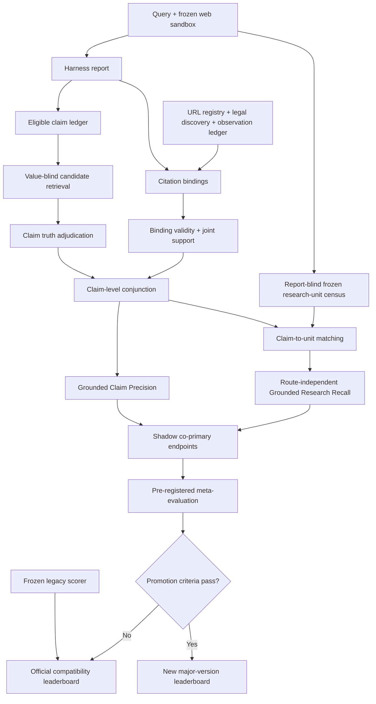

# DRA 报告评分最终方法学设计

**文档版本：** Final Synthesis 1.0
**日期：** 2026-08-02
**评分候选：** DRA-GR Shadow v0
**状态：** 方法学裁决完成；仅批准双轨影子运行；未批准替换正式榜单
**适用范围：** 有限、冻结、可复现网页沙盒中的 12 个 harness 统一评分

## 1. 执行摘要

| 决策问题 | 最终裁决 |
|---|---|
| 是否立即替换当前公式 | **否。** 现有分数和历史结果保持不变，新方案先影子运行。 |
| 当前公式是否合理 | 有明确工程优点，但报告级乘法、轴间重复、错误覆盖得分和任意等权尚未通过方法学验证。 |
| 新方案的基本单元 | 先在 claim、citation binding 和观察记录层合取事实、支持、绑定与来源，再聚合。 |
| 新方案的主量 | Grounded Claim Precision 与路线无关的 Grounded Research Recall。 |
| 是否计算二者 F1 | **当前不计算。** 两者分母分别是报告 claim 与冻结研究单元，不是同一 matching universe。 |
| F1 何时成立 | 仅在冻结、有限的研究单元集合内，对“尝试单元 precision”和“必要单元 recall”计算 matched-unit F1。 |
| Provenance 如何处理 | 下沉为 binding 级 gate；不再用报告级比例乘全报告。确认的 fabricated URL 触发完整性暂扣。 |
| 写作 Elo | 继续单独发布。它是相对偏好量，不与绝对比例相加、相乘或解释为同一尺度。 |
| 升级条件 | Dev-14 校准、56 题确认性 meta-evaluation、替代路线测试、受控反例和 Qwen 逐判定族人工校准全部通过。 |

文献能够支持 claim 级事实核验、引用绑定、覆盖率、细粒度诊断和逐轴 Judge 校准；文献不能证明 DRA 四轴等权、报告级 Provenance 乘法或 \(F_1(\mathrm{GCP},\mathrm{GRR})\) 是正确的总分。因而本设计采用“旧榜单继续正式发布，新指标影子运行，升级条件预注册”的保守路径。

## 2. 不可变的 DRA 前提

1. 评分世界是有限、冻结、版本化并可重放的网页沙盒。
2. 12 个 harness 使用同一评分程序、同一任务合同和同一冻结 Judge。
3. 评分保留 claim ledger、URL registry、legal discovery 记录、observation ledger、页面快照和精确证据 span。
4. exact、BM25、dense、structured 和 graph 只召回候选证据，不直接决定真假或产生分数。
5. 构题时的 witness URL 只证明可回答性，不是允许路线的白名单。
6. 未被本次运行合法发现和观察的页面不能作为 grounded evidence。
7. 评分器故障导致暂扣；报告自身失败导致低分或完整性状态变化。
8. 方案必须保持高自动化、低逐题人工 rubric 成本和完整审计能力。
9. Writing Elo 只表示给定对手池和版本下的相对写作偏好。

## 3. 二十篇文献的计数裁决

### 3.1 计数口径

| 口径 | 数量 | 论文编号 | 可支持的表述 |
|---|---:|---|---|
| 严格 P/R | 9/20，45% | 04、05、06、07、09、11、12、14、18 | 显式报告 Precision/Recall 对，或以 F1 评价生成内容或引用子系统 |
| 实际计算调和 F1 | 7/20，35% | 05、07、09、11、12、14、18 | 在某个事实性、引用或 RAG 子系统中计算 F1 |
| 宽口径 P/R 思想 | 14/20，70% | 严格 9 篇，加 01、03、10、13、17 | 另计未命名双分母和单侧 precision-like 比例 |
| 直接 Deep Research 子集 | 严格 P/R 1/6 | 01、02、03、04、15、20 中仅 04 | Deep Research 报告级工作主要采用 rubric pass rate 或多面板 |
| Deep Research 报告级 F1 总分 | 0/6 | 无 | 不能声称 F1 是直接同类工作的多数总分 |

因此：

- “多数使用 P/R 思想”仅在把单侧 precision-like 和未命名双分母都纳入的**宽口径**下成立。
- “多数论文使用 F1 总分”不成立。只有 7/20 在某个子系统计算 F1，而且多为引用或事实性子系统，不是完整报告总分。
- 最接近严格 shared-universe F1 的先例是 RAGChecker [18]。其 response claim 与 gold claim 可以匹配到同一命题空间，这一前提不能自动转移到 DRA 的报告 claim 与必要研究单元。

### 3.2 材料中的计数争议

`PAPER_SCORING_EXTRACTION.md` 在 ALCE 的逐篇描述中使用了“P/R/F1”措辞，但该文件的总计、Kimi 的逐篇复核和 F1 论文枚举均未把 ALCE 列入实际计算调和 F1 的 7 篇。本文采用可枚举的 **7/20** 口径，并把 ALCE [06] 归为“报告 Citation Precision 与 Citation Recall，但不计算调和 F1”。若后续原文复核改变该判断，应提升文献审计版本，不得静默改数。

## 4. 当前公式审计

### 4.1 当前候选公式

线性形式为：

\[
\mathrm{LegacyTruth}_{t}
=
\mathrm{Provenance}_{t}
\cdot
\frac{
\mathrm{Fact}_{t}
+
\mathrm{Evidence}_{t}
+
\mathrm{Completeness}_{t}
+
\mathrm{Rubric}_{t}
}{4}.
\]

v1.3 另列出几何候选：

\[
\mathrm{Truth}_{geometric,t}
=
\mathrm{Provenance}_{t}
\cdot
\left(
\mathrm{Fact}_{t}
\mathrm{Evidence}_{t}
\mathrm{Completeness}_{t}
\mathrm{Rubric}_{t}
\right)^{1/4}.
\]

这里存在版本记载不一致：v1.3 把 linear 称为 diagnostic、geometric 称为待校准 formal candidate；Qwen 扩展稿则把 linear 定义称为锁定的正式定义。兼容车道必须按实际 score packet 中的 scorer 版本和哈希重放，不由本文追溯性地替项目选择 linear 或 geometric。

### 4.2 应保留的优点

- 冻结世界、同一程序和完整审计包支持可复现比较。
- Fact 使用原子 claim、精确 qualifier、支持与反证 span。
- Evidence 区分 observation、local binding、support、scope 和 source role。
- Completeness 采用分层宏平均，避免容易拆成大量单元的类别主导。
- Rubric 与 Completeness 有不相交约束。
- Provenance 使用 URL registry 和快照 attestation。
- value-blind retrieval 避免用报告给出的数值直接检索同值答案。
- scorer-side gap 采用 fail-closed，而不是把评分器故障记为报告错误。
- witness URL 明确不是 allowlist。
- Writing Elo 不进入 Truth。

### 4.3 最小反例

1. **报告级乘法无法识别错误重合。** 十个 claim 中，Fact 与 Provenance 都是 0.9。若两类失败发生在同一 claim，联合通过 9 个；若发生在不同 claim，联合通过 8 个。报告级乘法均给 0.81。

2. **错误覆盖可能优于诚实遗漏。** Completeness 只检查语义覆盖而不门控真实性。错误回答一个必要单元可以增加 Completeness，而沉默不增加；当报告已有大量真 claim 时，新增一个假 claim 对 Fact 的边际影响可能小于 Completeness 的增益。

3. **Evidence Recall 与 Completeness 可能重复惩罚遗漏。** citation-required unit 通常是 applicable TEC unit 的子集。遗漏一个单元可能同时降低两个轴。

4. **fabricated URL 的报告级比例与危害不对应。** 同一个关键伪造 URL，在 100 个 URL 中只使 Provenance 降 1%，在 2 个 URL 中却降 50%。该差异来自引用密度，不是伪造内容的危害。

5. **四轴等权没有文献上的理论依据。** 四轴等权可以作为工程默认值，但不能解释为经验证的构念权重。0.39/0.28/0.33 或其他拟合权重同样不能在没有独立 meta-evaluation 时成为理论依据。

6. **零分母规则不完整。** 无 claim、无 citation-required claim、无 binding、空研究单元组和全部 unresolved 等情况尚未在 v1.3 中统一定义。

## 5. 最终设计裁决

### 5.1 总体结构

纯文本含义：任务侧研究单元在查看被测报告前冻结；报告侧先抽取 eligible claim，再独立判断事实真值、引用绑定、联合支持和本次运行观察；通过 claim 级合取得到 GCP，并将 grounded claim 匹配到路线无关研究单元得到 GRR。旧评分器并行产生正式兼容分，新指标只有通过预注册 meta-evaluation 才能升级。

## 6. 评分对象与冻结合同

### 6.1 任务侧冻结单元

每个任务 \(t\) 在查看被测报告前冻结研究维度集合 \(D_t\) 和必要研究单元集合：

\[
\mathcal U_t
=
\bigcup_{d\in D_t}\mathcal U_{t,d}.
\]

每个单元至少记录：

- `unit_id`、研究维度和 unit type；
- 路线无关的完成条件；
- 必要性删除测试；
- 冻结沙盒中的 answerability witness；
- 允许的替代证据与来源角色原则；
- 是否包含外部事实前提；
- 负命题所需的范围和穷尽协议；
- task、world、TEC 和 rubric 版本哈希。

单元描述不得包含 URL 或要求特定网页措辞。witness URL 仅证明该单元在冻结世界中可回答。

必要单元应从 query、TEC、结构化槽位和冻结证据图半自动生成。人工工作限于必要性、可回答性和路线中立性的短二元审查，不要求专家逐题撰写长 rubric。

### 6.2 Eligible claim

报告 \(t\) 的 eligible claim 集合记为 \(\mathcal C_t\)。claim 只有同时满足以下条件才进入：

1. 报告实际断言，而不是标题、引用标识或写作连接语；
2. 经原子化和语义去重；
3. 对任务结论有实质影响；
4. 是可由外部世界证伪或证实的命题；
5. 实体、型号、时间、数值、单位、条件、极性、模态和归因明确；
6. 位于冻结任务和世界范围内。

以下内容不直接进入外部事实 claim 分母：

- 报告自述和元陈述；
- 用户已给约束的机械复述；
- 纯数学或逻辑推导；
- 无外部事实内容的分析结构；
- 主观偏好；
- 推荐结论本身。

决定性推荐的价格、性能、风险、机制、社区经验和约束满足前提仍必须拆成 eligible claim。若报告写“来源 X 声称 Y”，至少将“X 声称 Y”作为归因 claim；若报告同时采信 Y，则另抽取 Y。

默认每个去重原子 claim 的质量 \(m(c)=1\)。如果未来保留非均匀 materiality mass，权重规则必须在 verdict 前冻结、与 harness 身份和真值盲化，并发布等权敏感性结果。

## 7. Claim-level truth、binding、joint support 与 provenance gate

### 7.1 Claim truth

Fact 检索必须保持 value-blind。检索得到的 exact、BM25、dense、structured 和 graph 结果只是候选 span。

对 eligible claim \(c\)，事实状态为：

- `true`：存在同范围支持 span，qualifier 完整，且无未解释的决定性反证；
- `false`：存在同范围反证，并通过 false guard 和复核；
- `conflicted`：同范围支持和反证均存在；
- `unresolved`：证据不足以可靠决定；
- `retrieval_failure`、`instrument_ambiguous`：评分器失败；
- `census_gap`、`world_scope_gap`：任务版本失败；
- `out_of_world`、`exempt`：不进入 eligible 分母。

对无保留的 categorical claim，`false` 和 `conflicted` 均不给 truth credit。若报告准确陈述“现有来源相互冲突”，则该冲突陈述本身可以是新的 true claim。

用区间表示可裁决状态：

\[
(\tau_c^L,\tau_c^U)
=
\begin{cases}
(1,1), & v(c)=\mathrm{true},\\
(0,0), & v(c)\in\{\mathrm{false},\mathrm{conflicted}\},\\
(0,1), & v(c)=\mathrm{unresolved}.
\end{cases}
\]

`retrieval_failure`、`instrument_ambiguous`、`census_gap` 和 `world_scope_gap` 不进入该区间计算，而是触发暂扣。

### 7.2 Citation requirement

是否需要引用由去上下文化后的命题内容决定，不由“显然”“可推得”等措辞决定。以下 claim 默认 citation-required：

- 具名实体或型号事实；
- 数字、日期、价格、单位和比较结果；
- 可证伪的因果或机制命题；
- 社区经验和争议性陈述；
- 决定性推荐的外部前提。

只有纯逻辑、纯数学、用户约束直接推论和报告自指元陈述可以豁免。豁免判定器单独校准。

### 7.3 Provenance gate

对 citation \(j\)：

\[
p_j
=
\mathrm{Canonicalized}_j
\land
\mathrm{InRegistry}_j
\land
\mathrm{LegalDiscovery}_j
\land
\mathrm{SnapshotAttested}_j
\land
\mathrm{Observed}_j.
\]

其中：

- `LegalDiscovery` 要求运行通过许可路径获得该资源；
- `Observed` 要求 observation ledger 中存在本次运行的原生页面观察；
- 只有搜索 snippet、没有合格页面抓取时，默认 `Observed=0`；
- URL 存在于 registry 但未被本次运行观察，属于 `unobserved`，不是 `fabricated`。

### 7.4 Binding 与联合支持

对 claim \(c\) 与 citation \(j\) 的绑定：

\[
h_{c,j}
=
p_j
\land
\mathrm{LocalBinding}_{c,j}
\land
\mathrm{ScopeMatches}_{c,j}
\land
\mathrm{RoleOK}_{c,j}
\land
\mathrm{ComponentSupport}_{c,j}
\land
\neg\mathrm{Contradicts}_{c,j}.
\]

`ComponentSupport` 表示该 citation 至少支持被明确分配给它的一个非平凡 claim 组件，不要求单条来源独立支持整个复合 claim。

联合支持为：

\[
a_c
=
\mathbb 1
\left[
\bigcup_{j\in J_c:\,h_{c,j}=1}
\mathrm{Span}(j)
\models
c
\right].
\]

它要求合格 citation 集合联合覆盖 claim 的全部原子组件、限定条件和比较关系。多来源分别支持价格、性能或机制时可以联合通过。

claim 的证据门为：

\[
e_c
=
\begin{cases}
1, & c\text{ 合法豁免引用},\\
1, & J_c\neq\varnothing,\ a_c=1,\ \text{且}\ \forall j\in J_c,\ h_{c,j}=1,\\
0, & \text{其他情况}.
\end{cases}
\]

要求所有就地绑定 citation 至少支持其被分配的组件，可防止“一条好引用加大量无关引用”获得满分。孤立参考文献作为 `null binding` 进入二级诊断，但不能为任何 claim 提供 credit。

### 7.5 Grounded claim

\[
g_c^L=e_c\tau_c^L,
\qquad
g_c^U=e_c\tau_c^U.
\]

该合取区分：

- 内容正确但引用未观察；
- 内容正确但引用不支持；
- 内容错误但 URL 真实；
- 内容和本次观察证据都合格。

一次失败只使相应 claim 的 grounded verdict 失败，不再通过报告级 Provenance 乘数重复作用于全部其他 claim。

## 8. Grounded Claim Precision

\[
\mathrm{GCP}_t^L
=
\frac{\sum_{c\in\mathcal C_t}m(c)g_c^L}
{\sum_{c\in\mathcal C_t}m(c)},
\qquad
\mathrm{GCP}_t^U
=
\frac{\sum_{c\in\mathcal C_t}m(c)g_c^U}
{\sum_{c\in\mathcal C_t}m(c)}.
\]

GCP 回答：

> 报告主动提出的、需要外部核验的实质性 claim 中，有多少同时真实、引用完整、绑定正确、来源合格并可归因于本次运行。

Claim Resolution Rate 为：

\[
\mathrm{CRR}_t
=
\frac{
\sum_{c\in\mathcal C_t}
m(c)\,
\mathbb 1[v(c)\in\{\mathrm{true},\mathrm{false},\mathrm{conflicted}\}]
}{
\sum_{c\in\mathcal C_t}m(c)
}.
\]

真实但不属于必要研究单元的补充 claim 仍进入 GCP。这样既不会强迫报告只复述 census，也不会让额外错误陈述逃离事实分母。

## 9. 路线无关的 Grounded Research Recall

### 9.1 单元通过规则

对必要研究单元 \(u\)，定义：

\[
z_u^L,z_u^U\in\{0,1\}.
\]

单元只有在以下条件同时成立时才通过：

1. 报告实质性完成该单元，而非只提到关键词；
2. 原子事实单元由至少一个匹配的 grounded claim 支持；
3. 比较、机制、综合、程序或推荐单元的所有决定性外部前提均为 grounded claim；
4. 替代来源路线在语义和来源角色上合格；
5. witness URL 未被当作 allowlist；
6. 没有依赖未裁决或相互矛盾的关键前提。

错误陈述不算覆盖。纯分析或推荐单元本身不接受真假标签，但其结构完成度和约束满足可以判断，所有外部前提仍受 grounded gate。

### 9.2 分层宏平均

对维度 \(d\)：

\[
R_{t,d}^{L/U}
=
\frac{
\sum_{u\in\mathcal U_{t,d}}w_u z_u^{L/U}
}{
\sum_{u\in\mathcal U_{t,d}}w_u
}.
\]

默认 \(w_u=1\)。只有 query 明示优先级时才允许在报告盲化阶段设置不同权重。

\[
\mathrm{GRR}_t^{L/U}
=
\sum_{d\in D_t}
\alpha_{t,d}R_{t,d}^{L/U}.
\]

若 query 没有明示维度权重，则：

\[
\alpha_{t,d}=\frac{1}{|D_t|}.
\]

这里的维度宏平均是防止单元拆分密度支配结果的抽样估计规则，不是“四个质量构念天然等权”的理论主张。必须报告 unit-level micro 结果作为敏感性诊断。

## 10. F1 与最终聚合裁决

### 10.1 不计算 \(F_1(\mathrm{GCP},\mathrm{GRR})\)

GCP 的分母是报告输出的 eligible claim；GRR 的分母是报告出现前冻结的必要研究单元。二者没有共享的 true-positive 计数，也不保证一一匹配。因此：

\[
\boxed{
\text{当前不得把 }
\mathrm{GCP}
\text{ 与 }
\mathrm{GRR}
\text{ 的调和平均称为 F1。}
}
\]

影子车道将二者作为共同主终点：

\[
\mathbf S_t
=
\left(
\mathrm{GCP}_t,
\mathrm{GRR}_t
\right).
\]

点估计下的 Pareto 关系为：

\[
A\succ B
\iff
\mathrm{GCP}_A\ge \mathrm{GCP}_B
\land
\mathrm{GRR}_A\ge \mathrm{GRR}_B,
\]

且至少一项严格大于。正式比较使用配对 bootstrap 的二维差值区间；不能由单轴优势强行产生总排序。

### 10.2 条件成立时的 matched-unit F1

若使用同一个冻结研究单元 universe \(\mathcal U_t\)，可以定义：

\[
\mathcal A_t
=
\{u\in\mathcal U_t:\text{报告实质性尝试了 }u\},
\]

\[
\mathcal G_t
=
\{u\in\mathcal A_t:z_u=1\}.
\]

此时：

\[
P_{U,t}
=
\frac{\sum_{u\in\mathcal G_t}w_u}
{\sum_{u\in\mathcal A_t}w_u},
\qquad
R_{U,t}
=
\frac{\sum_{u\in\mathcal G_t}w_u}
{\sum_{u\in\mathcal U_t}w_u},
\]

\[
F_{1,t}^{U}
=
\frac{2P_{U,t}R_{U,t}}
{P_{U,t}+R_{U,t}}.
\]

这里的 \(P_{U,t}\) 和 \(R_{U,t}\) 共享研究单元 universe 和同一个 grounded-success 分子，因此 F1 在结构上成立。它衡量的是“必要研究单元的尝试质量与覆盖”，不是全部报告 claim 的真实性；GCP 仍必须作为共同主终点。

matched-unit F1 只有在以下证书全部通过后才可发布为候选总量：

- 单元集合在报告前冻结、有限、可枚举；
- `attempted` 与 `passed` 映射可审计；
- claim-to-unit 映射通过人工 Precision、Recall、F1 与 Kappa 校准；
- 替代路线与 witness 路线得到等价判定；
- task-scope material claim 的未匹配率低于预注册阈值；
- 补充 claim 不会被错误地当作 false-positive unit。

在证书完成前，影子榜只发布 GCP、GRR 和资格状态，不用 harmonic mean、geometric mean、minimum 或拟合权重强制产生总排名。

## 11. 边界情况与零分母规则

| 情况 | 处理 |
|---|---|
| 任务要求外部研究，但报告没有 eligible claim | GCP 为 N/A，GRR 为 0，状态为 `empty_research_output`；不得把空 precision 记为 1 |
| 有 claim，但全部 unresolved | 发布 GCP 区间 \([0,1]\) 和 CRR=0；正式候选分暂扣 |
| citation-required claim 没有 citation | \(e_c=0\)，相应 grounded claim 和依赖单元不得分 |
| 没有 citation-required claim | Citation 诊断为 N/A；不得为了补齐轴而人为记 1 |
| 没有 binding，但存在 citation-required claim | Joint Support Rate 为 0；Binding Precision 为 N/A |
| 某冻结维度没有 applicable unit | 只有在报告前已标记不适用时才从宏平均移除 |
| 所有维度均为空 | 任务合同无效，正式评分暂扣 |
| \(P_U+R_U=0\)，且必要单元非空 | \(F_1^U=0\) |
| `unresolved` | 留在固定分母，通过上下界表示，不静默删除 |
| `retrieval_failure` 或 `instrument_ambiguous` | scorer-side failure，正式结果暂扣 |
| `census_gap` | 当前任务版本暂扣；修订 census、提升版本并对 12 个 harness 全部重跑 |
| `world_scope_gap` | 任务版本暂扣，不把世界缺失算成报告错误 |
| `out_of_world`、`exempt` | 不进入 eligible claim 分母，另报数量 |
| categorical `conflicted` | 记 0；准确陈述冲突本身可作为另一条 true claim |
| 纯分析 | 不进入 GCP；若任务要求，则进入研究单元完成度 |
| 推荐 | 推荐本身不判真假；约束满足和决定性事实前提进入 GRR 与 GCP |

## 12. 负命题

“页面没有提到 X”不能证明“X 不存在”或“X 不会发生”。

负命题只有在以下任一条件成立时才可获得 true 和 grounded credit：

1. 合格来源在相同范围内明确断言该否定命题；
2. 任务预先定义有限可枚举的搜索域，并完成全部项的系统性搜索；
3. observation ledger、查询集合、范围边界和未发现证书均完整；
4. 未发现任何同范围反例。

无边界的普遍否定、单页非提及或开放网页搜索中的“没有搜到”只能是 unresolved。`supports_by_absence` 在通过独立人工校准前不得自动给分。

## 13. 失败类型的精确后果

| 失败 | 精确定义 | Claim 后果 | GRR 后果 | 发布后果 |
|---|---|---|---|---|
| `fabricated_url` | alias 解析和申诉后仍无 registry、快照或真实资源匹配，却被报告作为已用来源 | \(p_j=0\)，绑定失败；就地 claim 的 \(e_c=0\) | 依赖该 claim 的单元失败 | 一个确认案例即 `withheld_integrity`；诊断分保留，不用报告级乘数清零 |
| `unobserved_citation` | URL 真实且可能在 registry，但本次运行无合格观察 | \(p_j=0\)，绑定失败；内容可仍为 true，但不 grounded | 不能靠该来源完成单元 | 报告自身未观察则低分；若 ledger 全局缺失则 scorer-side 暂扣 |
| `unsupported_citation` | 页面已观察且同范围，但不蕴含被绑定组件，也不构成明确反证 | \(h_{c,j}=0\)；该 claim 的 evidence gate 失败 | 依赖 claim 不通过 | 二级面板记录；不再另乘报告级惩罚 |
| `wrong_binding` | 来源可能支持报告别处内容，但不支持本地 claim 或 marker 范围错误 | \(h_{c,j}=0\)，本地 claim 不 grounded | 相应单元不通过 | 二级面板记录 |
| `contradicted_citation` | 本地同范围 span 蕴含 claim 的反命题 | \(h_{c,j}=0\)、\(a_c=0\)；Fact 必须使用该反证重新裁决为 false 或 conflicted | 相应单元不通过 | 标记 `critical_citation_error`，但不重复进入另一数值轴 |
| `missing_citation` | citation-required claim 没有绑定引用 | \(e_c=0\) | 相应单元不 grounded | 二级面板记录 |
| `illegal_discovery` | 页面未通过许可的运行路径取得 | \(p_j=0\) | 不能完成 grounded unit | 执行审计失败；按原因决定报告低分或运行暂扣 |
| 仅有 snippet | 没有合格原生页面观察 | 默认按 unobserved 处理 | 不得完成单元 | 二级面板记录 |

`fabricated_url` 的单例暂扣是完整性治理政策，不是文献证明的连续效用函数。该政策在启用前必须验证误报率、alias 解析和人工申诉流程。

## 14. 榜单与二级诊断布局

### 14.1 正式主榜字段

影子期主榜只保留用户需要的字段：

| 字段 | 含义 |
|---|---|
| Harness | 被测程序 |
| Official score | 冻结 legacy scorer 的正式分、版本和 95% CI |
| Shadow GCP | GCP 区间及 CRR |
| Shadow GRR | GRR 区间 |
| Status | `eligible`、`withheld_scorer`、`withheld_census` 或 `withheld_integrity` |

若 matched-unit F1 以后通过升级条件，它可以替换 `Official score` 成为新版本的任务完成主量，但 GCP 仍保留为共同主终点。旧分数继续以原版本可查询。

### 14.2 二级诊断面板

二级面板可以包含：

- Fact-only precision、真假冲突分布；
- Citation Binding Precision；
- Joint Support Rate；
- missing、unobserved、unsupported、wrong binding、wrong role 和 contradicted 计数；
- fabricated URL 数量和申诉状态；
- 各研究维度 GRR；
- claim-to-unit 未匹配率；
- CRR、区间宽度和 census gap；
- entity、型号、数字、单位、时间和限定条件错误；
- explicit task compliance；
- scorer batch split、order disagreement 和 instrument ambiguity。

这些字段用于审计和定位，不得重新加权形成另一套未经验证的主分。

Writing Elo 在独立榜单中发布，并记录对手池、Judge、提示和版本。它不得与 GCP、GRR、matched-unit F1 或 LegacyTruth 相加、相乘。

## 15. 受控反例与排序推演

以下均为构造性公式推演，不是实验结果。旧公式输入记为：

\[
\mathbf x=(\pi;F,E,C,B),
\qquad
L=\pi(F+E+C+B)/4,
\]

其中 \(\pi\) 是 Provenance，\(B\) 是 Rubric。影子输入记为：

\[
\mathbf s=(P_g,R_g)=(\mathrm{GCP},\mathrm{GRR}).
\]

为展示强行聚合的影响，另计算实验专用、**不获推荐**的调和复合：

\[
H^\dagger
=
\frac{2P_gR_g}{P_g+R_g}.
\]

\(H^\dagger\) 不是合法的 F1，因为其两个输入没有共享 matching universe。

| # | 受控报告对 | 旧公式排序 | 影子体系 | \(H^\dagger\) |
|---:|---|---|---|---|
| 1 | A 短而全真：\(\mathbf x=(1;1,1,.1,.3)\)，\(\mathbf s=(1,.1)\)；B 全面：\((1;.9,.9,.9,.8)\)，\((.85,.85)\) | B>A，.875>.600 | B 支配 A | .850>.182 |
| 2 | A 多说一个错误单元：\((1;.99,1,1,1)\)，\((.99,.9)\)；B 诚实遗漏：\((1;1,1,.9,1)\)，\((1,.9)\) | **A>B**，.998>.975 | **B 支配 A** | .947>.943 |
| 3 | A Fact 与来源失败重合：\((.9;.9,1,1,1)\)，\((.9,.9)\)；B 失败分散：同一旧轴值，\((.8,.8)\) | A=B，均 .878 | **A 支配 B** | .900>.800 |
| 4 | A 100 URL 中 1 个伪造：\((.99;1,.99,1,1)\)；B 2 URL 中 1 个伪造：\((.5;1,.5,1,1)\)；功能危害相同，影子均 \((.99,.99)\) | **A≫B**，.988>.438 | 数值相同，二者均完整性暂扣 | .990=.990 |
| 5 | A 单 claim 挂 1 条好引用和 9 条无关引用：\((1;1,.182,1,1)\)，\((0,0)\)；B 只挂好引用：全 1 | B>A，1>.796 | B 支配 A | 1>0 |
| 6 | A URL 真实但未观察；B 页面观察但不支持。二者旧轴均 \((1;1,0,1,1)\)，影子均 \((0,0)\) | A=B，均 .750 | 主量相同，诊断原因不同 | 0=0 |
| 7 | A 有限域负命题带穷尽证书：全 1；B 仅因没搜到而声称不存在：旧 Fact 无定义，影子 \((0,0)\) | B 无稳定旧分 | A 支配 B | 1>0 |
| 8 | A 使用构题 witness；B 使用其他合法观察来源；语义支持相同，二者全 1 | A=B | A=B | 1=1 |
| 9 | A 完成纯分析和推荐单元，无外部 claim；B 为空报告 | 旧 Fact/Evidence 零分母，均不稳定 | A 的 GRR=1，B 的 GRR=0；GCP 均 N/A | 不定义 |
| 10 | A 一真九 unresolved，complete-case 旧轴均为 1；B 十项中八项确定通过，旧轴均 .8 | **A>B**，1>.8 | A 区间 \([.1,1]\) 且暂扣；B 可正式比较 | A 为 \([.1,1]\)，B=.8 |
| 11 | A 全面且无额外错误：全 1；B 同样覆盖但增加一个错误补充 claim：\((1;.9,1,1,1)\)，影子 \((.9,1)\) | A>B，1>.975 | A 支配 B | 1>.947 |
| 12 | A 内容正确但所有应引 claim 均无观察证据：\((1;1,0,1,1)\)，\((0,0)\)；B 各项稳定为 .7 | **A>B**，.750>.700 | **B 支配 A** | .700>0 |
| 13 | A 广覆盖但仅 10% 有合格引用：\((1;.95,.182,.9,.8)\)，\((.095,.09)\)；B 窄但完全 grounded：\((1;1,1,.3,.5)\)，\((1,.3)\) | **A>B**，.708>.700 | **B 支配 A** | .462>.092 |
| 14 | A 高精度低召回：\(\mathbf s=(1,.4)\)；B 中等且均衡：\((.7,.7)\)，旧分均设为 .75 | A=B | **不可比**，不强制总排序 | B>A，.700>.571 |

这些反例说明：

- 旧公式会因错误分散、引用密度和轴间补偿产生不可见差异。
- 强行计算 \(H^\dagger\) 可以制造总排序，但该排序依赖未经验证的跨构念交换率。
- 影子向量允许“不可比”，这是当前证据状态下比虚假精确总排名更诚实的结果。

## 16. Qwen Judge 的人工校准与统计验证

### 16.1 冻结要求

正式语义判断继续使用同一个冻结 Qwen3-8B snapshot：

- 模型文件、tokenizer、vLLM、prompt 和 JSON Schema 全部哈希；
- `temperature=0`；
- 固定 decoding 配置并禁用 thinking；
- 保存完整 request、raw response、解析结果和证据 ID；
- batch 优化不得改变 item ID、候选证据、标签空间、span 合同或分母；
- batch 失败时递归拆分，singleton 仍不稳定则记 `instrument_ambiguous`。

“同一 Judge”保证尺子一致，但不证明尺子正确。每个判定族必须单独与人工 gold 比较。

### 16.2 人工校准样本

以下是起始最低规模，不是实验结果：

| 判定族 | 最低样本 | 分层 |
|---|---:|---|
| Claim extraction 与 eligibility | 300 个候选及漏抽审计段 | 数字、否定、条件、比较、归因、纯分析 |
| Claim truth | 300 条 claim | true、false、conflicted、unresolved、实体与时间错误 |
| Binding 与 joint support | 300 个 binding，加 100 个多来源 claim | passing、unobserved、unsupported、wrong binding、wrong role、contradicted |
| Claim-to-unit mapping | 200 个候选对，加 200 个 unit verdict | covers、partial、contradicts、unrelated |
| 分析、程序和推荐单元 | 至少 100 个或全部单元的 20% | 完成、部分、遗漏、外部前提失败 |
| 负命题 | Dev-14 中全部实例，加定向构造集 | 明示否定、有限域证书、单页非提及、开放域否定 |

每项由两名互盲标注者独立判断，分歧由第三人仲裁。标注者看不到 harness 身份、旧分和候选排名。人类合同应与 Judge 合同镜像，避免比较两个不同问题。

### 16.3 统计量的用途

| 统计量 | 用途 | 不能证明什么 |
|---|---|---|
| Accuracy | 标签较均衡时衡量总体正确比例 | 类别不均衡时可能掩盖少数类失败 |
| Precision | 检查某错误标签的误报，例如把真实引用误报为 fabricated | 不能说明漏检 |
| Recall | 检查关键错误的漏检，例如 contradicted citation | 不能说明误报 |
| F1 | 在同一标签任务内平衡 Precision 与 Recall | 不能把不同分母的报告构念合法化为 F1 |
| Macro-F1 | 让少数标签与多数标签获得相同类别权重 | 不表示报告级排名正确 |
| Cohen’s Kappa | 两方判断去机会一致性 | 受标签流行率影响，不能替代 confusion matrix |
| Fleiss’ Kappa | 三名及以上标注者的一致性 | 不表示标签定义本身有效 |
| Weighted Kappa | ordinal rubric 或 partial/fulfilled/not 的距离敏感一致性 | 不适用于无序错误类型 |
| Cluster bootstrap | 按任务簇估计 harness 分差和排名稳定性 | claim 不能被当作独立样本 |
| PPI | 用少量人工标签校正大量 Qwen 预测的总体均值和 CI | 不能修复错误标签定义或认证单条 claim |

### 16.4 Bootstrap 与 PPI

对 12 个 harness 的比较应以 task 为配对聚类单元。每次 bootstrap 重采样 task，并保留同一 task 下所有 harness 的配对关系；需要时在 topic 和 archetype 内分层。建议使用至少 10,000 次预注册重采样。

若 56 题被视为固定 benchmark census，区间应称为“任务重采样稳定性区间”，不能声称它覆盖所有未来任务。

对自动判定总体均值，可使用基本 PPI 校正：

\[
\widehat{\mu}_{PPI}
=
\frac{1}{N}\sum_{i=1}^{N}\widehat y_i
+
\frac{1}{n}\sum_{i\in L}(y_i-\widehat y_i),
\]

其中 \(\widehat y_i\) 是 Qwen 判断，\(y_i\) 是人工 gold，\(L\) 是概率抽取的人工样本。非线性比例和 F1 应对完整估计过程使用 influence-function 或 cluster bootstrap，不能分别校正分子分母后忽略协方差。

PPI 只用于总体估计和置信区间，不改写单个报告的审计 verdict。

### 16.5 建议的预注册门槛

下列门槛是项目治理起点，不是文献通用标准，也不是已有结果：

| 检查 | 退出门槛 |
|---|---:|
| Item ID 保全 | 100% |
| 非法 span 被接受 | 0 |
| Claim extraction recall | 至少 98% |
| 每判定族 macro-F1 | 点估计至少 .80，95% 下界至少 .75 |
| Cohen’s Kappa | 点估计至少 .60，95% 下界至少 .50 |
| fabricated/contradicted 等关键类 Recall | 点估计至少 .90，95% 下界至少 .80 |
| optimized batch 相对 legacy 的 macro-F1 下降 | 不超过 .02 |
| 单报告轴分绝对差中位数 | 不超过 .02 |
| unresolved 单报告轴分差 | 不超过 .05 |
| Instrument 排名相关 | Kendall 与 Spearman 至少 .95 |
| Batch 顺序置换 disagreement | 不超过 1% |

这些门槛验证 Judge 和执行工具。它们不能单独证明新聚合优于旧公式。

## 17. 保守兼容车道

1. 旧 scorer、Qwen snapshot、prompt、TEC、world、registry 和 score packet 保持只读。
2. 现有历史结果不重命名、不追溯重算，也不把新公式覆盖写入旧字段。
3. 每个正式分必须带 scorer major version、world version、task contract hash 和 judge hash。
4. 新方案读取同一份冻结报告和观察 ledger，写入独立的 shadow score packet。
5. linear/geometric 的历史语义按实际 artifact 记录重放；先解决文档不一致，再发布统一名称。
6. 影子排名不得影响正式榜、对外结论或 harness 选择。
7. 若新方案转正，提升 scorer major version，并对所有可重放历史报告生成 crosswalk；旧分仍永久可查。
8. 任何失败均回滚到旧正式榜，新分保留为 diagnostic，不删除失败证据。

## 18. 从 Dev-14 到 56 题的实施计划

| 阶段 | 工作与冻结点 | 退出条件 | 回滚条件 |
|---|---|---|---|
| Phase 0：协议冻结 | 冻结 eligibility、负命题、failure taxonomy、GCP/GRR、零分母和榜单字段 | 受控反例有唯一预期；协议、schema、阈值全部哈希 | 任一核心状态语义不明确 |
| Phase 1：Dev-14 census | 报告盲化生成必要单元；做删除测试、answerability 和 URL-free lint | 每个单元有 witness、必要性结论和版本；替代路线不受 URL 限制 | 发现单元依赖 witness 措辞或大量主观 rubric |
| Phase 2：Dev-14 人工校准 | 建立 claim、binding、mapping、unit 和负命题 gold | 达到第 16.5 节门槛；分歧已仲裁 | 任一判定族未达门槛或 critical error 漏检 |
| Phase 3：Dev-14 双轨运行 | 同时产生 legacy 与 shadow；运行至少 14 个受控反例及替代路线对 | 无未解释方向错误；区间、gap 和完整性状态可审计 | 发现重复计分、路线偏置或不可重放结果 |
| Freeze A | 冻结 Qwen、prompt、schema、mapping、census、meta-evaluation endpoint | 在查看 56 题确认性结果前完成注册 | 任何事后阈值或公式变更 |
| Phase 4：56 题确认 | 对全部 12 harness 统一运行；其余 42 题不调参 | 逐判定族有效；配对 bootstrap 稳定；候选相对旧公式的人类 meta-evaluation 达预注册优效或非劣条件 | 确认集上重新调参、出现 census gap、区间过宽或 harness-specific 偏差 |
| Phase 5：升级裁决 | 独立审查全部证书和 crosswalk | 所有必要条件同时通过；提升 major version 并全量重放 | 任一条件失败则保持 shadow |
| Phase 6：持续治理 | 版本化处理申诉、别名、网页 gap 和新增任务 | 每次变更可重放、对 12 harness 同步 | 静默修改历史 denominator 或单独修补某 harness |

### 18.1 升级的必要条件

新方案只有同时满足以下条件才可替换正式榜：

1. claim、binding、mapping 和 unit Judge 均通过轴级人工校准；
2. necessary research census 在报告前冻结并通过删除测试；
3. 替代路线对与 witness 路线在等价内容下无系统性差异；
4. 受控反例的排序方向全部符合预注册预期；
5. unresolved 和 gap 不使主要 harness 比较不可识别；
6. 候选指标相对旧公式与独立专家判断的配对一致性达到预注册的优效或非劣界；
7. batching、缓存和并发通过 instrument equivalence；
8. fabricated URL 申诉和误报审计可运行；
9. 若使用 \(F_1^U\)，shared-universe 证书完整；
10. 所有变化通过 scorer major version 管理。

高 Kendall 相关本身不是升级理由。新指标可能因为修复旧公式缺陷而合理改变排名；关键是变化是否由独立人工判断和受控反例支持。

## 19. 文献支持、待验证假设与禁止声明

### 19.1 已有文献支持

- 原子 claim 级事实核验和输出侧 factual precision [10–14]。
- statement–URL 或 claim–citation 级去重、绑定和支持判断 [01、05–09]。
- 任务侧 rubric 或 gold claim 覆盖率 [02、04、18]。
- 引用子系统可以独立报告 P/R 或 F1 [05–07、09]。
- 报告质量通常需要多面板，而不是由单个 Citation F1 代替 [01–05、17]。
- Judge 应逐指标与人工校准，系统总分接近不能证明轴级有效 [19、20]。
- PPI 可以用少量人工标签校正大规模自动估计 [19]。
- audit-then-score 和版本化 gap 治理是合理方向 [15]。
- 共享证据和 batch 可以降低成本，但可能改变 Judge 行为，必须做等价性测试 [14、Qwen 扩展稿]。

### 19.2 必须由 DRA 实验证明的假设

- Dev-14 和 56 题可以构建必要、可回答、路线无关且成本可控的 census。
- Claim-to-unit mapping 足以稳定支持 GRR 或 matched-unit F1。
- Claim-level conjunction 与专家对报告可信度的判断更一致。
- Qwen3-8B 在每个 DRA 判定族均达到预注册门槛。
- 分层宏平均不会因维度拆分方式造成系统性偏差。
- 一个 fabricated URL 即完整性暂扣的治理政策具有可接受误报率。
- 新指标比旧公式更好地区分短真、堆砌、错引、未观察和替代路线报告。
- 影子指标的区间足够窄，可以支持 harness 比较。
- 二元必要性审查的人工成本明显低于逐题自由文本 rubric。

### 19.3 当前不能声称

- 多数论文使用 F1 作为 Deep Research 报告总分。
- Fact 与 Completeness 天然构成严格 P/R。
- GCP 与 GRR 可以直接计算经典 F1。
- 四轴等权或任何拟合权重具有理论最优性。
- 报告级 Provenance 与其他轴近似独立。
- 总分接近证明 Qwen 与另一 Judge 等价。
- TEC 等于冻结世界中的全部相关事实。
- 冻结环境自动保证 census 完整或路线公平。
- 负命题可以由普通“未发现”自动证明。
- batching 一定不改变 Qwen verdict。
- 已有材料证明新方案会改善 56 题排名。
- Writing Elo 可以解释为绝对比例或与 Truth 交换。

## 20. 可直接用于论文 Methods 的英文表述

### Evaluation environment

We evaluate all reports in a finite, versioned web sandbox. The same scoring program, frozen task contract, URL registry, page snapshots, and judge snapshot are used for all twelve harnesses. Lexical, dense, structured, and graph retrieval methods identify candidate evidence only; they do not directly determine factuality or contribute numeric score credit.

### Claims and evidence attribution

Each report is decomposed into deduplicated, externally verifiable material claims while preserving exact report offsets and qualifiers. Claim truth is adjudicated against the frozen world independently of the report’s citations. For citation-required claims, a claim receives grounded credit only when its locally bound citations were legally discovered and observed during the evaluated run, refer to attested registry resources, support their assigned claim components at the correct scope and source role, and jointly support the full claim. This claim-level conjunction avoids assuming independence between report-level factuality and provenance rates.

### Coverage

Before inspecting evaluated reports, we freeze a report-blind census of necessary research units. Each unit must pass a necessity test and have at least one answerability witness in the frozen sandbox. Witness URLs establish answerability but do not form an allowlist. A unit may be completed through any legally observed evidence route that satisfies the same semantic and source-role requirements. Incorrect or ungrounded content does not count as coverage.

### Primary endpoints and aggregation

We report Grounded Claim Precision and Grounded Research Recall as co-primary endpoints. We do not take their harmonic mean because their denominators are, respectively, report-generated claims and frozen task-side research units. A conventional F1 score is considered only for attempted-unit precision and required-unit recall defined over the same frozen, enumerable unit universe. Writing preference is evaluated separately through a versioned pairwise Elo procedure and is not combined with the absolute groundedness measures.

### Uncertainty and validation

Unresolved claims and units remain in their original denominators and induce lower and upper score bounds. Scorer-side retrieval, census, or instrumentation failures withhold formal scores. We validate each automated decision family against independently annotated human items using class-wise Precision, Recall, F1, agreement coefficients, and task-clustered bootstrap intervals. Prediction-powered inference may be used to bias-correct population-level automated estimates, but it does not replace item-level audit records. The proposed metrics are shadow-run against the legacy scorer until preregistered meta-evaluation criteria are satisfied.

## 附录 A：二十篇论文到 DRA 决策的映射

| # | 论文 | 对 DRA 的设计作用 | 不能外推的内容 |
|---:|---|---|---|
| 01 | DeepResearch Bench | statement–URL 去重、引用支持率、完整页面核验 | Effective Citations 不是 recall |
| 02 | DeepResearch Bench II | 细粒度必要单元和 batch rubric 判定 | 万级专家 rubric 不符合低成本目标 |
| 03 | ResearcherBench | 输出侧 faithfulness 与事实 claim 引用覆盖的双分母 | “有引用”不等于真实支持 |
| 04 | ReportBench | 参考文献 P/R、完整页面和独立事实面板 | 不计算报告级 F1 |
| 05 | OpenScholar | Citation F1 可评价引用子系统，内容质量另报 | Citation F1 不能替代完整报告质量 |
| 06 | ALCE | statement citation recall、citation precision 和局部绑定 | 不含 DRA observation ledger；本审计不计入实际 F1 7 篇 |
| 07 | LongCite | 细粒度引用、功能句豁免和 Judge Kappa | 位置和句级规则需在 DRA 重校准 |
| 08 | CiteEval | 区分缺失、冗余、错误、替换引用及 N/A | Likert 引用质量不能直接并入 truth |
| 09 | ALiiCE | 先判联合支持，再判单条 citation 必要性和位置 | 不能自动解决 DRA 的 legal discovery |
| 10 | FActScore | 原子事实输出侧 precision | 单独使用会奖励短而保守的报告 |
| 11 | SAFE / LongFact | 搜索后逐 claim 核验及 \(F_1@K\) | \(K\) 是长度代理，不是真实答案全集 |
| 12 | VeriScore | 先筛 eligible/verifiable claim | 域内中位数 \(K\) 不能替代冻结 census |
| 13 | D-FActScore | 强调实体、时间、关系和聚合矛盾 | 只提供 precision 方向 |
| 14 | FaStFact | 共享页面证据、批量核验和效率优化 | 低置信度跳过会改变正式分母 |
| 15 | DeepFact | audit-then-score、census gap 和版本治理 | 验证器 F1 不是报告总分 |
| 16 | MiniCheck | 低成本 verifier 的 meta-evaluation 基线 | 外部数据集成绩不能认证 DRA Judge |
| 17 | RAGAS | Faithfulness、Context Recall 等多面板分离 | 不支持把不同 universe 的比例做 F1 |
| 18 | RAGChecker | shared gold-claim universe 下的 claim P/R/F1 | 只有匹配 universe 成立时才能移植 |
| 19 | ARES | 逐分类器校准、少量人工标签和 PPI 置信区间 | PPI 不证明单条 Judge verdict 正确 |
| 20 | Deep Research, Shallow Evaluation | 系统级与指标级验证必须分开 | 人类整体偏好不能代替轴级 gold |

## 附录 B：模型协作与可复现记录

### B.1 模型角色

- **Kimi K3 max 独立审查：**
  `docs/literature/dra_scoring_20_2026-08-02/KIMI_K3_INDEPENDENT_REVIEW.md`
- **Kimi K3 max 对 GPT 初始方案的交叉质疑：**
  `docs/literature/dra_scoring_20_2026-08-02/KIMI_K3_CROSS_CRITIQUE.md`
- **GPT-5.6 Sol max 初始候选方案：**
  `docs/literature/dra_scoring_20_2026-08-02/GPT56_INITIAL_SCORING_PROPOSAL.md`
- **GPT-5.6 Sol max 最终方法学编辑：**
  对上述材料、20 篇提取、v1.3 规范和 Qwen 扩展稿进行最终裁决与排版。

模型讨论用于提出反例、检查定义和组织候选方案，**不是科学证据**。科学主张必须回溯到论文原文、人工 gold、冻结评测 artifact 和预注册实验。

### B.2 必读材料哈希

- `PAPER_SCORING_EXTRACTION.md`
  SHA-256：`bc1acee4081997be3e1677a9b7e386b0182eb030513d83b7318af3c25ed85b82`
- `paper_manifest.tsv`
  SHA-256：`87f34576b6e52113808317f6775ec44527c9130c955bdca975f00214443abbf8`
- `KIMI_K3_INDEPENDENT_REVIEW.md`
  SHA-256：`00ce397df1745ee9772726fd5c73a50f1bb1c414b0345b08773c8970f0e3f7a8`
- `KIMI_K3_CROSS_CRITIQUE.md`
  SHA-256：`6fbc0947cc8ed9a290d18edbb5d04ff40cd4c3e49048a3a3f3050300d2ec6caa`
- `GPT56_INITIAL_SCORING_PROPOSAL.md`
  SHA-256：`89334d807fd0382f3b58ee3941f30364f6a97f64660e8bb6822173ec90c43a38`
- `docs/DRA_FOUR_AXIS_SCORING_V1_3_SPEC.md`
  SHA-256：`b121dd03288747b4c5695c6538fdc221395940fca9a584ceda0ce243ea20ce6a`
- `docs/DRA_QWEN_SCORER_SCALING_WITHOUT_METRIC_CHANGE_2026-07-30.md`
  SHA-256：`22f2cb16c36dd3c1044de3a1811f665babe3b4953cc161a7d174c77481d4d940`
