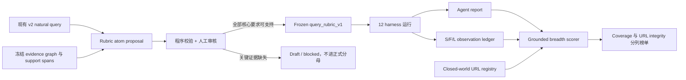
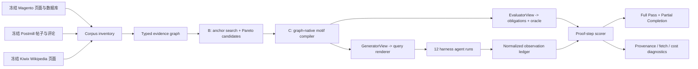
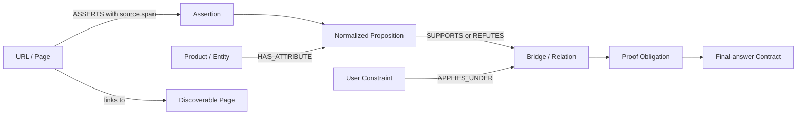
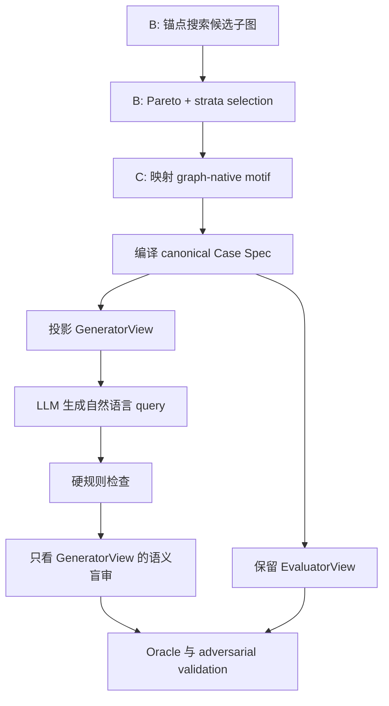
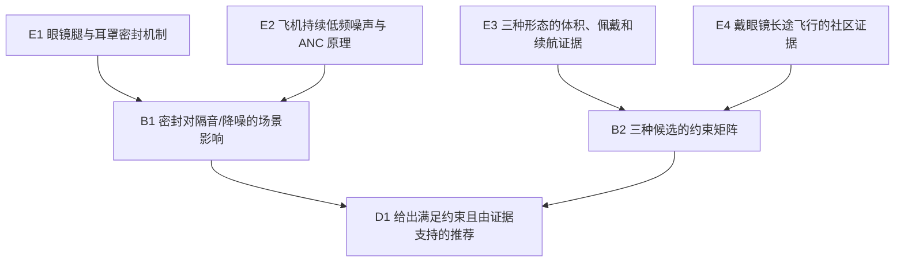
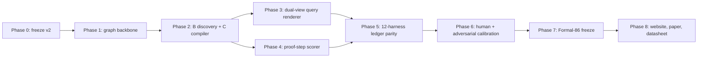

# DRA 双路线任务与确定性评分重构规划

版本日期：2026-07-15

文档状态：整体方案已确认；路线 A 最小实现与测试已落地，尚未替换正式榜单；路线 B 继续按阶段建设

目标版本：

- 路线 A：`task_v2 + query_rubric_v1 + grounded_requirements_v1`
- 路线 B：`task_v3 + evidence_graph_v1 + proof_steps_v1`

适用仓库：`/root/Desktop/lyb/deep_reserch`

## 0. 决策摘要

DRA 采用两条并行且不可混分的路线：

| 路线 | 保留或新建的任务 | 主要回答的问题 | 正式输出 |
|---|---|---|---|
| A：v2 修复线 | 保留现有自然 query | 报告覆盖了多少必要研究面，而且这些内容是否来自本次真实可见的合法网页 | `Grounded Requirement Coverage`、`URL Fabrication Rate` |
| B：graph-native 线 | 从 evidence graph 构造 v3 query | agent 完成了多少预定义 proof steps，是否端到端闭环 | `Partial Completion Rate`、`Full Pass Rate` |

两条路线共享 URL registry、S/F/L acquisition ledger、citation local binding 和 fail-closed provenance，但使用不同任务、不同评分原子、不同公式 stamp。路线 A 不是路线 B 的低配总分，路线 B 也不回写 v2 历史成绩。

DRA v3 不再采用“先写自然语言 query，再从冻结语料中拼答案键”的任务构造方式，也不再把 `fact`、`proof_of_fetch` 和 `completeness` 通过任意权重合成为 `quality`。

新的总原则是：

> 先在冻结语料中构造一个可证明、可发现、不可由单页直接回答的证据图任务，再从该任务渲染自然语言 query；评分时以同一组 required proof steps 为唯一原子单位，判断任务要求是否被正确、绑定引用且基于本次运行真实可见的证据完成。

v3 只使用两个并列头条指标，不再把异质信号压成一个总分：

```text
Partial Completion Rate
    = 先计算每题通过的 required proof steps 比例，再对正式任务宏平均

Full Pass Rate
    = 完整通过的任务数 / 可归责的正式任务数
```

前者连续回答 agent 把预先规定的证明路线完成了多少，后者严格回答 agent 真正端到端闭环了多少任务。`RouteCoverage`、错误声明、provenance、fetch coverage、snippet reliance、成本和时间保留为诊断列，不再进入一个加权 `quality`。

本规划明确建议：

1. 退休 `quality = 0.39*fact + 0.28*pof + 0.33*completeness`。
2. 退休用引用数、访问页数、搜索次数和字数定义“深度”的任务要求。
3. 不再把三种来源强行做成数量对称，而是要求它们在证据图中承担不可替代的互补角色。
4. 不允许 LLM 直接生成 gold。LLM 只能从脱敏后的 `GeneratorView` 渲染 query，不能看到 evidence、URL、proof steps 或答案条件。
5. 前 14 道手写题作为 development/calibration subset，不进入正式头条分数；从中选择 3 道结构不同的脱敏示例用于 query renderer，其余 11 道用于校准与人工对比。
6. v2 与 v3 使用不同任务版本、答案键版本和公式版本，禁止跨版本比较。
7. Deep Research 的广度由独立 research subgoals 和必要证据簇定义，深度由 proof DAG 的必要依赖链定义，不以大多数 agent 是否失败来反推。
8. 不设唯一 gold route，也不要求命中唯一 URL。评分原子是带来源约束的 proof step；支持同一命题且满足来源条件的不同页面可以形成等价路径。
9. Case 生成采用两阶段流程：B 阶段先自动发现高价值候选子图，C 阶段再用 graph-native motif 结构化与验收。
10. B 阶段使用锚点驱动的约束搜索和 Pareto 前沿，不使用随机事实拼接或任意加权总分；正式集合再按题型、主题、广度和深度分层抽取。
11. Evidence graph 使用确定性骨架与受约束语义抽取，并显式区分 `Page asserts Proposition` 与“客观事实”。
12. Query 采用硬规则与盲审语义检查双层验收。
13. 十二个 harness 必须输出同一 acquisition ledger，并通过同一组 observation conformance tests。
14. 路线 A 退休旧的三项加权和；必要 rubric atom 通过率与 URL 造假率分列展示，绝不相乘或相加。
15. 路线 A 不要求唯一标准路线或唯一 URL；任何冻结语料内、角色合格、本次确实可见且能支持该 atom 的页面都可通过。
16. v2 query 若包含冻结环境无法支持的核心要求，rubric 必须保持 draft/blocked，该题不进入可归责正式分母，不能靠放松 matcher 假装可评分。

## 1. 为什么当前方法需要重构

### 1.1 当前任务构造方向反了

当前任务大体来自“主题簇 × 任务原型”，先生成一个自然、开放的研究问题，再从 Magento、Postmill 和 Wikipedia 中寻找附近的可评分内容。

这种方法会产生 query 与 gold 的结构性错位：

- query 要求解释机制、权衡约束并作出建议；
- gold 主要包含商品价格、评分、buyer sentiment 和若干概念词；
- scorer 最后奖励的是检索到这些邻近事实，而不是解决 query。

有限环境不应该先问一个可能无法由语料完整回答的问题。正确方向是先枚举语料能够证明什么，再构造必须使用这些证据才能完成的任务。

### 1.2 当前三个质量轴不是同一种测量

现行三项分别使用不同原子单位：

| 轴 | 当前原子单位 | 当前主要含义 |
|---|---|---|
| `fact` | 报告中的价格、总评分声明 | 狭窄结构化事实的正确率与数量 |
| `proof_of_fetch` | distinct cited URL | 引用页面中有多少被实际抓取 |
| `completeness` | answer-key vital nugget | 任务附近的 gold 项覆盖率 |

三者不能自然相加，原因包括：

1. 一个 URL、一个事实声明和一个 vital nugget 不是同一单位。
2. `proof_of_fetch` 证明打开过页面，不证明页面与任务有关或支持具体陈述。
3. `completeness` 在正式 v2 中已经要求一部分事实正确、同位置引用和实际 fetch，与另外两轴重复。
4. 同一个正确价格可能同时贡献 `fact`、`proof_of_fetch` 和 `completeness`。
5. 当前 `fact` 只覆盖价格和总评分，在大量报告上完全不激活。
6. `0.39/0.28/0.33` 是人为 harm ordering 的归一化，不是可识别的测量尺度。

### 1.3 当前“多跳”定义容易退化为行为配额

历史规范曾使用以下条件定义 deep research：

- 至少访问若干页面；
- 至少进行若干次搜索；
- 至少引用若干 URL；
- 三个来源各达到固定数量；
- 输出达到固定字数。

这些条件只能证明 agent 做了很多动作，不能证明这些动作对答案是必要的。一个页面已经包含完整答案时，访问 20 个页面仍然不是多跳研究。

v3 将多跳定义为证据依赖性质：

> 一个任务只有在结论依赖至少两个不可互相替代的证据节点，且删除任一关键节点都会使结论不再可判定或改变 admissible conclusion set 时，才是多跳任务。

## A. 路线 A：保留 v2 Query 的 Grounded Requirement 修复线

### A.1 路线 A 解决什么，不解决什么

路线 A 不重新生成 v2 query。它给每道现有 query 编译一组“必要但不充分”的 rubric atoms，例如：

- 必须比较哪些候选或形态；
- 必须讨论哪些决策维度；
- 必须引入哪类不可替代的来源角色；
- 必须形成哪种最小综合输出。

它可以确定性回答：报告有没有讨论该项；该处有没有绑定引用；引用 URL 是否属于冻结环境；支持内容是否在本次运行中真实对 agent 可见；页面正文是否支持该项。

它不能单独宣称：最终推荐是全局最优；开放式推理已经完全正确；任务具备 graph-native 多跳深度。这些属于路线 B 的 proof DAG，或另行报告的人工 usefulness/semantic calibration，不得偷偷混入路线 A 的确定性分数。

### A.2 路线 A 总体流程



关键顺序是：先用 query 定义必要研究面，再用 evidence graph 证明每个研究面在有限环境中确实可支持，最后才冻结 rubric。LLM 只能提出 atom 草案，不能决定某个 atom 已经有 gold support。

### A.3 Rubric atom schema

每个 score-bearing atom 必须包含：

```json
{
  "atom_id": "A_engine_noise_anc",
  "atom_type": "dimension",
  "description": "Explain why ANC is relevant to repetitive low-frequency aircraft noise.",
  "required": true,
  "mention": {
    "all_term_groups": [["ANC", "active noise"], ["engine", "aircraft"]]
  },
  "response_contract": {
    "all_term_groups": [["ANC", "active noise"], ["low frequency", "periodic"]]
  },
  "evidence": {
    "acceptable_source_roles": ["wiki"],
    "minimum_distinct_sources": 1,
    "observation_mode": "body",
    "track_discovery": true,
    "citation_binding_window_chars": 500,
    "evidence_window_chars": 1500,
    "relevance_contract": {
      "all_term_groups": [["active noise"], ["aircraft", "engine"]]
    }
  },
  "approved": true
}
```

约束如下：

1. 所有进入分母的 atoms 都是 required，不允许在 atom 上加权。
2. optional 项只能作为 diagnostics，不能悄悄改变分母。
3. `mention` 检查是否真正讨论该项，URL slug 会在匹配前遮蔽，不能靠引用地址中的词命中。
4. `response_contract` 只检查最小回答形态，不命名为 correctness，也不宣称完成开放式语义真值判断。
5. `evidence.relevance_contract` 必须在本次可见的 snippet/body 的一个局部窗口内重放，不能依靠整页相距很远的关键词拼接。它证明页面与要求相关，不单独证明报告结论的方向性真值。
6. known support URL 和 evidence ID 可以用于 authoring audit，但不是评分时的唯一答案。评分默认按来源角色和支持内容接受等价页面。
7. `frozen` artifact 必须绑定 query SHA-256、rubric SHA-256、reviewer 和 evidence/corpus stamp。

### A.4 单 atom 的正式判定

对任务 `t` 的第 `i` 个 atom，定义：

```text
R_ti = report 的局部文本同时满足 mention 与 response contract
B_ti = R_ti 附近的冻结字符窗口内绑定足量引用
U_ti = 引用 URL 属于 closed-world registry 且来源角色合格
O_ti = 引用页面的相关证据存在于本次完整 observation ledger 的局部窗口
```

```text
GroundedRequirement_ti = R_ti ∧ B_ti ∧ U_ti ∧ O_ti
```

若允许 search snippet 作为相关证据，必须显式设置 `observation_mode=snippet_or_body`。正式 rubric 默认要求 body，评分器禁止运行后补抓 URL。

发现路径不进入主公式。系统另算：

```text
DiscoveryTrace = cited support URL 更早出现在 search result、page link 或冻结 seed 中
```

这是 acquisition provenance 诊断。原因是 direct fetch 仍能证明 agent 看到了页面，而 search/link 路径是否完整可见会受 harness 能力影响。在 12 个 harness 的记录 parity 完成前，把它作为主分硬门槛会引入框架偏差。

这直接区分两种报告：

```text
模型写到要求但没引证：R=1，B=0，O=0，因此只进入 Requirement Coverage
模型引用本次可见支持页：R=B=U=O=1，因此进入 Grounded Requirement Coverage
模型直接打开真实页面：主覆盖可通过，但 DiscoveryTrace=0，单独展示
```

### A.5 路线 A 的公式

单题只计算同一组 atoms 的两个覆盖率：

```text
RequirementCoverage_t
    = Σ_i R_ti / m_t

GroundedRequirementCoverage_t
    = Σ_i GroundedRequirement_ti / m_t
```

`RequirementCoverage` 只作为诊断，回答“按冻结合同回答了多少必要项”；路线 A 的能力指标是 `GroundedRequirementCoverage`，回答“有本次运行证据地完成了多少必要研究项”。它不等于整份报告质量，也不等于开放式推理正确率。另保留：

```text
AllAtomsGrounded_t = 1[Σ_i AtomPass_ti = m_t]
```

URL 完整性独立计算：

```text
URLFabricationRate_t
    = fabricated content-shaped citations
      / (in-corpus content citations + fabricated content-shaped citations)
```

search/navigation URL 不充当证据，也不进入 URL 造假率分母；off-sandbox 与 content-shaped-but-absent URL 计为 fabricated。一个假 URL 不能支持 atom，但不把整份报告的 coverage 乘成 0。正式页面同时展示：

```text
Grounded Requirement Coverage: 6 / 8 = 75%
URL Fabrication Rate:           2 / 10 = 20%
Requirement Coverage:           8 / 8 = 100%   (diagnostic)
Acquisition Trace Coverage:     4 / 6 = 66.7%  (diagnostic)
```

严禁恢复下面任何形式：

```text
0.39*fact + 0.28*pof + 0.33*completeness
provenance^1.5 * quality
GroundedRequirementCoverage * (1 - URLFabricationRate)
```

这些量没有共同可加尺度。分列能让“任务面覆盖不足”和“URL 造假”保持可解释。

### A.6 可归责、withhold 与 agent 聚合

单题只有同时满足以下条件才进入正式分母：

- rubric 状态为 frozen；
- query hash 与实际公共任务一致；
- URL registry 完整；
- observation ledger 明确 `capture_complete=true`；
- run ID 可归责且 ledger 校验通过；
- 所有 source membership 均可判定。

否则返回 `status=withheld` 和 reason codes，不能记为 agent 0 分。agent 级聚合采用 task macro average：

```text
AgentGroundedRequirements
    = (1 / |T_attr|) * Σ_t GroundedRequirementCoverage_t
```

URL 造假率采用 citation micro aggregation，公开总 numerator/denominator；同时报告 `IntegrityCleanRate`，避免少数长报告完全控制解释。

### A.7 Atom 如何生成与冻结

采用“前 14 道人工校准，后续 LLM 提案”的两段式流程：

1. 前 14 道手写 query 作为 development/calibration subset，由两位标注者独立写 atom 草案。
2. 每个 query 先列出用户明确要求，再映射为 option、dimension、source-role、synthesis atoms。
3. 每个 atom 必须在 evidence graph 找到至少一个带 support span 的已知支持路径；该路径只证明可评分，不成为唯一 gold route。
4. 核心要求缺乏支持时，任务标记 blocked，选择补语料、改 query 或退出正式集合，不能删除难评分要求来美化覆盖率。
5. 从 14 道中选择 3 道结构不同、已经脱敏的例子给 LLM。例子只展示 atom 拆分格式，不提供正式题 URL 或答案。
6. 后续题由 LLM 根据 query 与去 URL 的 evidence summary 提出 2 到 3 组候选 atoms；程序去重、验证 schema、检查 query requirement coverage 和 evidence support。
7. 人工审核选择或合并候选，校验 atom 是否必要、非重复、可观察、不过度指定路线。
8. 双人分歧裁决和 adversarial test 完成后冻结 query/rubric/corpus hashes。

这里的 LLM 负责语言归纳和候选拆分，程序负责事实存在性、URL 身份、support span 和 hash，人工负责“是否确实是 query 的必要面”这一规范性判断。

### A.8 不设唯一标准路线

路线 A 的已知 support refs 是 authoring witness，不是评分白名单。正式 scorer 接受：

```text
任意 cited URL
  AND registry membership = true
  AND source role 符合 atom
  AND 本次 ledger 中存在可见相关证据
  AND 局部证据窗口通过 atom relevance contract
  AND citation 与报告中的该 atom 局部绑定
```

因此 agent 可以通过搜索结果、正文链接、合法 seed 或 direct fetch 得到不同页面，也可以选择不同产品，只要满足同一个必要研究面。发现路径完整度单独进入 acquisition diagnostic。固定 URL 只在任务明确要求核查某个特定页面时使用。

### A.9 `0010` 当前校验结果

`0010` 是很自然的 query，但当前 evidence capture 不能完整支持它。`data/evidence_graph/dra-v3-pilot-my5090-20260715-r2/inventory.json` 明确记录：

- 没有 captured source 直接说明眼镜腿破坏 over-ear acoustic seal；
- 没有 captured community source 覆盖戴眼镜长途飞行。

现有语料能支持 ANC 与低频/周期性飞机噪声、一般 over-ear seal、耳塞便携与隔音、ANC 电池对尺寸重量的影响，以及一个戴眼镜夹痛的单用户报告，但不能把这些节点拼成“眼镜破坏密封”的 gold bridge。

因此示例文件 `data/golden/query_rubric_drafts/dr_cross_deep_0010.atoms.json` 保持 `draft + blocked`。正式处理只能三选一：补入已审核的直接证据；把 query 改成当前语料可回答的范围并生成新 task version；将此题排除在路线 A 正式分母外。

### A.10 已落地代码与下一步接线

当前最小实现：

| 文件 | 作用 |
|---|---|
| `src/eval/query_rubric_schema.py` | schema、hash、冻结校验、rubric compiler |
| `src/eval/query_rubric_scorer.py` | atom local binding、S/F/L support、URL integrity、聚合 |
| `scripts/compile_query_rubric.py` | task + atom drafts 编译 CLI |
| `scripts/score_query_rubric.py` | 单报告评分 CLI |
| `scripts/build_route_a_board.py` | 分列聚合 CLI |
| `tests/test_query_rubric_*.py` | schema、对抗 scorer 与 CLI 测试 |

正式接线顺序：先完成 14 道 development rubric 和 inter-annotator calibration；再核对 12 harness 的 ledger 完整性；随后用旧报告做 shadow board，不覆盖 v2 历史分；最后冻结 Route A panel 和 protocol manifest，网站只读取 scorer 输出，不自行重算。

### A.11 预期 challenge 与口径边界

| 可能的 challenge | 当前处理 |
|---|---|
| 关键词匹配不等于语义正确 | 明确把 `response_contract` 定义为回答形态，不发布 correctness claim；方向性真值交给 typed verifier 或路线 B |
| 引用放在同一长段落即可串绑 | 引用必须在冻结字符窗口内与 mention/response contracts 同时匹配 |
| 页面不同位置各出现一个词也算证据 | relevance contract 必须在一个冻结 evidence window 内共同满足 |
| 两个同类商城页冒充跨源综合 | atom 可设置 `required_source_roles`，冻结 witness 和运行时观察都必须覆盖这些角色 |
| direct fetch 因缺少搜索记录被不公平判错 | discovery path 退出主公式，只报告 Acquisition Trace Coverage |
| 没有内容引用却显示 URL 全部干净 | `URLFabricationRate` 与 `IntegrityClean` 均返回 null，不把空集合解释成成功 |
| atom 数量和写法由标注者任意决定 | Dev-14 双人独立标注、分歧裁决、query requirement diff、冗余检查和冻结 hash |
| 已知 URL 变成唯一标准路线 | known support 只作为可回答性 witness；运行时按来源角色、局部相关证据和实际 observation 接受等价页面 |
| coverage 被宣传成完整研究质量 | 正式名称限定为 Grounded Requirement Coverage；usefulness、推理正确性和路线 B completion 分列 |

### A.12 AI 访谈不能消除 Rubric 依赖，只能使其可控

路线 A 的分母不可避免地依赖规范性 rubric。AI interviewer 的作用不是替人决定 requirements，而是统一提问顺序、保存初始判断、执行删除/合并挑战并留下版本化记录。

为避免两位标注者被同一个 AI 候选列表共同锚定，正式流程必须满足：

1. AI 在收到人的 Batch 1 自由回答前不得提出 candidate atoms。
2. `initial_requirements` 和访谈后的 `final requirements` 同时保存，分别计算 pre-AI 与 post-interview agreement。
3. A、B 使用独立对话，不能读取对方输出。
4. AI 自动决定的输出标为 `ai_led_draft`，不得计入 human inter-annotator agreement。
5. 分歧由人裁决；AI 只能列出 overlap、遗漏和风险。
6. questionnaire、task query hash、模型/skill 版本和完整访谈记录一起冻结。

对应 skill 为 `skills/route-a-rubric-interviewer/`，内置 `route_a_qbank_v1` 与 Dev-14 脱敏 query bank。

## 2. v3 总体架构



这套架构中，`Case spec + proof DAG` 是 query 和 scorer 的共同单一来源。query 不得提出 case spec 没有定义的关键要求，scorer 也不得奖励 query 没有要求且对结论非必要的内容。

## 3. 证据图如何构建

证据图不是“商品 URL 互相连起来”的链接图，而是由页面、页面断言、规范化命题、产品属性、用户约束、证明关系和最终答案合同共同组成的 typed graph：



页面和 URL 负责 provenance，proposition 负责可比较的语义事实，proof obligations 负责评分，final-answer contract 负责判断最终建议是否与用户约束及已验证证据一致。

### 3.1 图中的节点

证据图至少包含以下 typed nodes：

| 节点类型 | 示例 | 典型来源 |
|---|---|---|
| `entity` | 某款耳机、某个产品类别 | Magento |
| `attribute` | 价格、评分、续航、重量、形态 | Magento / structured DB |
| `mechanism` | 密封、被动隔音、主动降噪原理 | Wikipedia / curated concept page |
| `proposition` | “戴眼镜时该耳机容易夹头”这一可支持或反驳的命题 | 跨来源规范化 |
| `assertion` | 某页面或用户在特定条件下作出的陈述 | Magento / Postmill / Wikipedia |
| `constraint` | 小背包、十小时佩戴、预算上限 | case spec |
| `contradiction` | 厂商宣称与社区经验不一致 | 跨来源派生 |
| `bridge` | 眼镜腿破坏密封，因此耳罩性能取决于贴合 | 规则派生 |
| `decision` | 在明确优先级下选择某候选或候选集合 | case spec 决策规则 |

### 3.2 图中的边

建议支持以下关系：

```text
HAS_ATTRIBUTE(entity, attribute)
INSTANCE_OF(entity, category)
ASSERTS(page_or_author, proposition)
SUPPORTED_BY(proposition, page_or_snippet)
REFUTES(proposition, page_or_snippet)
CONTRADICTS(claim_a, claim_b)
APPLIES_UNDER(claim, constraint)
REQUIRES(inference, premise)
DERIVES_FROM(conclusion, premise_set)
DISCOVERABLE_FROM(url_b, url_a_or_search_result)
SATISFIES(candidate, constraint)
VIOLATES(candidate, constraint)
```

### 3.3 每个事实必须保存的审计字段

```json
{
  "evidence_id": "ev_audio_seal_001",
  "subject": "over-ear acoustic seal",
  "predicate": "degraded_by",
  "object": "eyeglass temples",
  "source_url": "http://localhost:...",
  "source_type": "concept",
  "support_spans": [
    {"start": 1204, "end": 1338, "sha256": "..."}
  ],
  "search_snippet_support": false,
  "body_support": true,
  "verifier": {
    "kind": "typed_claim",
    "tolerance": null
  },
  "corpus_snapshot": "corpus-v3-..."
}
```

关键原则：gold 不只保存“正确答案”，还要保存哪段冻结内容足以支持它，以及该支持内容是可能出现在 search snippet 中，还是必须打开正文才能看到。

页面中的一句话不自动升级为全局真相。自然语言内容统一表示为：

```text
Page -> ASSERTS -> Proposition
```

论坛个体经验还必须保存作者、产品、使用条件、时间范围和原文片段。不同页面可以支持、反驳或限定同一个 proposition，评分器检查 agent 是否准确报告这些断言及其适用范围，不为来源类型设置任意“可信度分数”。

### 3.4 三种来源应互补，而不是对称

v3 不要求每种来源贡献相同数量的 proof steps。推荐角色是：

| 来源 | 主要角色 | 不应被迫承担的角色 |
|---|---|---|
| Magento | 产品身份、结构化属性、候选集合 | 解释通用机制 |
| Wikipedia | 原理、定义、机制桥接 | 证明具体用户体验 |
| Postmill | 场景经验、反例、争议、使用条件 | 充当权威结构化规格 |

一个任务可以使用两种或三种来源，但每个进入 critical path 的来源都必须提供其他来源不能替代的前提。单纯要求“三源各引一个 URL”不构成跨源综合。

### 3.5 图构建分层

图构建采用两层流程：

1. **确定性骨架**：程序解析页面、URL、正文链接、商品实体、结构化属性、价格、规格和评分。
2. **受约束语义层**：抽取器只提出带原文定位的 proposition 候选，不能直接写入无依据的事实或关系。

语义候选的统一结构为：

```text
(subject, predicate, object, conditions, source_span)
```

只有同时满足以下条件才允许入图：`source_span` 存在于冻结快照；实体可映射；predicate 属于冻结关系集合；数字与单位通过程序复核；支持或反驳方向可以由受约束 verifier 重放。LLM 可以用于提出候选，但不能创建没有原文 span 的节点或边。

## 4. 多跳 Case 如何从图中产生

### 4.1 B 阶段：锚点驱动的候选子图发现

不从事实池随机抽样，也不枚举所有固定大小的连通子图。先识别具有任务价值的锚点：

- 产品之间的关键属性差异；
- 产品声明与社区经验之间的冲突；
- 用户约束与产品属性之间的满足或违反关系；
- 同一决策目标下的多个候选方案；
- 可以形成机制或演化解释链的关系。

从锚点向外做有界扩展：

```text
G_c = Expand(anchor, depth <= d)
```

候选子图必须满足硬条件：

```text
Eligible(G_c)
    = Connected
      AND Solvable
      AND MultiOption
      AND MultiSourceRole
      AND DecisionRelevant
      AND NOT SinglePageSufficient
```

### 4.2 B 阶段：Pareto 筛选与数据集配额

合格候选不通过任意加权总分排序。分别计算 `Breadth`、`Depth`、`Conflict`、`AlternativePaths` 和 `Solvability`，保留非支配候选：

```text
Candidates* = ParetoFront({G_c : Eligible(G_c)})
```

随后按 `graph_motif`、`topic_cluster`、广度、深度、冲突有无、来源角色组合和等价路径数量做分层选择。随机性只能用于同一 strata 内合格候选的可复现抽样，不能决定事实是否合格。

### 4.3 C 阶段：五种 graph-native task motifs

首批只实现五种由图拓扑定义的 task motifs：

1. `constraint_match_and_select`：`UserConstraints -> Attributes -> Options -> Decision`。
2. `claim_verification`：`Claim <- SupportEvidence, RefuteEvidence`。
3. `evidence_reconciliation`：`EvidenceA <-> EvidenceB -> ScopeCondition -> ReconciledConclusion`。
4. `causal_or_evolution_explanation`：`State0 -> Change -> Mechanism -> State1`。
5. `multi_branch_synthesis`：`Branch1 + ... + BranchN -> SynthesizedConclusion`。

现有 buying dilemma、claim check、community vs ratings、durability/BIFL、value question、evolution explainer 和 use-case fit 只保留为语义子标签，不再各自拥有一套评分逻辑。

### 4.4 多跳有效性的机器检查

每个候选 case 必须通过：

```text
minimum_required_evidence_nodes >= 2
minimum_reasoning_depth          >= 2
single_page_sufficient           == false
oracle_unique_or_admissible      == true
all_critical_evidence_reachable  == true
```

还必须执行节点消融：

```text
for each critical evidence node e:
    remove(e)
    assert decision becomes unresolved
           or admissible conclusion set changes
```

如果移除某个所谓 critical node 后结论完全不变，该节点应降为 optional diagnostic，不得用于宣称多跳。

### 4.5 难度不再由页面数量定义

推荐的难度控制变量：

| 难度维度 | 含义 |
|---|---|
| depth | 从叶子证据到结论的最长必要路径 |
| breadth | 同时需要处理的独立证据分支、来源角色和候选数 |
| distractor density | 相关但不能支持结论的页面数量 |
| contradiction count | 必须解释的真实冲突数量 |
| discovery difficulty | 从共享起点发现关键证据的搜索/链接难度 |
| evidence visibility | 支持内容位于 snippet 还是必须 fetch 正文 |
| decision ambiguity | 唯一答案还是条件化 admissible set |

访问页数和搜索次数只作为运行结果，不作为造题配额。

### 4.5.1 广度、深度与失败率必须分开

任务很难或大多数 agent 得 0，不自动说明它是 Deep Research。任务可能只是证据缺失、query 不确定或 scorer 过严。v3 只使用任务的证明结构定义 Deep Research：

```text
breadth_t = 独立必要证据分支、来源角色和比较选项形成的研究宽度
depth_t   = proof DAG 中从 evidence 到 final answer 的最长必要依赖链
```

一个 `research subgoal` 是完整的局部研究问题，不是单个事实或单个 URL。它必须同时包含必要 evidence、局部综合规则和可判定的局部结论。例如：

```text
G1 解释眼镜腿对耳罩密封的影响
G2 解释飞机低频噪声与 ANC 的关系
G3 比较三种形态的便携、续航和佩戴约束
G4 综合戴眼镜长途飞行的社区经验
G5 调和机制证据与社区反例
G6 按显式优先级形成最终推荐
```

评分时把每个可独立验证的证明义务编译为一个 required proof step。单个孤立事实不能被无限拆分成多个步骤；只有包含命题、可接受支持条件、必要关系和 provenance contract 的完整 proof step 才能贡献一次 partial completion。这样列出十个价格不能淹没缺失的综合和决策。

pilot 的暂定 Deep Research 入选条件是：

```text
required_research_subgoals >= 4
minimum_reasoning_depth    >= 2
cross_source_bridges       >= 2
single_page_sufficient     == false
```

这些条件用于筛选任务，不作为 agent 分数的连续权重；最终阈值必须经过 pilot 校准后冻结。

### 4.6 Query 生成顺序



LLM 只能从 `GeneratorView` 生成自然语言版本，并必须满足：

- 不能增加 case spec 中不存在的约束；
- 不能删除 final-answer contract 所需的用户约束；
- 不能泄露 gold proposition、gold URL 或 scorer step；
- 不得出现“至少搜索 N 次”“至少引用 N 个来源”等 scorer-shaped 指令；
- canonical renderer 与最终 query 的 constraint diff 必须为空；
- 盲审 evaluator 只能看到 `GeneratorView` 与 query，不能看到 gold answer；
- 超过冻结的重试次数仍未通过时，淘汰该 case，不能人工静默改题。

## 5. v3 Case Spec 建议结构

```json
{
  "task_id": "dra_v3_audio_0001",
  "task_version": 3,
  "case_schema": "evidence_graph_case_v1",
  "corpus_snapshot": "corpus-v3-2026-xx-xx",
  "cluster_id": "audio_glasses_flight",
  "motif": "constraint_match_and_select",
  "difficulty": {
    "breadth": 4,
    "depth": 3,
    "distractor_density": 0.4,
    "contradiction_count": 1,
    "alternative_path_count": 3
  },
  "generator_view": {
    "scenario": "戴眼镜、每月长途飞行且背包空间有限",
    "constraints": [
      "wears_glasses",
      "flight_duration_10h",
      "small_bag"
    ],
    "candidate_actions": ["over_ear", "on_ear", "earbuds"],
    "target": "比较三种形态并给出约束一致的建议"
  },
  "evaluator_view": {
    "propositions": ["P_SEAL", "P_ANC", "P_FORM_FACTOR", "P_COMMUNITY"],
    "required_proof_steps": [
    {
      "step_id": "E1",
      "type": "evidence",
      "vital": true,
      "claim": "P_SEAL",
      "acceptable_support": {
        "source_roles": ["concept", "community"],
        "support_mode": "body_or_exact_snippet",
        "condition_match": true
      },
      "provenance_contract": "discovered_then_observed"
    },
    {
      "step_id": "E2",
      "type": "evidence",
      "vital": true,
      "claim": "P_ANC",
      "acceptable_support": {
        "source_roles": ["concept"],
        "support_mode": "body_or_exact_snippet",
        "condition_match": true
      },
      "provenance_contract": "discovered_then_observed"
    },
    {
      "step_id": "E3",
      "type": "evidence",
      "vital": true,
      "claim": "P_FORM_FACTOR",
      "acceptable_support": {
        "source_roles": ["product", "concept"],
        "support_mode": "body_or_exact_snippet",
        "condition_match": true
      },
      "provenance_contract": "discovered_then_observed"
    },
    {
      "step_id": "E4",
      "type": "evidence",
      "vital": true,
      "claim": "P_COMMUNITY",
      "acceptable_support": {
        "source_roles": ["community"],
        "support_mode": "body_or_exact_snippet",
        "condition_match": true
      },
      "provenance_contract": "discovered_then_observed"
    },
    {
      "step_id": "B1",
      "type": "bridge",
      "vital": true,
      "requires": ["E1", "E2"],
      "rule": "seal_noise_bridge_v1"
    },
    {
      "step_id": "B2",
      "type": "bridge",
      "vital": true,
      "requires": ["E3", "E4"],
      "rule": "constraint_matrix_bridge_v1"
    },
    {
      "step_id": "D1",
      "type": "decision",
      "vital": true,
      "requires": ["B1", "B2", "E4"],
      "rule": "constraint_consistent_recommendation_v1"
    }
    ],
    "final_answer_contract": {
      "unique_product_required": false,
      "must_address_constraints": true,
      "must_explain_tradeoffs": true,
      "must_depend_on_verified_steps": true
    }
  },
  "query_rendering": {
    "few_shot_subset": "manual_dev14_examples3_v1",
    "forbidden_leaks": [
      "step_id",
      "source_url",
      "gold_answer",
      "required_step_count"
    ],
    "validation": ["hard_rules", "blind_semantic_alignment"]
  },
  "oracle": {
    "minimal_proof": ["E1", "E2", "B1", "E3", "E4", "B2", "D1"],
    "alternative_proofs": ["route_a", "route_b"],
    "human_solve_minutes": 12
  }
}
```

如果任务本质上允许多个合理答案，应使用条件化 conclusion rules，而不是伪造唯一 gold：

```json
{
  "acceptable_conclusions": [
    {
      "answer": "earbuds",
      "when": "portability_is_hard_constraint",
      "required_tradeoffs": ["fit_risk", "battery_limit"]
    },
    {
      "answer": "over_ear",
      "when": "noise_reduction_has_priority",
      "required_tradeoffs": ["bulk", "glasses_seal_risk"]
    }
  ]
}
```

这里的 `acceptable_conclusions` 不是产品白名单。正式判定以用户约束、已验证 proof steps 和 tradeoff contract 为准；不同产品或不同条件化结论只要满足同一 contract，都可以通过。无法写出明确 answer contract 的 query 可以保留为 usefulness/jury 任务，但不得进入 deterministic Full Pass Rate。

## 6. 统一的 Proof-Step Verification

### 6.1 为什么 proof step 是唯一评分原子

每个 required proof step 同时对应：

- query 中的一项必要交付；
- evaluator view 中的一项可判定证明义务；
- proof DAG 中的一个节点；
- scorer 中的一次通过/失败判断。

统一表示为：

```text
ProofStep = (claim, admissible_support, relation, provenance_contract)
```

步骤在 case freeze 前固定，正式评分不加权。`vital` 只用于 Full Pass 的硬门槛，不给 partial completion 乘更大的权重。这样 query、graph、proof dependency 和 scorer 使用同一种原子单位。

### 6.2 Proof step 的验证条件

对任务 `t` 的 proof step `i` 定义：

```text
D_ti = URL 通过 search、已读页面链接或显式 seed 合法发现
O_ti = 支持内容来自本次实际可见的 snippet 或成功 fetch 的正文快照
S_ti = 可见内容支持 claim，且没有丢失关键条件
B_ti = 报告中的 claim 与引用在允许的局部范围内绑定
R_ti = 报告正确表达该步骤要求的关系；纯 evidence leaf 时取 1
```

步骤是否通过：

```text
StepPass_ti = D_ti AND O_ti AND S_ti AND B_ti AND R_ti
```

乘法形式仅表示布尔合取：

```text
StepPass_ti = D_ti * O_ti * S_ti * B_ti * R_ti
```

它不是连续 quality 的乘法。任一必要条件失败，该 proof step 就没有完成。

`Support(claim, snapshot)` 按事实类型判定：

```text
structured_fact  -> normalized exact/tolerant match
quoted_experience -> source span exists AND constrained semantic check
derived_claim     -> all premises pass AND relation rule passes
conflict_claim    -> both sides supported AND scope/reconciliation passes
```

能用确定性程序判断的结构化事实不得交给 LLM。LLM 或语义模型只处理无法由规则完整覆盖的自然语言一致性，并且必须绑定冻结原文 span。

### 6.3 S、F、L 在新评分中的角色

需要把“发现 URL”和“看到支持内容”拆开：

| 事件 | 可以证明什么 | 不能证明什么 |
|---|---|---|
| `S` search result | URL 被搜索返回；snippet 内容被 agent 看见 | agent 看见了目标页面正文 |
| `F` fetch 200 | agent 看见了记录下来的页面正文 | URL 是通过正常发现而非参数记忆猜出的 |
| `L` link in fetched body | agent 可以从已读页面发现目标 URL | agent 已经读取目标 URL 的正文 |

推荐规则：

1. search snippet 只能支持 snippet 中实际出现的 claim。
2. 页面正文只能在对应 `F` observation 存在时支持 claim。
3. `L` 只赋予目标 URL discovery license，不赋予目标正文内容。
4. `F-only` 必须标记 `guessed_then_fetched`。除非 URL 来自 task 明示入口或允许的 start page，否则不能满足 `L_i`。
5. discovery 必须满足事件顺序：`S_before_cite`、`L_before_fetch` 或显式 task seed URL。
6. 所有 observation 必须保存 agent 实际接收到的 bytes/hash，不能用 evaluator 事后抓取的页面替代。

这会修复当前 provenance 将 `F` 直接纳入 numerator 所产生的 `guessed_then_fetched` 漏洞。页面正文支持的基本条件可以写为：

```text
EvidencePass(claim, u)
    = 1[u in F]
      AND Support(claim, snapshot(u))
      AND CitationBound(claim, u)
      AND DiscoveryLicensed(u)
```

### 6.4 不设唯一 URL 或唯一标准路线

Case spec 不枚举 agent 必须照抄的 URL 序列。每个 proposition 定义可接受来源角色、条件匹配和支持谓词：

```text
AdmissibleSupport(claim, u)
    = SourceRoleOK(u)
      AND ConditionMatch(claim, u)
      AND Support(claim, snapshot(u))
```

只要 agent 本次合法发现并读取的页面满足该谓词，就能支持对应步骤。评分时从实际 report、citation 和 acquisition ledger 动态匹配一条或多条有效路径。gold oracle 只提供最小证明和代表性替代证明，不宣称穷举了所有路径。

### 6.5 Bridge step 的验证条件

Bridge step 不通过关键词出现来计分。它必须同时满足依赖和规则：

```text
StepPass_bridge_j = RULE_OK_j AND all(StepPass_k for k in dependencies(j))
```

例如：

```text
E1: 眼镜腿会破坏耳罩密封
E2: 密封下降会削弱被动隔音，并改变低频降噪表现
B1: 对戴眼镜用户，over-ear 的降噪优势取决于实际贴合
```

只有 E1、E2 都通过，且报告明确表达 B1，B1 才通过。仅仅写出“眼镜可能有影响”不能获得 bridge credit。

### 6.6 Final-answer step 的验证条件

```text
FinalAnswerPass_t
    = CONSTRAINTS_ADDRESSED
      AND TRADEOFFS_EXPLAINED
      AND all(final_answer_dependencies passed)
      AND conclusion explicitly stated
```

不要求与一个唯一 gold 产品字符串相同。开放式 recommendation 只有在 Case Spec 能定义可机器检查的 final-answer contract 时才进入 deterministic score。这个 contract 检查约束覆盖、tradeoff、前提依赖和结论一致性；无法定义这种 contract 的 recommendation 只进入 usefulness jury。

## 7. 新公式与正式榜单语义

### 7.1 退休的公式

v3 明确退休：

```text
quality = 0.39 * fact + 0.28 * proof_of_fetch + 0.33 * completeness
truth   = provenance * quality
```

退休原因不是权重取值不佳，而是三个输入的测量单位不同且存在重复计分。更换另一组权重不能修复构念问题。

### 7.2 单题必要步骤计数

令 `P_t` 为任务 `t` 在 freeze 前声明的 required proof steps：

```text
m_t = |P_t|
k_t = sum(StepPass_ti for i in P_t)
```

每个步骤等权，不能通过事后调权让某类 harness 或某个答案受益。无法判定的开放陈述单列为 `unscored_claims`；错误、矛盾和 fabricated citation 也单列 reason code，不能伪装成尚未覆盖的步骤。

### 7.3 单题部分完成度

```text
PartialCompletion_t = k_t / m_t
```

它回答“预先规定的必要证明步骤完成了多少”。它不是“部分通过”二值标签，也没有人为设置 0.5 或 0.8 的门槛。

proof steps 本身就是任务要求的可接受研究路线，因此整体路线完成比例与 `PartialCompletion_t` 使用同一原子，不再另造第三个总分。诊断时可以对某个分支 `b` 单独计算：

```text
RouteCoverage_tb
    = passed_steps_in_branch_b / required_steps_in_branch_b
```

它只用于显示 agent 卡在 evidence、bridge、source branch 还是 final answer，不参与新的加权合成。

### 7.4 单题完整通过

```text
FullPass_t
    = 1[every vital proof step passed]
      * 1[FinalAnswerPass_t = 1]
      * 1[critical_contradictions = 0]
      * 1[fabricated_citations = 0]
```

乘法仍然只是布尔合取。真实但无关的 URL 不增加任何步骤 credit，并作为 `unused_citations` 披露。一个报告即使完成大部分步骤，只要缺少 vital step、最终答案不满足约束或包含 fabricated citation，`FullPass_t` 仍为 0，但已完成步骤继续体现在 `PartialCompletion_t`。

### 7.5 可归责正式任务

头条指标的分母只包含正式集合中的 attributable tasks。排除条件必须在运行前冻结：

- harness 或平台崩溃且 agent 没有获得正常执行机会；
- acquisition ledger 损坏或 scorer observation 不完整；
- 冻结语料服务不可用；
- scorer 自身失明，无法重放必要判定。

这些情况标记 `withhold` 并重跑。Agent 搜不到、没有 fetch、错误使用工具、达到运行时限或生成错误报告仍是 agent 可归责失败，必须留在分母中。

### 7.6 Agent-level 聚合

两个头条指标为：

```text
Partial Completion Rate_agent
    = macro_mean(PartialCompletion_t for attributable formal tasks)

Full Pass Rate_agent
    = sum(FullPass_t) / number_of_attributable_formal_tasks
```

先计算每题 `k_t / m_t`，再对任务宏平均，避免步骤更多的任务主导榜单。相同底层 evidence subgraph 的 paraphrases 必须归入同一个 `cluster_id`。置信区间按 `topic_cluster x graph_motif` 做 cluster bootstrap，不能把共享图结构的题目当作完全独立样本。

正式榜单建议展示：

| 类型 | 指标 | 是否进入头条排名 |
|---|---|---:|
| 部分完成 | Partial Completion Rate | 是，连续主指标 |
| 完整解决 | Full Pass Rate | 是，严格主指标 |
| 路线诊断 | Evidence / Bridge / Decision / source-branch coverage | 否 |
| 错误诊断 | Unsupported / contradicted / fabricated claims | 否 |
| 任务过程 | S/F/L、fetch coverage、snippet reliance | 否 |
| 效率 | Cost / tokens / wall time | 否 |
| 输出体验 | Usefulness jury | 独立榜单或严格受限 tie-break |

不再发布名为 `quality`、`truth` 或 `Verified F1` 的混合头条分数。

### 7.7 人工校准与冻结

前 14 道手写 development tasks 由两名标注者独立判断步骤拆分和 `StepPass`，分歧经裁决解决。校准对象是步骤边界、typed support verifier 和语义判定器，不是为部分完成度寻找任意阈值。达到预注册一致率后冻结 case、graph、verifier 和评分协议；正式测试期间不得人工改分或调整步骤。

## 8. `0010` 的 v3 改造示例

当前 query 的核心情境是戴眼镜、十小时飞行、小背包，在 over-ear、on-ear 和 earbuds 中选择。要把它变成正式 v3 case，必须先确认冻结语料真实包含以下必要证据：



GeneratorView 只需要给出真实场景、候选形态、用户约束和研究目标，例如：

```text
我戴眼镜，每月都有十小时左右的长途飞行，而且只带一个小背包。
请比较 over-ear、on-ear 和 earbuds 在降噪、长时间舒适度、便携性
和续航上的取舍，说明眼镜可能造成的影响，并给出有证据支持的建议。
```

这道题不要求唯一产品答案。Agent 可以因合理的约束排序得出不同建议，但必须覆盖同一组必要 proof steps，并明确说明自己的取舍。E1 至 E4 也不绑定唯一 URL；满足 proposition、来源角色、条件和 observation contract 的替代页面可以构成等价证据路径。

如果冻结语料没有 E1、E2、E3 或 E4 中任何一个必要节点，则不能通过自动匹配 buyer sentiment 来补洞。正确处理只有两种：

1. 扩充并重新冻结语料；
2. 拒绝 `0010` 进入 deterministic v3 panel。

这体现有限环境的基本纪律：只评估环境能够完整证明的问题。

## 9. Query 数据集构建流程

### 9.1 Corpus-first pipeline

```text
Step 1  枚举并规范化全部冻结页面、实体、结构化字段和可支持 claim
Step 2  构建确定性 graph 骨架和 Page -> Asserts -> Proposition 语义层
Step 3  建立 discoverability graph，并验证冻结环境的 S/F/L 可观察性
Step 4  B 阶段从决策锚点做约束扩展，产生候选子图池
Step 5  对合格候选做 Pareto 筛选和 strata selection
Step 6  C 阶段映射五种 graph-native motif，编译 required proof steps
Step 7  执行可解性、可发现性、单页充分性和关键节点消融检查
Step 8  生成 canonical Case Spec、GeneratorView、EvaluatorView 和 oracle
Step 9  LLM 从 GeneratorView 渲染自然语言 query
Step 10 运行硬规则检查和只看 GeneratorView 的语义盲审
Step 11 运行 oracle、浅层 baseline 和 adversarial baselines
Step 12 仅将通过全部 gate 的 case 冻结进正式 panel
```

### 9.2 任务分层

建议 pilot 与正式集都按以下维度分层：

- `topic_cluster`
- `graph_motif`
- `breadth`
- `depth`
- `source_role_combination`
- `alternative_path_count`
- `evidence_visibility`
- `contradiction_presence`

禁止把同一批产品、同一组帖子和同一组概念换一个场景描述后当作独立的多道题。共享主要 proof subgraph 的任务必须具有相同 `cluster_id`。

### 9.3 前 14 道手写 development subset

现有前 14 道手写题不直接当作正式 leaderboard tasks，而作为开发和校准材料：

1. 从中选择 3 道覆盖不同 graph motif 的题，转换为 `(GeneratorView, HumanWrittenQuery)` 脱敏 few-shot；
2. 另外 11 道用于步骤拆分、双人标注、自动 verifier 校准和 human-versus-generated query 分析；
3. 14 道都不得向 query renderer 暴露 evidence、URL、proof steps、答案或 scorer 字段；
4. 因为 14 道参与了开发或校准，它们不进入正式两个头条指标。

如果保持当前总共 100 道的项目规模，后 86 道由冻结 pipeline 生成并作为 formal candidates；若论文需要 100 道正式任务，则应在 14 道 development tasks 之外另行生成 100 道，而不能把开发集重新塞回测试分母。

### 9.4 Query renderer 与验收

每个 Case Spec 可以生成多个候选 query，但验收合同固定：

```text
RulePass(q)
    = ConstraintCoverage
      AND OptionCoverage
      AND NoURL
      AND NoScorerTerms
      AND NoAnswerLeak

QueryAccepted(q)
    = RulePass(q)
      AND BlindSemanticAlignment(q, GeneratorView)
```

盲审只判断 query 是否忠实、自然、可由封闭环境回答且确实需要多分支研究。失败自动重生成；超过冻结重试次数后丢弃 Case Spec，不允许人工静默修补后继续进入正式集。

## 10. 12 个 Harness 的 observation 统一

v3 proof-step scorer 依赖 agent 实际看到的内容，因此在发布正式榜前必须统一记录所有 harness 的 acquisition ledger，而不仅是统一 `/search` URL。

### 10.1 统一 observation schema

```json
{
  "run_id": "...",
  "event_id": 42,
  "timestamp": "...",
  "event_type": "search_query | search_result | fetch_body | extracted_body | page_link | citation",
  "request_url": "...",
  "canonical_url": "...",
  "parent_event_id": 37,
  "content_sha256": "...",
  "content_text_or_blob_ref": "...",
  "http_status": 200,
  "observable": true
}
```

无论框架通过 requests、curl、aiohttp、浏览器、shim extract 还是 native retriever 获取页面，最终都必须映射到同一 schema。

ledger 派生三类 URL 集合：

```text
S = 本次运行搜索接口返回过的 URL
F = 本次运行实际成功抓取且正文快照可重放的 URL
L = 本次已经抓取的页面正文中出现过的链接
```

`S` 证明搜索结果或 snippet 可见；`F` 证明正文可见；`L` 只证明链接可发现。三者不得互相替代。

### 10.2 正式可评分条件

每个 lane 必须证明：

- search results 可观察；
- page body 或 extract response 可观察；
- event ordering 可重放；
- content bytes/hash 可复核；
- run attribution 无歧义；
- 公网旁路被阻断或完整记录；
- `guessed_then_fetched` 可以识别。

### 10.3 Acquisition-path coverage matrix

“适配了 12 个 harness”不等于“适配了 12 个 harness 的所有网页获取方式”。发布前必须为每个 harness 枚举并测试：

- native search；
- native HTTP client；
- `requests` / `curl` / `aiohttp` 等 shell 或代码路径；
- browser / Playwright；
- extract、reader、crawler 或 native retriever；
- cache、redirect、retry 和子进程产生的 fetch；
- 最终 citation exporter。

维护 `harness x acquisition_path` coverage matrix。每个声明支持的路径都必须通过同一组 conformance tests：已知 search 产生 S；已知 fetch 产生 F 和正文 hash；已知正文链接产生 L；L-only 不获得正文支持；F-only 可以识别 guessed-then-fetched；citation 能回指对应 observation。未覆盖路径必须禁用或将该 harness 放入单独 protocol，不能默认算已适配。

如果某个 harness 的架构只有 snippets，没有 page fetch，它仍可以在 snippet 足以支持 claim 时通过相应 evidence step；它不能因为架构标签自动获得或失去分数。若任务的 vital evidence 只存在于正文，该 lane 无法完成任务，这是研究能力差异，但前提是所有 harness 都被提供了公平可用的 fetch 能力。若能力边界本身不同，必须分 protocol 榜单，不能混排。

## 11. Oracle 与 Adversarial Validation

### 11.1 每题必须有的 oracle

每个 case 至少包含：

1. machine oracle：按 proof DAG 生成完整结构化答案；
2. human oracle：人在冻结环境中完成一次，记录时间和访问路径；
3. minimal oracle：只使用最小必要证据集完成；
4. admissible alternative oracle：如果允许多个结论，为每种结论提供一个通过样例。

所有 oracle 必须在正式 scorer 上得到：

```text
FullPass = 1
PartialCompletion = 1
critical_contradictions = 0
fabricated_citations = 0
```

不能只验证 canonical oracle。对 case 明确允许的自由度，还必须建立 positive invariance fixtures，并用同一正式 scorer 重放：

| 应当通过的变体 | 构造要求 | 预期结果 |
|---|---|---|
| 替代证据 | 用另一条满足相同 proposition、来源角色、适用条件和 observation contract 的冻结证据替换 canonical evidence | `FullPass=1`，不得绑定唯一 URL |
| 替代 proof route | 使用 case 预先声明的另一组充分前提完成同一研究目标 | `FullPass=1`，未采用的 route 不得被当作遗漏 |
| 不同允许结论 | 对每个 conditional conclusion 分别给出满足其条件的完整报告 | 每个声明允许的结论均 `FullPass=1` |
| 不同研究顺序 | 改变搜索、读取和报告组织顺序，但仍满足发现先于 fetch、引用绑定和依赖关系 | 分数不因呈现顺序改变 |
| 语义等价改写 | 改写 evidence、bridge 和 decision 的文字，不复制 canonical 表述 | `FullPass=1`，不得要求 verbatim match |

positive fixture 必须包含真实 report 和完整 observation ledger；禁止在 suite 中直接填写一个预期分数冒充 scorer 重放。并非要求穷举所有可能路径，而是要求每一种 case 声明的自由度至少有一个代表性通过样例。

### 11.2 每题必须击败的负例

| 负例 | 预期结果 |
|---|---|
| URL dump，引用很多真实页面但不回答 | FullPass 0，步骤不因 URL 数增加 |
| 完成答案但额外附带 fabricated URL | `fabricated_citations > 0`，FullPass 0 |
| 打开所有页面但不写必要结论 | FullPass 0 |
| 写出正确结论但没有观测证据 | critical decision 未 verified |
| 只列商品价格和评分 | 缺 bridge/decision，FullPass 0 |
| 只使用单一来源 | 若缺 critical premise，则 FullPass 0 |
| 猜中真实 URL 后直接 fetch | 标记 `guessed_then_fetched`，discovery license 失败 |
| 正确事实绑定到错误页面 | citation binding/support 失败 |
| 完整复述所有证据但给出矛盾推荐 | final-answer step 失败 |
| 只改写或复述 query，不提供研究证据与结论 | PartialCompletion 0，FullPass 0 |
| 其余内容完整但删去一个关键分支 | 被删分支及其依赖步骤失败，其他独立分支保持通过，FullPass 0 |
| 沉默或极短 shell | PartialCompletion 0，FullPass 0 |

### 11.3 构念验证

pilot 必须证明：

- 增加孤立 evidence leaves 但不完成预定义 proof step，不能提高 Partial Completion；
- 增加无关引用不能提高 Partial Completion；
- 增加无关 fetch 不能提高 Full Pass；
- 删除关键推理会降低分数；
- 相同结论在无证据情况下不能与有证据结论同分；
- 正确 paraphrase 不因缺少 verbatim copy 自动失败；
- snippet-only 支持与 body-only 支持按实际可见内容公平处理；
- scorer 在双人人工标注的 step pass/fail 上达到预先声明的一致率目标。

还必须检查分数地板和任务深度是否混淆：

- Oracle 的 Partial Completion 和 Full Pass 都为 1；
- 浅层 baseline 的 Full Pass Rate 应低，但不能靠 URL dump 获得高 Partial Completion；
- 强 agent 应在 Partial Completion 上形成有区分度的连续分布；
- 如果所有 agent 的 `FullPass=0`，但 Partial Completion 有明显差异，该题可以作为 hard task 保留；
- 如果所有 agent 在相同 subgoal 上全部失败，应优先检查语料、query 和 scorer，而不是直接宣称任务更深。

### 11.4 尚未完成的外部有效性 TODO

以下两项是正式发布前必须完成的 empirical validation，不得因代码测试通过而提前勾选，也不得在论文中把待验证假设写成已经证明的结论。

- [ ] **TODO-HV1：独立人工 proof-step 内容有效性。** 为每个正式 case 生成不含 matcher、阈值、自动得分和 oracle 标签的中性审核包。两位不知道 scorer 实现细节、也看不到彼此答案的领域专家，先独立对每个 proof step 标注：`necessary / not necessary / uncertain`、删除后是否仍能完整回答、`keep / merge / split / delete`、依赖边是否成立，以及是否存在可接受的替代证据或替代 proof route。初始答案必须先锁定，再按预注册规则裁决；未解决的关键分歧交由第三位专家。发布原始一致率、预注册的一致性统计量及置信区间、每次裁决理由、裁决前后 step/edge diff。发布 gate 至少要求不存在未解决的 critical-step 分歧；具体数值阈值必须在看正式结果前冻结。
- [ ] **TODO-HV2：自动指标与人类质量判断对齐。** 从多模型、多 harness 报告中按 task、domain、graph motif、model 和自动分数区间分层抽取校准集与独立 held-out 集。盲评专家不得看到模型身份、自动分数、proof-step pass/fail 或 scorer 字段，只看 query、报告和冻结证据包，独立评价事实正确性、需求完整性、引用支持、研究综合质量、usefulness 和 overall pass。先报告人际一致率，再检验 `PartialCompletion` 与各项有序评分的 Spearman/Kendall 相关，以及 `FullPass` 对专家 overall pass 的 precision/recall、AUROC 或等价预注册统计量；置信区间按 task cluster 重采样，并报告跨模型、跨领域和 leave-one-model-out 稳定性。scorer 若根据校准集修改，必须重新冻结并使用未见过的 held-out 报告验证；不得在 held-out 上反复调参。usefulness 仍单独报告，不因相关性高低偷偷并入两个头条分数。

### 11.5 替代路径与对抗测试的执行合同

每个测试样例都由 `(parent_oracle, mutation_spec, report, observation_ledger, expected_step_vector)` 构成，并保存 artifact hash。验证脚本必须调用正式 scorer 重放 report 与 ledger，不能读取预存总分作为结果。

1. **正向不变性测试。** 从通过的 minimal 或 machine oracle 出发，分别生成替代证据、替代 route、不同允许结论、研究顺序置换和语义改写。一次只改变一个因素，便于失败时归因；随后再增加少量组合变体。所有变体必须由人工确认语义等价或满足 case 声明的另一条件，然后要求 `PartialCompletion=1`、`FullPass=1`、`fabricated_citations=0`。
2. **query 复述负例。** 仅保留 query 中的实体、约束和问题，换一种说法复述，不写经证据支持的 claim、bridge 或 decision。预期所有 proof step 失败，`PartialCompletion=0`、`FullPass=0`。
3. **关键分支删除负例。** 对每条 critical branch 从完整 oracle 自动产生一份 mutation，只删除该分支对应的报告句子和引用，第一版保留完整 ledger，以隔离检验“看过但报告漏答”而不是 acquisition 失败；另做可选的 report 与 observation 同时删除变体。预期该 evidence step 及其下游 bridge/decision 失败，不依赖它的步骤仍通过；`PartialCompletion` 必须精确等于剩余通过步骤数除以总步骤数，`FullPass=0`。这既检查“漏关键分支不能过”，也检查 scorer 没有把整份报告粗暴清零。
4. **已有攻击回归。** §11.2 的 URL dump、fabricated URL、fetch-all、unsupported answer、fact dump、single source、guessed-then-fetched、wrong binding、contradictory decision 和 silence 继续逐题重放，任何一类缺失都 fail closed。
5. **防止伪测试。** 正向替代证据必须来自冻结语料且确实支持相同 proposition；负例必须尽量只做目标 mutation，不能靠乱码或空文件制造容易失败的假攻击。人工只负责确认语义等价性、替代路线合理性和 mutation 是否干净；批量生成、重放、逐步断言、hash 与汇总由程序完成。

## 12. 实施阶段与交付物

实施依赖关系如下。网页与论文展示必须等 graph、scorer 和 harness ledger 冻结后再改，避免先展示一个尚未成立的公式：



### Phase 0：冻结 v2 与形成 ADR

交付物：

- 将当前 `task_v2 + transport_v2 + linear provenance gate` 标记为 legacy baseline；
- 新增 scoring ADR，记录退休 `quality` 的构念原因；
- 明确 v2 榜单不因 v3 开发被静默重算。

退出条件：

- v2 formula stamp、任务 hash、答案键 hash 可完整重放；
- 网站和论文不把 v2 与 v3 数字直接比较。

### Phase 1：Corpus inventory 与 Evidence Graph

建议新增：

```text
src/eval/evidence_graph.py
scripts/build_evidence_graph.py
data/evidence_graph/<corpus_snapshot>/nodes.jsonl
data/evidence_graph/<corpus_snapshot>/edges.jsonl
data/evidence_graph/<corpus_snapshot>/support_spans.jsonl
```

退出条件：

- 所有图节点指向冻结 URL 和内容 hash；
- typed verifier 能重放结构化事实与 support span；
- discoverability graph 可以区分 S、F、L 及事件顺序。

### Phase 2：B/C Case Compiler 与 Dev-14

建议新增：

```text
src/eval/case_schema_v3.py
scripts/enumerate_cases_v3.py
scripts/compile_case_v3.py
data/tasks/deep_research/v3/<task_id>.json
data/golden/cases_v3/<task_id>.json
```

退出条件：

- B 阶段完成锚点搜索、Pareto 前沿和 strata selection；
- C 阶段完成五种 graph-native motif 编译；
- 14 道 development tasks 全部通过 answer-contract/admissible-set 检查；
- 全部通过单页不充分与关键节点消融；
- 每题具有冻结数量的 required proof steps，并满足 Deep Research 广度/深度结构门；
- 每题 machine oracle 与 human oracle 都通过；
- 共享 proof subgraph 的任务被正确 cluster。

### Phase 3：Query Renderer

建议新增：

```text
src/tasks/query_renderer_v3.py
tests/test_query_case_alignment_v3.py
```

退出条件：

- query constraint 与 case spec constraint 机器 diff 为空；
- 3 道脱敏手写示例只包含 GeneratorView 与 HumanWrittenQuery；
- 无 gold URL、step id、答案和 scorer 配额泄漏；
- 硬规则与盲审语义检查均通过。

### Phase 4：Proof-Step Scorer

建议新增：

```text
src/eval/slot_scorer.py
src/eval/observation_ledger.py
scripts/score_case_v3.py
tests/test_slot_scorer_v3.py
tests/test_reasoning_dependencies_v3.py
tests/test_guessed_then_fetched_v3.py
```

退出条件：

- 所有 score 均可从 case spec、report 和 observation ledger 确定性重放；
- 每个 StepPass 都有 step/claim id、匹配证据和 reason code；
- 无证据日志时 withhold，不回退 evaluator 事后抓取；
- 旧 fact/pof/completeness 不进入 v3 公式。

### Phase 5：12 Harness Observation Parity

退出条件：

- 12 个 maintained harness 各自完成至少一个 development case；
- 每个 harness 的所有声明支持 acquisition paths 都进入 coverage matrix；
- 每条 acquisition path 都通过统一 S/F/L conformance tests；
- 每个 run 均产生完整 observation ledger；
- isolation audit、run attribution 和 content hash 全通过；
- 不存在未披露的 fetch bypass；
- snippet-only 与 fetch-capable protocol 差异被显式决定，而不是隐含混排。

### Phase 6：Adversarial 与 Human Validation

退出条件：

- 本文 §11.1 的全部 positive invariance fixtures 按预期通过；
- 本文 §11.2 的全部负例按预期失败，且关键分支删除产生预期的逐步失败传播；
- TODO-HV1 完成，双人独立标注的一致率达到预注册阈值，裁决记录完整且无未解决的关键分歧；
- TODO-HV2 在独立 held-out 报告上完成，相关性、分类性能、置信区间和跨模型稳定性全部披露；
- Partial Completion 形成可区分的连续分布；Full Pass Rate 的地板/天花板单独披露；
- difficulty strata 对 breadth/depth 的变化具有可解释响应。

### Phase 7：Formal-86 与正式发布

退出条件：

- 14 道 development tasks 被排除在头条分母之外；
- 后 86 道 generated formal candidates 通过全部 release gates；
- cluster bootstrap CI、replicate 稳定性和 harness fairness audit 通过；
- formula、case schema、corpus snapshot 和 observation schema 全部盖章；
- 网站、论文、datasheet 和 scorer 使用同一公式文案；
- 决定正式 panel 的规模和冻结日期。

### Phase 8：网页、报告与论文同步

每个单题报告必须可以展开显示：

- `FullPass_t` 与失败原因；
- `PartialCompletion_t = k_t / m_t`；
- 每个 proof step 的通过/失败、对应报告句子、引用和支持 span；
- 每条候选证据的 S/F/L 类别与时间顺序；
- evidence、bridge、final-answer 和 source-branch 的路线诊断；
- withhold 与 attributable failure 的区别。

榜单页只把 `Full Pass Rate` 和 `Partial Completion Rate` 作为头条指标。网页不得自行重新计算另一套 quality；论文、datasheet、board JSON 和 UI 必须读取同一 protocol manifest 与 formula stamp。

## 13. 版本与迁移规则

建议的版本字段：

```text
task_version          = 3
case_schema           = evidence_graph_case_v1
evidence_graph        = evidence_graph_v1
observation_semantics = observation_ledger_v1
scoring_semantics     = proof_steps_v1
headline_metrics      = [partial_completion_rate_v1, full_pass_rate_v1]
diagnostic_metrics    = [route_coverage_v1, acquisition_diagnostics_v1]
```

必须遵守：

1. v2 报告可以重新解析为诊断材料，但不能在缺少 v3 observation/proof steps 时伪装成 v3 正式分。
2. v3 case、corpus 或 scorer 任一版本变化都产生新 formula/task stamp。
3. 不允许在同一榜单混合 `quality_v2` 和 `proof_steps_v1`。
4. 旧榜单保留原公式和历史说明，不回写新分。
5. v3 发布前，当前线性 `provenance * quality` 只能称为过渡公式。

## 14. 需要修改或退休的现有组件

| 当前组件 | v3 处理 |
|---|---|
| `score_fact_support` | 保留可复用的价格/评分提取逻辑，降为 typed proof-step verifier |
| `score_completeness` | vital pool 只用于迁移候选，正式任务改由 required proof steps 编译 |
| transport PoF | 保留为 observation 与 fetch diagnostic，不进入加权 quality |
| provenance | 拆成 discovery licensing 与诊断分类，不再作为 report-level 乘法分 |
| `compose_truth` | v3 不调用；保留用于 v2 重放 |
| `build_truth_board.py` | 新增独立 v3 builder 或显式 semantics 分支，禁止隐式兼容 |
| answer-key 自动关键词匹配 | 不再产生正式 vital steps，只能提供 proposition/case 候选 |
| citation/search/word quotas | 从任务能力定义中退休，仅可作为资源限制或 compliance |
| usefulness jury | 保留为独立读者体验指标，不进入 deterministic FullPass |

不建议在原函数中不断增加条件分支。v2 scorer 应冻结，v3 scorer 使用新模块和新 schema，等正式迁移完成后再决定是否合并公共解析器。

## 15. 测试计划

### 15.1 Schema 与构造测试

- case spec schema validation；
- 每个 query requirement 映射到至少一个 required proof step；
- 每个 vital step 对 query 决策必要；
- GeneratorView 不包含 EvaluatorView 的 proposition 真值、URL、step 或答案条件；
- B 阶段候选来自合法锚点和约束扩展；
- Pareto 与 strata selection 可按 seed 重放；
- 五种 graph motif schema 都有正反例；
- support spans 对应冻结 bytes；
- 无单页充分解；
- 节点消融改变决策可判定性；
- cluster 去重与 task-set hash 稳定。

### 15.2 Scorer 单元测试

- correctness tolerance；
- citation local binding；
- snippet exact support；
- fetched body support；
- L-only 不获得正文支持；
- guessed-then-fetched；
- event ordering；
- bridge dependency；
- admissible conditional decisions；
- structured/experience/derived/conflict 四类 Support 分支；
- 不同 URL 支持同一 proposition 的等价路径；
- 错误、矛盾和 unscored claims 的 reason code；
- withhold 与 observed zero 分离。

### 15.3 端到端测试

- 12 harness x acquisition-path conformance matrix；
- oracle 全通过；
- adversarial baselines 全失败；
- board protocol stamps；
- dirty/missing observation refusal；
- rerun byte determinism；
- task-cluster replicate aggregation；
- cross-version comparison refusal。

## 16. 正式发布前的 Gate Checklist

- [ ] Evidence graph 覆盖全部正式 case 的 critical evidence。
- [ ] 每个 critical evidence node 有冻结 URL、content hash 和 support span。
- [ ] 每题至少两个不可替代证据节点。
- [ ] 每题通过单页不充分检查。
- [ ] 每题通过关键节点消融。
- [ ] 每题具有机器可判定的 final-answer contract，不要求唯一产品字符串。
- [ ] Query 与 case spec constraint diff 为空。
- [ ] Machine oracle、human oracle 和 minimal oracle 全通过。
- [ ] 替代证据、替代 route、不同允许结论、不同研究顺序和语义等价改写均通过。
- [ ] URL dump、fetch-all、fact dump、query 复述、遗漏关键分支、unsupported answer 等负例失败。
- [ ] 12 harness observation ledger 完整。
- [ ] guessed-then-fetched 可识别。
- [ ] 每个 evidence step 同时验证合法发现、实际 observation、正文支持和 citation binding。
- [ ] 等价路径按 proposition 与来源条件判定，不绑定唯一 URL。
- [ ] `fabricated_citations = 0` 是 `FullPass=1` 的全局条件。
- [ ] scorer 失明时 withhold，不记 agent 0。
- [ ] `FullPass`、`PartialCompletion` 和所有 diagnostics 使用独立字段。
- [ ] Partial Completion 以预定义 proof steps 比例计算，不使用阈值或任意权重。
- [ ] Full Pass Rate 与 Partial Completion Rate 作为仅有的两个头条指标。
- [ ] Deep Research 广度/深度由 proof 结构定义，不由 agent 失败率、URL 数或搜索次数定义。
- [ ] 不再发布混合 `quality`。
- [ ] 任务按 evidence subgraph cluster 做统计。
- [ ] 前 14 道 development tasks 不进入正式分母，3 道 few-shot 已脱敏。
- [ ] TODO-HV1 独立人工 proof-step 有效性审核完成，原始标注、一致率与裁决过程可审计。
- [ ] TODO-HV2 多模型报告盲评完成，自动指标与人类质量判断的 held-out 对齐结果已报告。
- [ ] 双人开发集校准完成，分歧已裁决，协议随后冻结。
- [ ] 12 harness 的全部 acquisition paths 都有 S/F/L conformance 结论。
- [ ] 基础设施 withhold 与 agent attributable failure 使用冻结 taxonomy。
- [ ] v2 与 v3 formula/task stamps 明确不可比较。
- [ ] 网站、论文、datasheet、board JSON 使用同一方法描述。

## 17. 推荐的第一批具体工作

按依赖顺序，第一轮完成以下工作：

1. 冻结 v2 任务、公式、答案键和现有榜单，生成可重放 stamp。
2. 枚举冻结语料的页面、URL、链接、产品和结构化属性，构建确定性 graph 骨架。
3. 对论坛与自然语言页面抽取带 source span 的 proposition/assertion 候选，并完成程序复核。
4. 实现锚点搜索、约束扩展、Pareto 前沿和 strata selection，生成 B 阶段候选池。
5. 实现五种 graph-native motif compiler，把候选子图编译为 proof steps、GeneratorView 和 EvaluatorView。
6. 把前 14 道手写题编译为 development subset，选出 3 道脱敏 query examples，另外 11 道完成双人校准。
7. 实现最小 proof-step scorer，先支持 structured evidence、experience evidence、两前提 bridge 和 final-answer contract。
8. 为 12 个 harness 建立 acquisition-path coverage matrix 和统一 S/F/L ledger。
9. 用 oracle、URL dump、fact dump、fetch-all、guessed-then-fetched 和 unsupported-answer 跑 adversarial validation。
10. 冻结 query renderer 与 verifier 后生成后 86 道 formal candidates；通过 release gates 后才更新网页、论文和 datasheet。

这一轮不要做：

- 不要在 graph、Case Spec 和 scorer 冻结前批量生成 query；
- 不要先调新的连续权重；
- 不要先重做网站；
- 不要继续增加 citation/page/word quotas；
- 不要用 LLM judge 填补尚未定义的 deterministic decision rule。

第一轮完成的标志不是“有了新榜单”，而是至少一题能够完整证明以下闭环：

```text
冻结证据
  -> evidence graph
  -> proof DAG
  -> natural query
  -> agent observations
  -> proof-step verification
  -> PartialCompletion + FullPass
```

## 18. 最终目标

DRA v3 应能够对每一个正式分数回答：

1. 这道 query 为什么能由冻结环境完整回答？
2. 哪些证据节点对结论是必要的？
3. agent 本次运行实际发现并看到了哪些支持内容？
4. 报告中的哪一句完成了哪个 required proof step？
5. 哪个 premise、bridge 或 decision 导致通过或失败？
6. 如果 scorer 无法观察，为什么是 withhold 而不是 0？

只有当这六个问题都有机器可读答案时，DRA 才真正从“检索与引用行为的加权评分”变成“有限世界中可证明、允许多条有效证据路线的深度研究任务完成度评测”。
